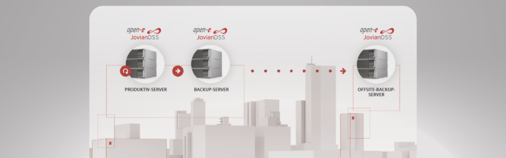

Open-E JovianDSS bietet eine umfassende Data Protection Lösung, die durch verschiedene Schutzebenen Datenverlust und -korruption verhindert. Das System kombiniert moderne Backup-Technologien mit flexiblen Deployment-Optionen für maximale Datensicherheit.

## Kernfunktionen der Data Protection

Die On- & Off-Site Data Protection Lösung bietet folgende Vorteile:

- **Benutzerfreundliche Backups**: Effiziente Sicherung unternehmenskritischer Daten ohne komplexe Konfiguration
- **Skalierbare Architektur**: Backups können auf separaten Servern in- und außerhalb des Unternehmens gespeichert werden
- **Schnelle Disaster Recovery**: Wiederherstellung von Daten aus der Vergangenheit in nur wenigen Minuten
- **Business Continuity**: Gewährleistet Datensicherheit in Kombination mit High Availability Clustern
- **Native Integration**: Keine zusätzliche Backup-Software von Drittanbietern erforderlich
## Funktionsweise der Data Protection

### Snapshot-Technologie
- **Hochfrequente Snapshots**: Neue Snapshots können im Minutenabstand durchgeführt werden
- **Langzeitspeicherung**: Snapshots werden über Jahre hinweg gespeichert, ohne dass der Speicherplatz ausgeht

### Native Backup-Lösung
**Integrierte Architektur**: Komplettes Backup und Disaster Recovery für Unternehmen ohne zusätzliche Software.

### Vollständige Datensicherung
**Umfassender Schutz**: Alle laufenden virtuellen Maschinen werden mit ihren Anwendungen und Daten gesichert - auch Datenbanksicherungen bleiben konsistent.

### Optimierte Backup-Zeiten
**Minimales Zeitfenster**: Das Backup-Zeitfenster wird auf Minuten reduziert. In jedem Intervall werden nur geänderte Daten repliziert.

### Ransomware-Schutz
**Schnelle Recovery**: Häufige Snapshots mit sofortigem Zugriff ermöglichen die schnelle Wiederherstellung des Status vor einem Angriff.

### Einfache Wiederherstellung
**Direkter Zugriff**: Über SMB haben Nutzer ohne Administrator-Hilfe direkten Zugriff auf "Vorgängerversionen" von Dateien.

### Flexible Medien-Verwaltung
**Export/Import-Funktionen**: Backup-Medien (Disks) können sicher entfernt und mit anderen Sets gewechselt oder an andere Standorte verschickt werden.

### Branchenführende Performance
Mit On- & Off-Site Data Protection können sowohl **RPO (Recovery Point Objective)** als auch **RTO (Recovery Time Objective)** in Minuten gemessen werden - Parameter, die zu den besten der Branche zählen.
## Skalierbare Sicherheitsstufen

Je größer die Bedeutung von Daten in einem Unternehmen ist, desto wichtiger wird der erforderliche Schutz. Open-E JovianDSS bietet flexible Schutzlevel - vom einfachen Produktiv-Server bis hin zur Kombination mit umfassenden Backup-Optionen.

### Verfügbare Schutzebenen

- **On-Site Data Protection - Stufe 1**: Grundlegende lokale Datensicherung
- **On-Site Data Protection - Stufe 2**: Erweiterte lokale Backup-Funktionen  
- **On-Site Data Protection - Stufe 3**: Umfassende lokale Datensicherheit
- **On-Site & Off-Site Data Protection**: Kombinierte lokale und externe Sicherung

## Maximale Datensicherheit durch Kombination

### Data Protection Komponente
- **Kontinuierliche Sicherung**: Datenschutz durch fortlaufende Backups mit Kopien sowohl lokal als auch extern
- **Flexible Wiederherstellung**: Ermöglicht die Wiederherstellung von Daten auf vorherige Stände bei Hardwareausfällen oder Datenkorruption

### High Availability Cluster
- **Unterbrechungsfreier Betrieb**: Gewährleistet kontinuierlichen Datenzugriff auch bei Hardwareausfällen
- **Optimierte Ressourcennutzung**: Maximiert die Nutzung von Hardware und Netzwerk-Ressourcen

## Fazit

Die Kombination aus On- & Off-Site Data Protection und High Availability Clustering bietet maximale Datensicherheit für unternehmenskritische Anwendungen. Open-E JovianDSS stellt damit eine umfassende Lösung für moderne Storage-Anforderungen dar.

---

*Matteo Keller ist Marketing-Spezialist bei Stylite AG und beschäftigt sich schwerpunktmäßig mit Storage-Lösungen und Datensicherheit.*
