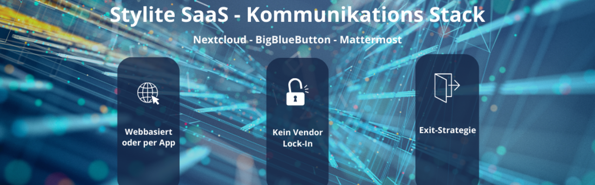

Wir setzen in der internen Kommunikation ausschließlich auf Open-Source-Alternativen. Unser Grundsatz bei STYLiTE ist, dass wir bei allen Anwendungen, die wir im Einsatz haben und unseren Kunden als Managed Service anbieten, auf minimal invasive Software zurückgreifen.

Was meinen wir mit minimal invasiver Software und was stellen wir uns darunter vor?

## Webbasiert oder per App als Selbstverständlichkeit
Alle Anwendungen in unserem SaaS-Kommunikations-Stack, zu dem neben Mattermost auch das Videokonferenztool BigBlueButton und die Filesharinglösung Nextcloud gehört, kommen ohne Installation aus. Der Vorteil für IT-Admins und Anwender: die Kommunikationslösungen können schnell und unkompliziert in die IT-Landschaft integriert werden, Updates erfolgen im Hintergrund automatisch. Darüber hinaus bieten webbasierte Anwendungen den Vorteil, dass allen Benutzern die Möglichkeit geboten wird, flexibel orts- und geräteunabhängig zu arbeiten und das ohne Installation!

## Lock-In Vermeidung als Konzept
Der Ansatz, den wir mit unseren Managed-Services verfolgen, ist darauf ausgerichtet, unseren Kunden größtmögliche Daten- und Informationsfreiheit anzubieten. Wir setzen mit den Kommunikationsangeboten alles daran, nicht in eine Lock-In-Situation zu geraten, die eine Abhängigkeit von einer bestimmten Software, eines Anbieters oder einer Technologie schaffen könnte. Deshalb bieten wir nur Lösungen an, bei denen unsere Kunden neben der Flexibilität und Effizienz in der Kommunikation die volle Kontrolle über ihre Informationen und Daten behalten.

## Exit-Strategie und Transparenz
Wir sind der Überzeugung, dass SaaS-Angebote so gestaltet sein müssen, dass im Vorfeld schon geklärt ist, was passiert, wenn der Kunde sich z.B. für eine andere Softwarelösung oder einen alternativen Anbieter entscheidet. Die Frage ist immer: was soll dann mit den Daten und dem Verfahren, die sie zum Leben erweckt, passieren? Mit unserem konsequenten Fokus auf u.a. Open Source stellen wir sicher, dass immer die Freiheit gegeben ist, Daten und Verfahren in der Hand zu behalten. Wir nennen das "informationelle Selbstbestimmung"!

## Fazit

Unser SaaS-Kommunikations-Stack basiert auf den Prinzipien von Offenheit, Transparenz und digitaler Souveränität. Mit webbasierten Open-Source-Lösungen wie Mattermost, BigBlueButton und Nextcloud bieten wir Ihnen maximale Flexibilität ohne Vendor-Lock-In und gewährleisten dabei höchste Datensicherheit und Kontrolle über Ihre Informationen.

---

*Matteo Keller ist Marketing-Spezialist bei Stylite AG und beschäftigt sich schwerpunktmäßig mit Cloud- und SaaS-Lösungen.*
