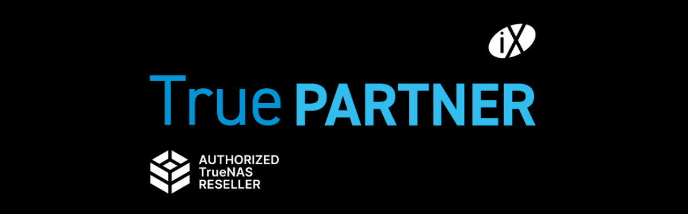

[iXsystems](https://www.ixsystems.com/) versteht sich als Open-Source-Pionier und ist seit vielen Jahren die treibende Kraft hinter TrueNAS. iX vermarktet Hardwarelösungen in der Enterprise-Klasse weltweit gemeinsam mit Partnern und auf Basis des quelloffenen ZFS-Betriebssystems TrueNAS.

## Partnerschaft mit iXsystems

Als iX TruePartner, Rechenzentrumsbetreiber und Experten für IT-Systemdesign mit einem langen Open-Source-Hintergrund freuen wir uns, mit Ihnen gemeinsam am Thema Storage zu arbeiten und Ihnen die Möglichkeiten mit TrueNAS vorzustellen.

Die iX TrueNAS Enterprise Appliances wurden übrigens bei [Gartner Peer Insights mit 4,9 von 5 Sternen](https://www.gartner.com/reviews/market/primary-storage/vendor/ixsystems/product/truenas) als erstklassige Primärspeicherlösung bewertet!

## Umfassende Beratung und Support

Gerne beraten wir Sie zu allen Fragen rund um Ihre Infrastrukturanforderungen und die Integration in bestehende IT-Landschaften. Als autorisierter Reseller bieten wir Ihnen:

- **Kompetente Beratung** zu TrueNAS Enterprise-Lösungen
- **Professionelle Integration** in bestehende IT-Umgebungen  
- **Langfristige Unterstützung** und Wartung
- **Direkte Verbindung** zu iXsystems für Enterprise-Support

## Fazit

Mit unserer Partnerschaft zu iXsystems und der langjährigen Expertise im Bereich Open-Source-Storage sind wir Ihr idealer Ansprechpartner für TrueNAS Enterprise-Lösungen. Kontaktieren Sie uns gerne für eine individuelle Beratung zu Ihren Storage-Anforderungen.

---

*Matteo Keller ist Marketing-Spezialist bei Stylite AG und beschäftigt sich schwerpunktmäßig mit Storage-Lösungen und TrueNAS.*
