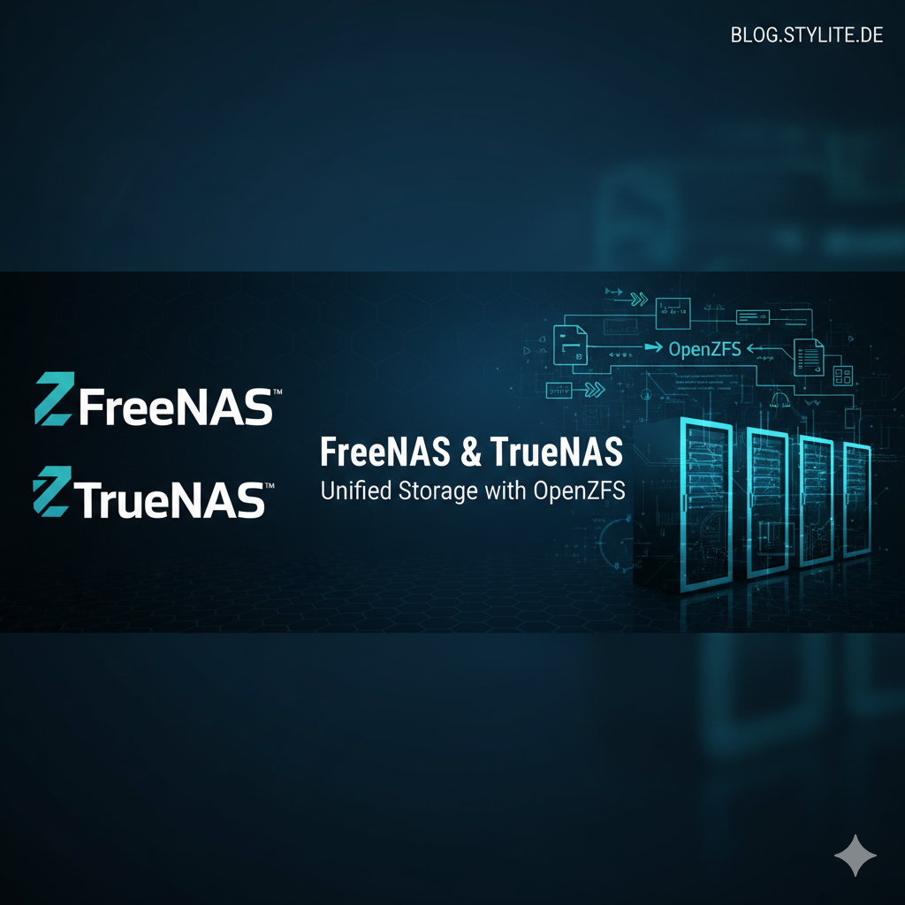

**FreeNAS**, **TrueNAS** und **OpenZFS** sind Open-Source-NAS-Lösungen, die für ihre Flexibilität, Leistung und Sicherheit bekannt sind. Neben der Möglichkeit, Daten zentral zu speichern, bieten sie auch verschiedene Optionen zur Freigabe dieser Daten im Netzwerk.

## Block- und Dateifreigabe

**Blockfreigabe** ermöglicht den blockbasierten Zugriff auf Speichergeräte, was ideal für die Verwendung mit virtuellen Maschinen (VMs) ist. **iSCSI**, **NFS** und **CIFS/SMB** sind gängige Protokolle für die Blockfreigabe.

**Dateifreigabe** hingegen ermöglicht den Zugriff auf einzelne Dateien und Ordner. **AFP**, **WebDAV** und **SFTP** sind Protokolle, die für die Dateifreigabe mit verschiedenen Clients verwendet werden können.

**Vorteile der Verwendung von FreeNAS, TrueNAS und OpenZFS für die Freigabe von Daten:**

- **Flexibilität:** Verschiedene Protokolle ermöglichen die Freigabe von Daten für verschiedene Clients
- **Leistung:** Die Systeme bieten eine hohe Performance beim Zugriff auf freigegebene Daten
- **Sicherheit:** Verschiedene Sicherheitsfunktionen schützen Ihre Daten
- **Skalierbarkeit:** Die Speicherkapazität kann einfach erweitert werden
## Performance

### Caching-Technologien
TrueNAS hebt sich durch sein leistungsstarkes Dateisystem von der Konkurrenz ab. Read- und Write-Caches ermöglichen es, die Performance eines Festplattenpools deutlich zu steigern.

### SSD und NVMe-Unterstützung
SSD und NVMe-Speicher werden von TrueNAS optimal unterstützt und sorgen für exzellente Lese- und Schreibgeschwindigkeiten.

### Zukunftssicherheit
**ZFS**, das underlying Dateisystem, ist auf die neuesten Technologien vorbereitet und bietet somit eine zukunftssichere Lösung mit herausragender Performance und erweiterbarer Speicherkapazität.

## Hochverfügbarkeit

### Cluster-Lösung
TrueNAS Enterprise bietet eine innovative Lösung für die Hochverfügbarkeit Ihrer Daten. Mit einem Cluster aus zwei Controllern ist Ihr System gegen Ausfälle abgesichert und bietet maximale Verfügbarkeit.

### Redundante Controller
Die Hochverfügbarkeitslösung mit redundanten Controllern und intelligenter Cluster-Software garantiert kontinuierlichen Zugriff und maximale Performance.

## Datensicherheit

### RAID-Z Technologie
ZFS wurde von Grund auf mit dem Fokus auf Datenintegrität entwickelt. Durch die Verwendung von RAID-Z bietet es einen ähnlichen Schutz wie RAID 5, jedoch ohne die bekannten Probleme wie die "Schreiblücke".

### Copy-on-Write-Architektur
Diese Schwachstelle wird dank der fortschrittlichen Copy-on-Write-Architektur von ZFS vermieden. Darüber hinaus bieten die zusätzlichen Level RAID-Z2 und RAID-Z3 sogar einen doppelten bzw. dreifachen Paritätsschutz.

### Software-Spiegelung
TrueNAS bietet außerdem die Möglichkeit zur Spiegelung über Software. Alle diese Funktionen können bequem über die Weboberfläche eingesehen und konfiguriert werden.

### Datenintegrität
Das ZFS-Dateisystem nutzt Prüfsummen, um die Datenintegrität zu gewährleisten, und ist eines der wenigen Dateisysteme, die auch inkonsistente Datenblöcke identifizieren können.

### Automatische Reparatur
Falls Inkonsistenzen auftreten, können Paritätsblöcke verwendet werden, um beschädigte Daten zu reparieren. Darüber hinaus ist das System standardmäßig so konfiguriert, dass es regelmäßig Datenscans durchführt.
## ZFS-Snapshots

### Erstellung und Verwaltung
Administratoren haben die Möglichkeit, jederzeit Snapshots des gesamten Dateisystems zu erstellen, zu speichern und zu planen. Diese Snapshots können entweder einmalig oder in regelmäßigen Abständen erstellt werden.

### Wiederherstellung
Auf Wunsch des Nutzers kann das gesamte Dateisystem auf einen früheren Snapshot zurückgesetzt werden, und es ist auch möglich, einzelne Dateien aus Snapshots wiederherzustellen.

### Klone und Verwaltung
Des Weiteren ermöglichen Klone von älteren Snapshots dem Anwender, Daten aus früheren Versionen des Dateisystems wiederherzustellen. In der Weboberfläche können Administratoren den Speicherplatz sehen, den ein bestimmter Snapshot auf dem Volume belegt.

### Snapshot-Operationen
Außerdem haben sie die Möglichkeit, einzelne Snapshots bei Bedarf zu löschen, zu klonen oder zurückzusetzen.

### Replikation
Die Replikation von ZFS-Snapshots bietet nicht nur lokale Backups, sondern ermöglicht auch die Erstellung von Remote-Backups. Durch die Replikation von Snapshots des Dateisystems auf ein entferntes ZFS-Dateisystem entsteht dort ein vollständiges Duplikat.

### Inkrementelle Backups
Zusätzlich fungieren weitere Snapshots desselben Dateisystems als inkrementelle Backups, wodurch sich ihre Größe auf die zwischen den Snapshots vorgenommenen Änderungen reduziert.

### Disaster Recovery
Im Falle einer katastrophalen Beschädigung eines lokalen ZFS-Dateisystems, wie beispielsweise einem Festplattenausfall über den Paritätsschutz hinaus oder dem unwiederbringlichen Ausfall mehrerer Festplatten, kann ein Replikat von einem Remote-System genutzt werden, um die Wiederherstellung einzuleiten.
## Verschlüsselung

### AES-XTS-Verschlüsselung
TrueNAS bietet über die Weboberfläche eine einfache Möglichkeit zur Verschlüsselung von ZFS-Pools oder einzelnen Freigaben. Beim Erstellen eines Pools oder einer Freigabe kann der Benutzer die Option zur Verschlüsselung wählen, die eine AES-XTS-Verschlüsselung nach Industriestandard bietet.

### Hardware-Beschleunigung
Zusätzlich kann eine Hardwarebeschleunigung aktiviert werden, sofern der Prozessor AES-NI-fähig ist.

### Schlüssel-Management
Verschlüsselte Volumes können nur von OpenZFS-Systemen gelesen werden, die im Besitz des Master Keys für dieses Volume sind. Der Benutzer kann optional eine Passphrase erstellen, um sein System zusätzlich vor Verlust oder Diebstahl zu schützen.

### Sichere Entsorgung
Die Verschlüsselung schafft Vertrauen bei der Ausmusterung und dem Recycling von Festplatten, da die Laufwerke nicht mehr gelöscht werden müssen, sofern die Hauptschlüssel unkenntlich gemacht wurden.

### Remote-Backups
Außerdem ermöglicht sie ein verschlüsseltes Backup auch an Remote-Standorten, die nicht über den Schlüssel verfügen, um die Daten zu entschlüsseln.
## Web-Schnittstelle

### Vereinfachte Verwaltung
Das Hauptziel von TrueNAS besteht darin, komplexe Verwaltungsaufgaben für seine Benutzer zu vereinfachen. Über die Web-Benutzeroberfläche können alle Aspekte eines TrueNAS-Systems verwaltet werden.

### Einrichtungsassistent
Ein Einrichtungsassistent erleichtert die Konfiguration während der Installation oder auch später im Einrichtungsprozess.

### Systemverwaltung
Die Erstellung von Datasets und Volumes, das Anlegen von iSCSI LUNs, das Festlegen von Berechtigungen für einzelne Freigaben oder das Einspielen von Software-Updates – all dies kann erledigt werden, ohne dass wichtige Schritte übersehen oder stille Fehler auftreten.

### Anpassungsmöglichkeiten
Alle Dienste sind anpassbar, und viele von ihnen bieten erweiterte Optionen, die über das Webinterface geändert werden können.

### Shell-Zugriff
Zusätzlich zur benutzerfreundlichen Web-Oberfläche steht Ihnen die volle Leistungsfähigkeit der FreeBSD-Shell-Umgebung sowohl über die GUI als auch über SSH zur Verfügung.

### Benutzerfreundlichkeit
Letztendlich macht TrueNAS die Bereitstellung eines NAS einfacher als je zuvor und stellt sicher, dass es keinen unnötigen Aufwand zwischen Ihnen und Ihrer gewünschten Lösung gibt.

## Interoperabilität

### Gemeinsame Basis
Durch die gemeinsame Basis der TrueNAS-Varianten können die Festplatten auf jedem System in die Pools eingebunden werden. Aus diesem Grund vertrauen Benutzer auf TrueNAS.

### Snapshot-Portabilität
Darüber hinaus können Snapshots zwischen den Versionen ohne Einschränkungen problemlos transportiert werden.

### Flexible Konfigurationen
Das bedeutet, dass ein TrueNAS Community System z.B. als Backup-Speicher für eine TrueNAS Enterprise Konfiguration verwendet werden kann.

### Vollzugriff
Der Benutzer erhält vollen Zugriff auf die Systemkonsole und kann jederzeit auf alle Systemfunktionen zugreifen.

## Fazit

### Umfassende Storage-Lösung
FreeNAS, TrueNAS CORE und OpenZFS bieten eine leistungsstarke, flexible und sichere Plattform für moderne Speicheranforderungen.

### Schlüsselvorteile
Die Kombination aus fortschrittlichem ZFS-Dateisystem, umfassenden Freigabeoptionen, robusten Sicherheitsfeatures und benutzerfreundlicher Weboberfläche macht diese Lösungen zur idealen Wahl für Unternehmen jeder Größe.

### Skalierbarkeit
Von kleinen Büros bis hin zu großen Rechenzentren - TrueNAS skaliert mit Ihren Anforderungen und gewährleistet dabei höchste Datensicherheit und -verfügbarkeit.

---

*Matteo Keller ist Marketing bei Stylite AG und beschäftigt sich schwerpunktmäßig mit FreeNAS, TrueNAS und OpenZFS-Technologien.*
