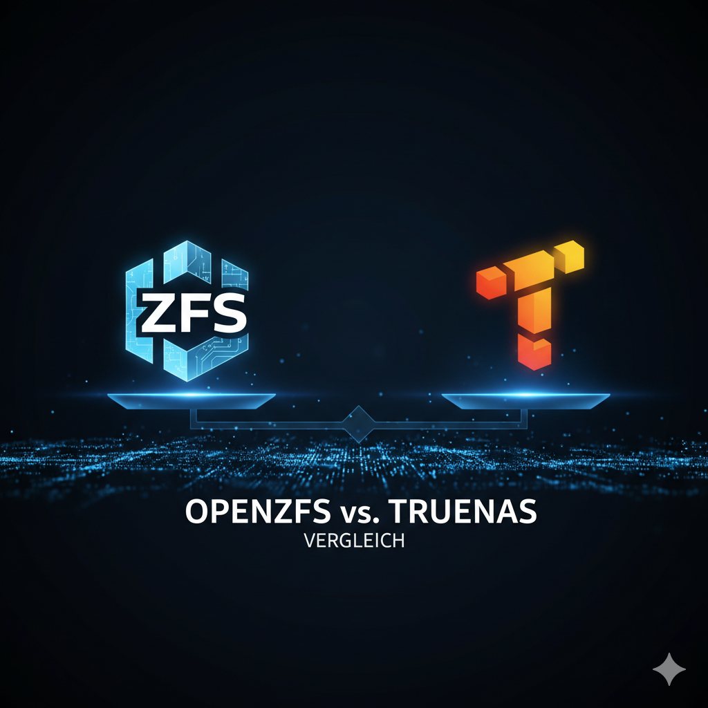

Die Geschichte von ZFS und TrueNAS ist eine faszinierende Reise durch die Evolution moderner Storage-Technologien. Von den ambitionierten Zielen bei Sun Microsystems bis hin zur heutigen Open-Source-Implementierung zeigt diese Entwicklung, wie innovative Dateisysteme die Art und Weise revolutionieren, wie Daten gespeichert und verwaltet werden.

## Entstehung und Ziele

### Die Geburtsstunde bei Sun Microsystems
Das Jahr 2001 markierte die Geburtsstunde von ZFS, dem "Zettabyte File System". Entwickelt von Matthew Ahrens und Jeff Bonwick bei Sun Microsystems für das Solaris-Betriebssystem, sollte ZFS die Grenzen damaliger Dateisysteme überwinden.

### Ambitionierte Ziele
Mehrere Festplatten ohne zusätzliche Hardware zu verwalten, die Anzahl der Dateien ins Unendliche zu skalieren und gleichzeitig die Speicherkapazität zu maximieren – diese ambitionierten Ziele trieben die Entwicklung voran.

## Kernfunktionen von ZFS

ZFS bietet als skalierbares Dateisystem viele fortschrittliche Funktionen:

- **Storage Pooling**: Vereinfachte Verwaltung mehrerer Speichergeräte
- **Umfassender Schutz vor Data Corruption**: Kontinuierliche Integritätsprüfung
- **Hohe Speicherkapazitäten**: Verarbeitung enormer Datenmengen
- **Große Dateigrößen**: Unterstützung von bis zu 16 Exabyte pro Datei
- **Massive Poolgrößen**: Bis zu 256 Billiarden Zettabytes
- **Effiziente Inline-Datenkompression**: Automatische Platzoptimierung
- **Copy-on-Write und Snapshots**: Sichere Datenmanipulation ohne Datenverlust
- **Kontinuierliche Integritätsprüfung**: Automatische Reparatur defekter Daten
- **Native NFSv4-Zugriffssteuerung**: Integrierte Sicherheitsfeatures
- **RAID-Z**: RAID-ähnliche Fähigkeiten mit erweiterten Volume-Management-Features
## OpenZFS und ZFS unter Linux: Die Geschichte einer Open-Source-Revolution

### Von proprietär zu Open Source
ZFS, das "Zettabyte File System", war ursprünglich ein proprietäres System von Sun Microsystems. 2005 öffnete Sun jedoch den Quellcode seines Solaris-Betriebssystems, der die ZFS-Codebasis enthielt, unter der GPL-Lizenz. OpenSolaris war geboren.

### Oracle übernimmt Sun
Ein paar Jahre später kaufte Oracle Sun und schloss damit den Zugang zum OpenSolaris-Code wieder. Der ZFS-Quellcode war jedoch bereits seit geraumer Zeit verfügbar.

### Die Geburt von illumos
Entwickler spalteten OpenSolaris ab und führten illumos als alternatives Betriebssystem ein. Den ZFS-Teil des Codes portierten sie erfolgreich auf mehrere Open-Source-Unix-Plattformen wie FreeBSD und macOS.

### Das OpenZFS-Projekt
Im Jahr 2013 gründete eine Gruppe von Entwicklern das OpenZFS-Projekt, um die Entwicklung zu koordinieren und die Fragmentierung des Codes zu verhindern. Durch ihre Initiative wurde ZFS in Unix-ähnlichen Systemen weit verbreitet, insbesondere unter FreeBSD.

### OpenZFS vs. proprietäres ZFS
OpenZFS und das ursprüngliche ZFS weisen aufgrund ihrer gemeinsamen Code-Basis eine starke Ähnlichkeit auf. Aufgrund dieser Ähnlichkeit wird OpenZFS oft einfach als ZFS bezeichnet.

### Plattform-Verfügbarkeit
Die proprietäre Version von ZFS ist derzeit nur im Solaris-Betriebssystem verfügbar. Alle anderen Plattformen nutzen entweder OpenZFS oder ZFS on Linux (ZoL), eine Portierung von OpenZFS für Linux, die erstmals im Jahr 2013 veröffentlicht wurde. Aus diesem Grund werden ZoF (ZFS on FreeBSD) und ZoL unter Open-Source-Enthusiasten üblicherweise auch als ZFS bezeichnet.
## ZFS unter Linux: Einigung auf OpenZFS

### FreeBSD vs. Linux: Der Wettlauf
Lange Zeit war ZFS on FreeBSD (ZoF) der führende Open-Source-Zweig von ZFS. Die Stabilität und Reife des FreeBSD-Betriebssystems sowie die aktive Community von ZoF-Entwicklern trugen zu dieser Dominanz bei.

### Linux holt auf
Mit der wachsenden Popularität von Linux und seiner größeren Benutzer- und Entwicklerbasis änderte sich jedoch das Blatt. ZFS on Linux (ZoL) entwickelte sich rasant weiter und holte in puncto Funktionsumfang und Performance schnell zu ZoF auf.

### Unterschiedliche Entwicklungsphilosophien
Ein wesentlicher Unterschied zwischen ZoF und ZoL lag in der Entwicklungsphilosophie. Die ZoF-Entwickler fokussierten sich auf die langfristige Stabilität des Dateisystems und integrierten neue Funktionen daher eher zurückhaltend. ZoL hingegen war agiler und experimentierfreudiger, was zu einer schnelleren Integration neuer Features führte.

### Ubuntu 20.04: Ein Meilenstein
Im Jahr 2019 war ZoL für viele führende Linux-Distributionen verfügbar. Ein Meilenstein war die Veröffentlichung von Ubuntu 20.04 LTS im Jahr 2020, die ZFS als Root-Dateisystem für das Betriebssystem nutzte. Dies trug zur weiteren Verbreitung von ZoL bei.

### Die Vereinigung: OpenZFS 2.0.0
Im Dezember 2020, mit der Veröffentlichung von OpenZFS 2.0.0, kam es zur Fusion von ZoF und ZoL. Dieser Schritt beendete die jahrelange Trennung der beiden Zweige und führte zu einer Vereinheitlichung der ZFS-Entwicklung unter Linux.
## FreeNAS: Das Open-Source Betriebssystem

### Die Anfänge bei iXsystems
Das FreeNAS-Projekt wurde 2005 von iXsystems ins Leben gerufen. Ursprünglich basierte es auf einer Linux-Mikrodistribution, bot aber nur rudimentäre Funktionen und war ausschließlich für erfahrene Nutzer zugänglich.

### Der Neustart mit FreeBSD
Im Jahr 2010 entschieden sich die Entwickler für einen Neustart mit FreeBSD als Basis. Diese Wahl versprach mehr Stabilität und den Zugang zum fortschrittlichen ZFS-Dateisystem.

### Die Herausforderung der Benutzerfreundlichkeit
ZFS bot zwar enorme Vorteile, war aber zu diesem Zeitpunkt noch rein kommandozeilenbasiert. Dies schränkte die Nutzerbasis stark ein und schloss viele potenzielle Anwender aus.

### Entwicklung der Web-GUI
Um die Hürden zu senken und FreeNAS einem breiteren Publikum zugänglich zu machen, entwickelten die Verantwortlichen eine benutzerfreundliche Web-GUI. Diese grafische Oberfläche ermöglichte die komfortable Konfiguration und Verwaltung des NAS-Systems auch ohne tiefgreifende Unix-Kenntnisse.

### Zwei parallele Versionen
iXsystems bot in der Vergangenheit zwei Versionen von FreeNAS an: TrueNAS als kostenpflichtige Enterprise-Lösung und FreeNAS als kostenlose Open-Source-Variante. Beide basierten auf separaten Codebasen und verwendeten unterschiedliche Installations-Images.
## TrueNAS CORE

Im März 2020 fasste iXsystems, die Firma hinter FreeNAS, die beiden NAS-Lösungen FreeNAS und TrueNAS unter dem Namen TrueNAS zusammen.

### Drei Versionen für jeden Bedarf

- **TrueNAS CORE**: Die kostenlose Open-Source-Version mit vollem Funktionsumfang und ohne Kapazitätsbegrenzung. Ideal für Privatanwender und kleine Unternehmen.
- **TrueNAS Enterprise**: Die kommerzielle Lösung mit erweitertem Funktionsumfang, Support und Hardware-Bundle. Perfekt für Unternehmen mit hohen Anforderungen.
- **TrueNAS SCALE**: Die Open-Source-Lösung für die Linux-Welt, die die bewährte Qualität von OpenZFS mit besserer Virtualisierung und Containerinfrastruktur verbindet.
### Der direkte Nachfolger von FreeNAS
TrueNAS CORE ist der direkte Nachfolger von FreeNAS. Es nutzt die gleiche bewährte Software, die bereits bei Hunderttausenden von Anwendern im Einsatz ist und das Vertrauen vieler IT-Experten gewonnen hat.

### Robustes Speicher-Backend
Richtig konfiguriert bietet TrueNAS ein robustes und sicheres Speicher-Backend für viele Anwendungen – vom SOHO-Bereich bis hin zu Multi-Terabyte-Unternehmenspools. TrueNAS stellt stets die neueste Version von OpenZFS mit den aktuellsten Funktionen, Updates und Patches zur Verfügung.

### Umfassende Kompatibilität
TrueNAS unterstützt Windows-, macOS- und Unix-Clients sowie verschiedene Virtualisierungshosts wie XenServer und VMware. Nutzer profitieren von einer breiten Palette an Protokollen wie SMB, AFP, NFS, iSCSI, SSH, rsync und FTP/TFTP.
## Auswirkungen der TrueNAS-Konsolidierung auf Anwender

### Idealer Einstieg in ZFS
Als Neueinsteiger in die Welt von ZFS bietet TrueNAS CORE die perfekte Plattform, um die Vorteile dieses innovativen Dateisystems zu erleben. Mit einer einheitlichen und stets aktuellen Softwareumgebung, inklusive OpenZFS, Samba, NFS, iSCSI und weiteren essentiellen Tools, ist TrueNAS CORE der ideale Einstiegspunkt für alle, die ihre Daten sicher und effizient speichern möchten.

### Kontinuierliche Updates
Dank der kontinuierlichen Weiterentwicklung von TrueNAS CORE profitieren Anwender stets von den aktuellsten Funktionen, Leistungs- und Sicherheitsupdates von ZFS.

### Bewährte Stabilität
Nutzer können sich auf die bewährte Stabilität und Robustheit von OpenZFS verlassen. Selbst bei einem Ausfall eines Controllers bewahrt ZFS Ihre Datenintegrität. Sie können Ihren ZFS-Pool einfach auf einem beliebigen System einbinden und so Ihre Daten mühelos wiederherstellen.

---

*Matteo Keller ist Marketing bei Stylite AG und beschäftigt sich schwerpunktmäßig mit ZFS, OpenZFS und Storage-Technologien.*
