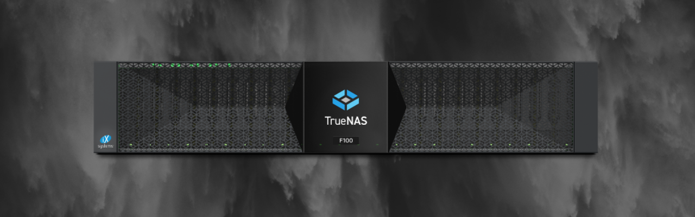

Wir stellen Ihnen die neuesten Mitglieder der TrueNAS Enterprise-Familie vor. Mit den Modellen F60 und F100, der brandneuen TrueNAS F-Series, erweitert iXsystems sein Portfolio um zwei leistungsstarke NVMe-Speicher-Systeme. Diese neue Modellreihe wurde für maximale Leistung, Zuverlässigkeit und Speicherdichte entwickelt, um Unternehmen mit extrem anspruchsvollen Workloads zu unterstützen.

Wie bei anderen TrueNAS Enterprise Appliances unterstützt die TrueNAS F-Serie Datei-, Block- und Objektprotokolle und bietet alle umfangreichen OpenZFS-Datenverwaltungsfunktionen. Alle Appliances können mit dem Enterprise-Support von iXsystems ausgestattet werden.

## Modellübersicht

Für die TrueNAS F-Series stehen zwei Modelle zur Auswahl:

**F100**
- Bis zu 24 NVMe Gen4 SSDs pro 2U System für 720TB
- Bis zu 30GB/s Bandbreite pro Node mit 6x 40/100 GbE optischen NICs
- 800W typische Leistungsaufnahme

**F60**
- Bis zu 24 NVMe Gen4 SSDs pro 2U-System für 720 TB
- Bis zu 20 GB/s Bandbreite pro Node mit 4x optischen 40/100-GbE-NICs
- Typische Leistungsaufnahme von 800 W

## Zielgruppen und Anwendungsfälle

Die neuen Modelle der F-Serie von TrueNAS Enterprise sind ideal für datenintensive Anwendungsfälle geeignet. Sie bieten maximale Leistung, Zuverlässigkeit und Speicherdichte. Besonders für Kunden aus Branchen wie der öffentlichen Verwaltung, dem Gesundheitswesen, Dienstleistungsunternehmen, Medienproduktion und Bildungseinrichtungen ist die Modellreihe bestens geeignet.

Die Geräte werden mit der neuesten Version der TrueNAS-Software, TrueNAS Enterprise 23.10, ausgeliefert. Im Vergleich zu den Vorgängermodellen von iX zeichnet sich die F-Serie durch einen reduzierten Stromverbrauch, Platzbedarf und Gesamtbetriebskosten aus.

## Hardware-Design der nächsten Generation

Das Hardware-Design der nächsten Generation unterstützt bis zu 24 Dual-Ported Gen 4 NVMe SSDs. Mit 30 TB NVMe-Laufwerken kann ein einzelnes 2U-System bis zu 720 TB an hochverfügbarem Speicher bieten. Ein NVMe-Erweiterungsregal wird später im Jahr 2024 verfügbar sein und ermöglicht eine Skalierung der F-Serie über 3,5 PB hinaus.

## Speicher-Highlights der TrueNAS F-Serie
- **Hohe Leistung:** NVMe-basierter Speicher für niedrige Latenzzeiten und Bandbreiten von bis zu 30 GB/s beim Lesen
- **Hervorragende Skalierbarkeit:** Die F-Serie lässt sich problemlos von einigen Dutzend Terabyte bis zu 720 TB in 2 HE skalieren und erfüllt damit eine Vielzahl von Anwenderanforderungen
- **Hochverfügbarkeit:** Die Dual-Controller-Architektur stellt eine kontinuierliche Verfügbarkeit sicher und vermeidet Datenverluste
- **Maximale Datenmobilität:** Die TrueNAS F-Serie bietet eine breite Palette an Replikations- und Datenmobilitätsoptionen, um die Flexibilität von Datenworkflows zu maximieren
- **Zukunftssicheres Design:** Entwickelt für moderne Geschäftsanwendungen und die damit verbundenen Leistungsanforderungen
## TrueNAS Enterprise-Portfolio

Das neue TrueNAS Enterprise-Portfolio bietet einheitlichen Speicher und Apps in einem vorkonfigurierten System mit technischen Services von iX. Diese Appliances bieten zusätzliche Softwarefunktionen wie Hochverfügbarkeit (HA), Chassis-Management, erweiterte Sicherheitsfunktionen und proaktiven Kundensupport. Die TrueNAS Enterprise Appliances wurden von Gartner Peer Insights mit 4,9/5,0 Sternen bewertet und als "2023 Customer Choice for Primary Storage in North America" ausgezeichnet.

## Fazit

Mit der neuen F-Serie setzt iXsystems neue Maßstäbe im Bereich hochperformanter NVMe-Speicher. Die Kombination aus modernster Hardware, bewährter TrueNAS-Software und umfassendem Enterprise-Support macht die F60 und F100 zur idealen Wahl für Unternehmen mit höchsten Performance-Anforderungen. Von der Medienproduktion bis zum Gesundheitswesen - die F-Serie bietet die nötige Leistung und Zuverlässigkeit für kritische Workloads.

---

*Wim Bonis ist CTO bei Stylite AG und beschäftigt sich schwerpunktmäßig mit Storage-Lösungen und TrueNAS Enterprise-Systemen.*
