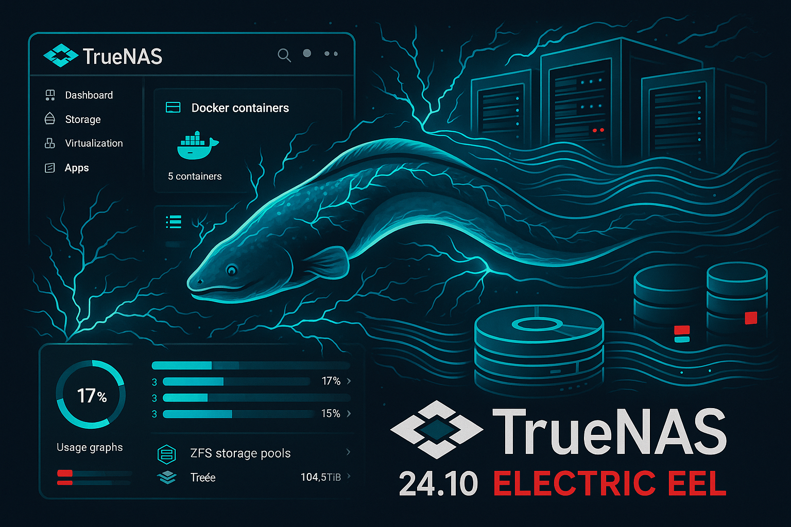

Das neue Update **[TrueNAS SCALE 24.10 "Electric Eel"][1]** ist da! Dieses Update bringt eine Reihe von Neuerungen mit sich, auf die wir uns schon lange freuen. Von einer nahtlosen Docker-Integration bis hin zu einer verbesserten App-Verwaltung und einem neuen Dashboard gibt es viel zu entdecken! Schauen Sie sich die neuen Funktionen an und lassen Sie sich vom Electric Eel elektrisieren.

## TrueNAS SCALE 24.10 Electric Eel - Alle Updates auf einen Blick
1. **Docker-Integration:** Das Backend der TrueNAS-Apps wechselt von Kubernetes zu Docker, um die App-Bereitstellung und -Verwaltung zu vereinfachen. Benutzerdefinierte App-Bereitstellung von Docker-Images ist über einen geführten Assistenten oder eine Compose-YAML-Datei möglich

2. **RAIDZ-Erweiterung:** Erweiterung eines RAIDZ-vdev mit einzelnen Festplatten (OpenZFS-Funktion, gesponsert von iXsystems)

3. **TrueCloud-Backup:** Neue TrueCloud-Backup-Aufgaben mit optimierter Funktionalität für Storj iX-Cloud-Backups und -Wiederherstellungen

4. **Globale Suche:** Neue globale Suche zum Auffinden von Seiten und Einstellungen in der TrueNAS-Benutzeroberfläche

5. **Dashboard-Update:** Überarbeitetes Dashboard mit mehr Widgets, Datenberichten und Anpassungsmöglichkeiten

6. **NVMe S.M.A.R.T.:** UI-Unterstützung für NVMe S.M.A.R.T.-Tests

7. **Gehäusemanagement:** Anpassung des Gehäusemanagement-Codes an Version 13.3 und Verbesserung der Leistung

8. **SMB-Verbesserungen:** Erhaltung von SMB-Alternativdatenströmen beim Importieren von Daten von entfernten Servern

9. **Installer-Update:** Neugestaltung des TrueNAS-Installers zur besseren Unterstützung zukünftiger Entwicklungsbemühungen

10. **UI-Verbesserungen:** Verbesserung der UI-Tabellendarstellung und Integration in die globale Suche

11. **SSSD-Integration:** Ersetzung von nslcd durch sssd zur Verbesserung der Kerberos-, NFS- und SMB-Unterstützung in Nicht-AD-Umgebungen

12. **System-ID:** Generierung einer eindeutigen System-ID für jede Installation

13. **ZFS Fast Deduplication:** OpenZFS-Funktion (gesponsert von iXsystems). Diese Funktion ist teilweise in TrueNAS vorhanden, wird aber in 24.10 als experimentell betrachtet und ist standardmäßig deaktiviert. Eine vollständige UI-Integration wird in einer zukünftigen TrueNAS-Version erwartet
## Sie haben Fragen, wir haben Antworten

Wir helfen gerne beim Update oder bei Fragen zur Implementierung. Jetzt Termin mit unserem Storage-Experten Wim über unsere [Webseite buchen!][2]

Weitere Informationen zu TrueNAS SCALE 24.10 Electric Eel finden Sie [hier][1].

## Fazit

TrueNAS SCALE 24.10 "Electric Eel" stellt einen bedeutenden Meilenstein in der Entwicklung der TrueNAS-Plattform dar. Mit der Umstellung auf Docker, erweiterten ZFS-Funktionen und einem modernisierten Dashboard bietet dieses Update sowohl für Administratoren als auch für Endnutzer erhebliche Verbesserungen. Die neuen Features wie die globale Suche, TrueCloud-Backup und die experimentelle ZFS Fast Deduplication zeigen, dass iXsystems kontinuierlich an der Verbesserung und Modernisierung ihrer Plattform arbeitet.
 [1]: https://www.truenas.com/docs/scale/24.10/
 [2]: https://www.stylite.de/termin-buchen

---

*Matteo Keller ist Marketing-Spezialist bei Stylite AG und beschäftigt sich schwerpunktmäßig mit Storage-Lösungen und TrueNAS.*
