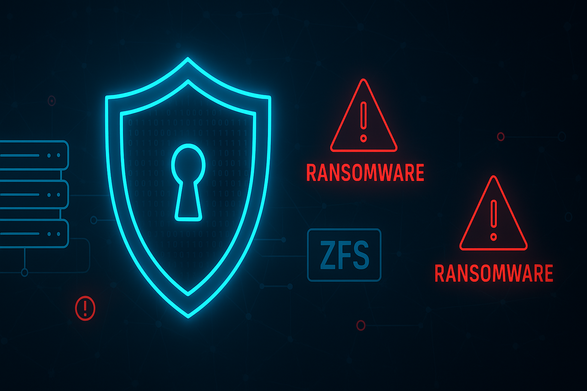

Ransomware gehört zu den gefährlichsten Cyberbedrohungen unserer Zeit. Die Entwicklung von den ersten primitiven Angriffen bis zu hochentwickelten kriminellen Organisationen zeigt die dramatische Evolution dieser Bedrohung. Gleichzeitig bieten moderne Storage-Lösungen wie TrueNAS innovative Abwehrmöglichkeiten gegen diese Angriffe.

## Die Anfänge der Ransomware

### Der erste Ransomware-Angriff: AIDS Trojan (1989)
In den späten 1980er Jahren, als Computer noch in den Kinderschuhen steckten und das Internet für viele Menschen Neuland war, trat eine neuartige digitale Bedrohung auf: der "AIDS Trojan", auch bekannt als "PC-Cyborg".

### Dr. Joseph L. Popp Jr. - Der Pionier der Ransomware
Dieser frühe Vorläufer der heutigen Ransomware-Attacken wurde 1989 von Dr. Joseph L. Popp Jr. entwickelt, einem Evolutionsbiologen mit einem Hintergrund in der AIDS-Prävention.

### Die Verbreitungsmethode
Popp verbreitete den Trojaner über tausende Disketten, die als AIDS-Informationsprogramm getarnt waren. Diese Disketten enthielten eine interaktive Datenbank, die Nutzer dazu verleiten sollte, sie zu installieren.

### Der Angriff
Nach einer bestimmten Anzahl von Systemstarts aktivierte sich der Trojaner, verschlüsselte Dateien und forderte von den Opfern eine "Lizenzgebühr" zur Wiederherstellung des Datenzugriffs.

### Die Auswirkungen
Obwohl die Verbreitung des AIDS Trojan über physische Datenträger im Vergleich zu heutigen Methoden primitiv erscheint, war seine Wirkung erheblich: Hunderte von Computern wurden infiziert. Dr. Popp wurde schließlich gefasst, jedoch nie verurteilt. Sein Vorgehen markierte den Beginn einer neuen Ära in der Cyberkriminalität und legte den Grundstein für die Entwicklung moderner Ransomware, die heute Millionen von Nutzern weltweit bedroht.
## Aktuelle Entwicklungen und Trends

### Sophos "State of Ransomware 2024" - Die Zahlen sprechen eine deutliche Sprache
Die Ransomware-Landschaft hat sich in den letzten Jahren dramatisch weiterentwickelt, wie der aktuelle "State of Ransomware 2024"-Bericht von Sophos zeigt.

### Geringere Angriffsrate, höhere Kosten
Obwohl die Angriffsrate leicht von 66% auf 59% gesunken ist, sind die finanziellen Auswirkungen alarmierend gestiegen. Die durchschnittlichen Wiederherstellungskosten nach einem Angriff haben sich auf **2,73 Millionen Dollar** erhöht, was einem Anstieg von fast 50% gegenüber dem Vorjahr entspricht.

### Dramatischer Anstieg der Lösegeldzahlungen
Besonders besorgniserregend ist der Trend zu höheren Lösegeldzahlungen. Zum ersten Mal gaben mehr als die Hälfte (56%) der betroffenen Organisationen an, Lösegeld gezahlt zu haben, wobei sich die durchschnittliche Zahlung auf **2 Millionen Dollar verfünffacht** hat. Dies unterstreicht die zunehmende Raffinesse und Hartnäckigkeit der Angreifer.

### Vielfältige Angriffsvektoren
Die Angriffsvektoren haben sich ebenfalls weiterentwickelt:
- **E-Mail-Phishing**: 52,3% (weiterhin häufigster Einstiegspunkt)
- **Ausgenutzte Schwachstellen**: 32%
- **Kompromittierte Zugangsdaten**: 29%

Dies zeigt, dass Cyberkriminelle ihre Taktiken diversifizieren und anpassen.

### Kleine Unternehmen besonders gefährdet
Kleine Unternehmen sind besonders vulnerabel, mit **55,8% der gemeldeten Vorfälle**, die Unternehmen mit 1-50 Mitarbeitern betreffen. Diese Statistik unterstreicht die Notwendigkeit, dass auch kleinere Organisationen robuste Cybersicherheitsmaßnahmen implementieren müssen.

### Bedrohung für Backup-Systeme
Ein weiterer beunruhigender Trend ist die Kompromittierung von Backups. **14% der Betroffenen** berichteten, dass auch ihre Backup-Speicher angegriffen wurden, was die Wiederherstellung erheblich erschwert und die Wahrscheinlichkeit von Lösegeldzahlungen erhöht.

Diese Entwicklungen zeigen deutlich, dass Ransomware weiterhin eine ernsthafte und sich ständig weiterentwickelnde Bedrohung darstellt, die Unternehmen aller Größenordnungen betrifft und erhebliche finanzielle und operative Risiken mit sich bringt.
## Maßnahmen zur Abwehr von Ransomware-Attacken

### Mehrschichtiger Cybersecurity-Ansatz
Effektiver Schutz gegen Ransomware-Attacken erfordert einen umfassenden, mehrschichtigen Cybersecurity-Ansatz.

### 1. Robuste Backup-Strategie
Eine robuste **3-2-1-1-Backup-Strategie** bildet das Fundament jeder Ransomware-Abwehr:
- **3** Kopien der Daten
- **2** verschiedene Medientypen
- **1** Kopie offsite
- **1** Kopie offline/immutable

### 2. Regelmäßige System-Updates
Ebenso wichtig ist die regelmäßige Aktualisierung und das Patching von Systemen, Software und Anwendungen, um bekannte Sicherheitslücken zu schließen.

### 3. Strikte Zugriffskontrollen
Zugriffskontrollen sind unerlässlich, um den Zugang zu sensiblen Daten und kritischen Systemen zu beschränken:
- **Starke Passwortrichtlinien**
- **Zwei-Faktor-Authentifizierung**
- **Rollenbasierte Zugriffskontrollen**

### 4. Mitarbeiter-Schulungen
Die kontinuierliche Schulung und Sensibilisierung der Mitarbeiter für Gefahren wie Phishing-E-Mails ist von großer Bedeutung, da der menschliche Faktor oft eine entscheidende Rolle bei erfolgreichen Angriffen spielt.

### 5. Netzwerksegmentierung
Die Implementierung einer Netzwerksegmentierung erschwert Angreifern die laterale Bewegung im Netzwerk.

### 6. Umfassende Sicherheitsüberwachung
Eine umfassende Sicherheitsüberwachung ermöglicht die frühzeitige Erkennung und Abwehr von Bedrohungen:
- **Intrusion Detection Systems (IDS)**
- **Security Information and Event Management (SIEM)**
- **KI-gestützte Sicherheitstools**

### 7. Incident Response Plan
Die Entwicklung und regelmäßige Aktualisierung eines detaillierten Incident Response Plans ist unerlässlich. Dieser Plan sollte klare Handlungsanweisungen für den Fall eines Angriffs enthalten und regelmäßig getestet werden.

### Fazit
Durch die konsequente Umsetzung dieser ineinandergreifenden Maßnahmen können Organisationen ihre Widerstandsfähigkeit gegen Ransomware-Angriffe erheblich steigern und das Risiko einer erfolgreichen Infektion deutlich reduzieren.
## Schutz der Daten mit TrueNAS im Ransomware-Fall

- **Regelmäßige Snapshots**: TrueNAS unterstützt OpenZFS-Snapshots, die verhindern, dass Daten in den Snapshots bei einem Ransomware-Angriff verschlüsselt werden. Damit ist TrueNAS Ihre „Last Line of Defense". Konfigurieren Sie wiederkehrende Snapshot-Aufgaben für einen kürzeren Recovery Point Objective (RPO).
- **Lange Aufbewahrungszeit für Snapshots**: Dank der Copy-on-Write-Technologie von TrueNAS können tägliche oder wöchentliche Snapshots monatelang oder jahrelang aufbewahrt werden, ohne einen großen Overhead zu verursachen.
- **Replikation auf weitere TrueNAS-Systeme**: Dies bietet eine wichtige weitere Schutzebene für die Datenintegrität. Verwenden Sie unterschiedliche Administratorpasswörter für die verschiedenen Systeme und konfigurieren Sie Pull-Replikationen für zusätzliche Sicherheit.
- **Zwei-Faktor-Authentifizierung (2FA)**: Aktivieren Sie 2FA für Administratorkonten, um das Risiko einer Account-Kompromittierung zu minimieren.
- **Netzwerkisolierung/-Segmentierung**: Verwenden Sie ein separates Netzwerk zum isolierten Betrieb Ihrer Replikationsserver.

**Expertentipp**: Physische Sicherheit – Betreiben Sie ihre Systeme in abgeschlossenen Umgebungen (sicherer Serverraum) und optimalerweise in verschiedenen Brandabschnitten.

## Zusätzliche Schutzmechanismen mit TrueNAS SCALE

TrueNAS SCALE bietet erweiterte Sicherheitsoptionen:

- **FIPS 140 mit TrueSecure™**: Für Regierungsorganisationen und andere, die zusätzliche Compliance benötigen.
- **Nicht-Root-Login für Administration**: Verwenden Sie ein separates Administratorkonto für die webbasierte Verwaltung.
- **Begrenztes Benutzerkonto für die Replikation**: Erstellen Sie spezielle Konten, die ausschließlich für Replikationszwecke vorgesehen sind.
- **Snapshot-Retention-Tags**: Schützen Sie wichtige Snapshots vor versehentlichem Löschen.
## Fazit und Handlungsempfehlung

### Die Bedrohung ist real
Cyberkriminelle entwickeln immer raffiniertere Methoden, um an unsere Daten zu gelangen. Ransomware ist dabei nach wie vor das Mittel der Wahl.

### Das Worst-Case-Szenario
Stellen Sie sich vor, Sie kommen morgens ins Büro, und plötzlich sind all Ihre wichtigen Daten verschlüsselt - ein Albtraum für jeden Unternehmer und IT-Verantwortlichen.

### Zeit zu handeln
Es ist an der Zeit, Ihr digitales Fundament zu stärken und den Bedrohungen durch Cyberkriminelle mit einem nachhaltigen und resilienten IT-Betrieb zu begegnen, der auf die effiziente Sicherung und Wiederherstellung Ihrer Daten setzt.

Quellen:

- [Symantec Security Response, "What is the history of ransomware?" (Europol, IOCTA 2021)](https://www.europol.europa.eu/publications-events/main-reports/internet-organised-crime-threat-assessment-iocta-2021)
- [Ransomware-Report 2024 - Sophos](https://www.sophos.com/de-de/content/state-of-ransomware)
- [BSI (2024) Top 10 Ransomware-Maßnahmen](https://www.bsi.bund.de/DE/Themen/Unternehmen-und-Organisationen/Cyber-Sicherheitslage/Analysen-und-Prognosen/Ransomware-Angriffe/Top-10-Ransomware-Massnahmen/top-10-ransomware-massnahmen.html)
- [Kaspersky (2024) Ransomware Schutz – So bleiben Ihre Daten auch 2024 sicher](https://www.kaspersky.de/resource-center/threats/how-to-prevent-ransomware)
- [Synology (2024) Schutz vor Ransomware: 8 wichtige Maßnahmen](https://blog.synology.com/ger/schutz-vor-ransomware-8-wichtige-massnahmen/)
- [Trend Micro (2024) Ransomware verhindern](https://www.trendmicro.com/de_de/what-is/ransomware/how-to-prevent.html)
- [Allianz für Cyber-Sicherheit (2024) Maßnahmenkatalog Ransomware](https://www.allianz-fuer-cybersicherheit.de/SharedDocs/Downloads/DE/BSI/Cyber-Sicherheit/Themen/Ransomware_Massnahmenkatalog.pdf)
- [TrueNAS-Blog-Security-in-2024](https://www.truenas.com/blog/truenas-security-in-2024/)

---

*Matteo Keller ist Marketing-Spezialist bei Stylite AG und beschäftigt sich schwerpunktmäßig mit IT-Sicherheit und Storage-Lösungen.*
