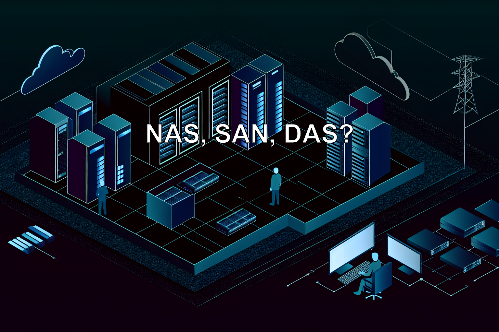

In der Unternehmens-IT dreht sich alles um Geschwindigkeit, Sicherheit und Zuverlässigkeit bei der Datenspeicherung. Wer sich heute mit Speichertechnologien beschäftigt, steht schnell vor einem Dickicht aus Abkürzungen: NAS, SAN, DAS. Die Unterschiede sind entscheidend – technisch wie wirtschaftlich.

## Was ist Direct Attached Storage (DAS)?

**Direct Attached Storage (DAS)** ist, wie der Name schon sagt, direkt mit einem einzelnen Server oder Computer verbunden. Die Anbindung erfolgt über Technologien wie SATA, SAS oder NVMe. Typische Beispiele sind externe Festplatten oder interne RAID-Systeme.

### Stärken von DAS
- **Einfache Einrichtung:** Schnell in Betrieb genommen und ideal für kleinere Budgets.
- **Hohe Leistung:** Keine Netzwerklatenzen sorgen für schnelle Zugriffszeiten im lokalen Betrieb.
- **Netzwerkunabhängig:** Die Performance wird nicht von Netzwerklast beeinflusst.
- **Dedizierte Workloads:** Optimal für einzelne Server oder lokale Backups.

### Schwächen von DAS
- **Begrenzte Skalierbarkeit:** Die Erweiterung ist durch die Host-Hardware limitiert.
- **Keine zentrale Verwaltung:** Speicher kann nicht einfach zwischen Systemen geteilt werden.
- **Geringe Ausfallsicherheit:** Weniger Redundanz im Vergleich zu NAS oder SAN.
- **Nicht für Virtualisierung geeignet:** Da der Speicher nicht geteilt werden kann, ist DAS für moderne Cluster-Systeme ungeeignet.

## Was ist ein Storage Area Network (SAN)?

Ein **Storage Area Network (SAN)** ist ein dediziertes, vom lokalen Netzwerk (LAN) getrenntes Hochgeschwindigkeitsnetzwerk, das Servern Zugriff auf Speicher auf Blockebene ermöglicht. SANs nutzen in der Regel Protokolle wie Fibre Channel oder iSCSI.

### Stärken von SAN
- **Sehr hohe Performance:** Geringe Latenz und hohe Übertragungsraten, ideal für rechenintensive Anwendungen.
- **Unternehmenskritische Systeme:** Erste Wahl für Datenbanken, Virtualisierung und KRITIS-relevante IT.
- **Hohe Skalierbarkeit und Ausfallsicherheit:** Auf Wachstum und Redundanz ausgelegt.
- **Zentrale Verwaltung:** Effiziente Steuerung über zentrale Management-Plattformen.
- **Blockbasierter Zugriff:** Maximale Flexibilität für virtuelle Maschinen und Cluster.

### Schwächen von SAN
- **Hohe Kosten:** Teure Anschaffung von Hardware (z.B. Fibre Channel) und Lizenzen.
- **Komplexe Einrichtung:** Erfordert spezialisiertes Fachwissen für Aufbau und Wartung.
- **Nicht für kleine Umgebungen:** Der hohe Aufwand ist für kleine IT-Landschaften oft nicht gerechtfertigt.

## Was ist Network Attached Storage (NAS)?

**Network Attached Storage (NAS)** ist eine Speicherlösung auf Dateiebene, die an ein Standard-LAN angeschlossen wird. Sie stellt mehreren Clients und Servern zentralen Speicher über Protokolle wie SMB/CIFS oder NFS zur Verfügung.

### Stärken von NAS
- **Einfache Bereitstellung:** Schneller Zugriff auf zentrale Dateien für mehrere Benutzer.
- **Zentrale Verwaltung:** Intuitive Weboberflächen reduzieren den Verwaltungsaufwand.
- **Hohe Kompatibilität:** Flexibel in gemischten Umgebungen (Windows, Linux, macOS) einsetzbar.
- **Kosteneffizient:** Attraktive Lösung für kleine bis mittlere Unternehmen.
- **Gute Skalierbarkeit:** Modular durch zusätzliche Festplatten erweiterbar.

### Schwächen von NAS
- **Leistungsgrenzen:** Für datenintensive Anwendungen wie Datenbanken kann die Performance limitiert sein.
- **Netzwerkabhängigkeit:** Die Leistung hängt stark von der Auslastung des LANs ab.
- **Begrenzter Blockzugriff:** Primär für dateibasierten Zugriff konzipiert.
- **Eingeschränkte Hochverfügbarkeit:** Native HA-Funktionen sind meist nur bei Enterprise-Lösungen verfügbar.

## SAN vs. NAS: Der direkte Vergleich

| Kriterium | Storage Area Network (SAN) | Network Attached Storage (NAS) |
| :--- | :--- | :--- |
| **Zugriffsart** | Block-basiert (iSCSI, Fibre Channel) | Datei-basiert (SMB, NFS) |
| **Netzwerk** | Dediziertes Storage-Netzwerk | Standard-LAN (Ethernet) |
| **Performance** | Sehr hoch, geringe Latenz | Durch Netzwerk limitiert |
| **Komplexität** | Hoch, erfordert Fachwissen | Niedrig, einfache Verwaltung |
| **Kosten** | Hoch | Niedrig bis mittel |
| **Skalierbarkeit** | Sehr gut (Kapazität & Performance) | Gut (Kapazität) |
| **Anwendungsfälle** | Datenbanken, Virtualisierung, kritische Systeme | Dateiserver, Backups, Zusammenarbeit |

## Welche Lösung passt zu welchem Unternehmen?

Die Wahl zwischen NAS, SAN und DAS hängt stark vom Einsatzzweck, der Unternehmensgröße und den IT-Strukturen ab. Bei **Stylite** beraten wir unsere Kunden technologieoffen und lösungsorientiert.

### TrueNAS Enterprise (von iXsystems)
Die perfekte NAS-Lösung für Unternehmen, die zuverlässigen Dateispeicher mit Enterprise-Features wie **ZFS, Replikation und Hochverfügbarkeit (HA)** suchen. Ideal für zentrale Dateiserver, Virtualisierung und Backup-Ziele.

### Open-E JovianDSS
Wer maximale Flexibilität für ein SAN mit iSCSI oder Fibre Channel sucht, ist hier richtig. Die Software kombiniert die Power von ZFS mit Enterprise-Funktionen wie **Active-Active HA, Deduplizierung und Snapshots** – hardwareunabhängig und ideal für maßgeschneiderte Storage-Umgebungen.

**Sie wollen herausfinden, welches Storage-Modell für Ihr Unternehmen das richtige ist?**

Sprechen Sie mit uns – wir helfen Ihnen gerne bei der Auswahl des passenden Speichersystems.

[Jetzt Kontakt aufnehmen!](https://www.stylite.de/kontakt)

---

*Matteo Keller ist Marketing-Spezialist bei der Stylite AG und beschäftigt sich schwerpunktmäßig mit Storage-Lösungen und IT-Management.*
