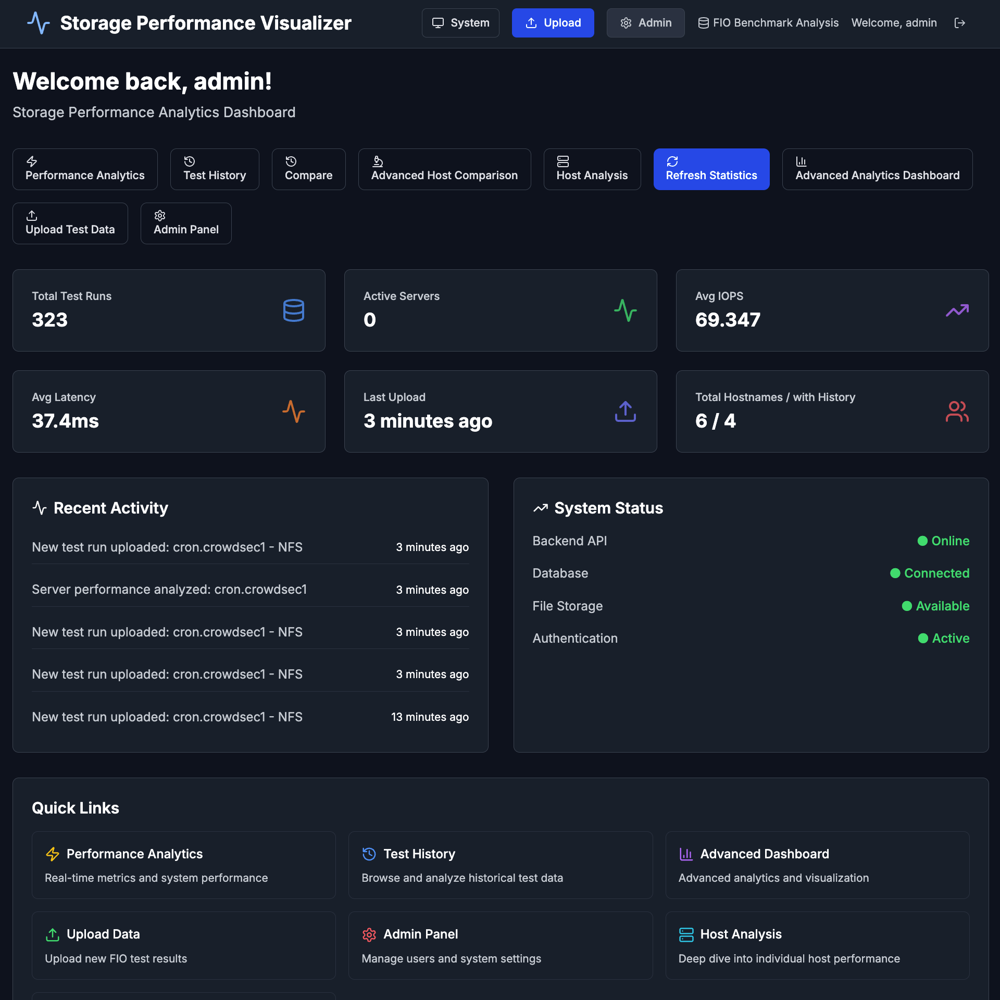
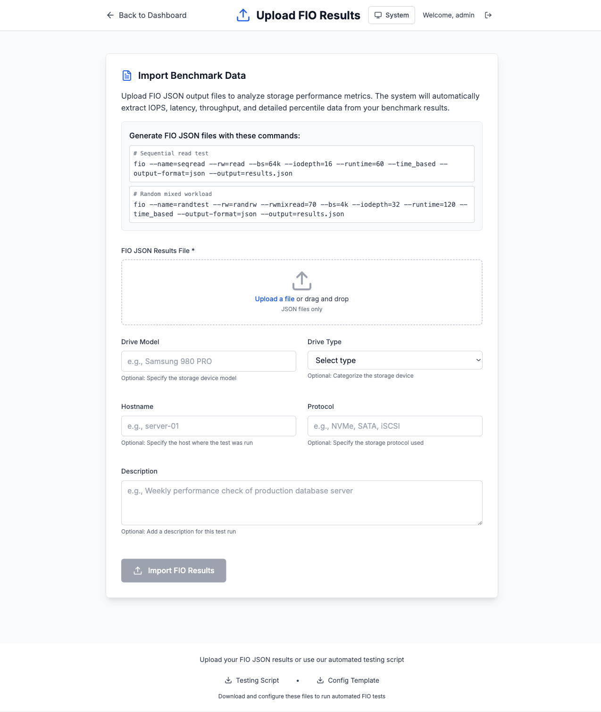
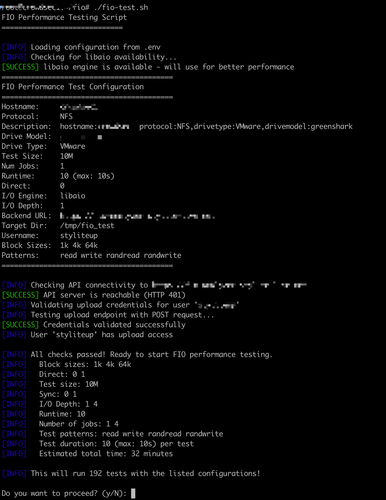
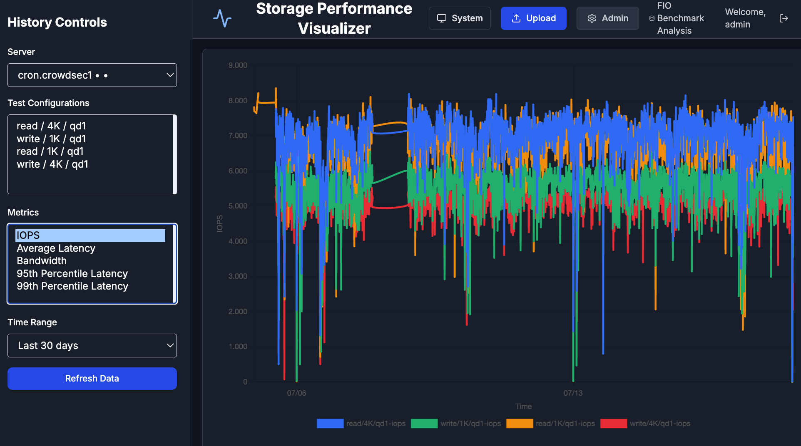
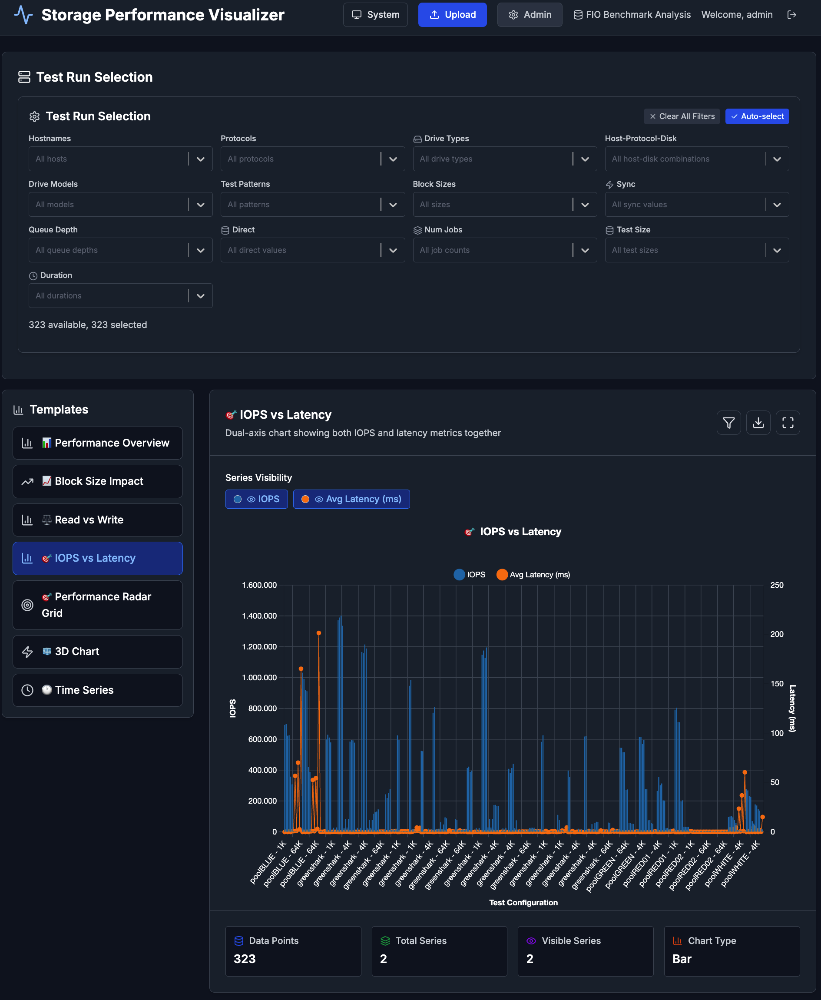
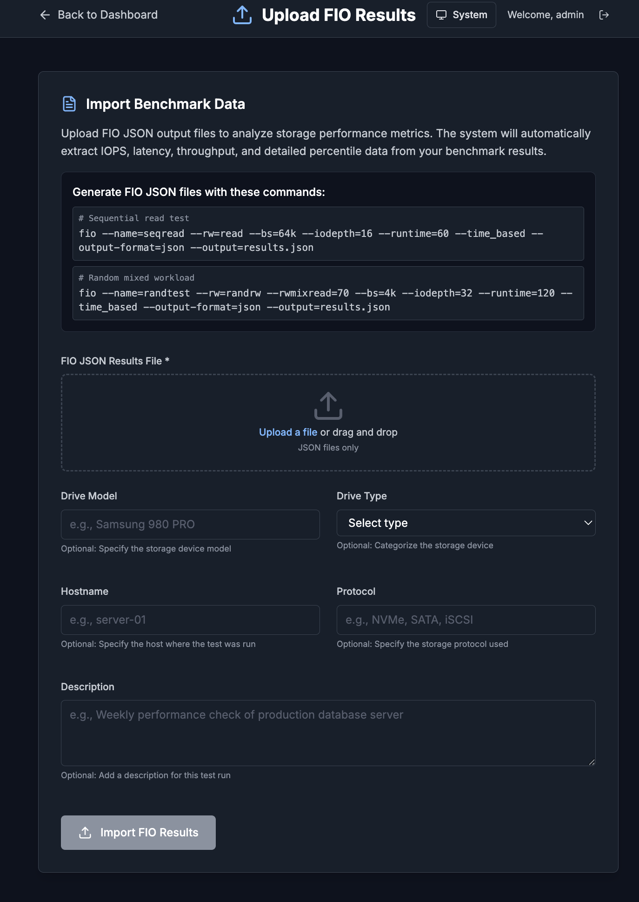

Bei der Stylite AG entstehen täglich Anforderungen zur systematischen Performance-Analyse verschiedener ZFS und TrueNAS Server-Konfigurationen. Herkömmliche Benchmarking-Tools lieferten zwar Rohdaten, aber die Analyse und Visualisierung war mühsam und zeitaufwändig.

Ähnliche Performance-Analysen sind auch bei anderen Storage-Lösungen wichtig - wie in unserem [ZFS vs. TrueNAS Vergleich](/blog/openzfs-vs-truenas/) und den [ZFS JBOD Tools](/blog/zfs-jbod-tools/) beschrieben.

## Die Lösung: FIO-Analyzer

Daher wurde der **FIO-Analyzer** entwickelt - ein vollständiges Web-Tool zur automatisierten Performance-Analyse von Storage-Systemen. Das Tool nutzt [fio (Flexible I/O Tester)](https://github.com/axboe/fio) als Backend und bietet eine intuitive Weboberfläche zur Visualisierung der Ergebnisse.

### Hauptfunktionen

**🔍 Umfassende Performance-Metriken:**
- IOPS (Input/Output Operations per Second)
- Durchsatz/Bandbreite
- Latenz-Messungen
- Separate Analyse von Read/Write-Operationen

**📊 Interaktive Visualisierung:**
- Chart.js-basierte Diagramme
- Vergleichsansichten zwischen verschiedenen Konfigurationen
- Historische Datenanalyse
- Export-Funktionen für Reports



Das Dashboard bietet eine umfassende Übersicht über alle Performance-Metriken und Systemstatus in Echtzeit.

**🚀 Automatisierte Workflows:**
- Vordefinierte Test-Skripte
- Unterstützung für verschiedene Block-Größen
- Automatische Datensammlung via Cron-Jobs


## Praktische Anwendung im Storage-Umfeld

### ZFS Pool-Vergleich

Mit dem FIO-Analyzer lassen sich schnell verschiedene ZFS Pool-Konfigurationen vergleichen:

```bash
# Beispiel: RAID-Z2 vs. Mirror Performance
./fio-test.sh --pool=tank-raidz2 --size=10G --runtime=300
./fio-test.sh --pool=tank-mirror --size=10G --runtime=300
```

Die Ergebnisse werden automatisch in die Weboberfläche hochgeladen und visualisiert.

### TrueNAS Performance-Tuning

Besonders wertvoll ist das Tool beim Tuning von TrueNAS-Installationen:

- **Verschiedene Vdev-Konfigurationen** testen
- **ARC-Einstellungen** optimieren
- **Netzwerk-Performance** bei iSCSI/NFS analysieren
- **SSD-Cache-Auswirkungen** messen



## Technische Details

### Architektur

Der FIO-Analyzer basiert auf einer modernen Web-Architektur:

- **Frontend:** JavaScript mit Chart.js für interaktive Diagramme
- **Backend:** Node.js für die API und Datenverarbeitung
- **Datenbank:** SQLite für die Speicherung der Testergebnisse
- **Deployment:** Docker-Container für einfache Installation

### Installation und Setup

Das FIO-Analyzer Tool bietet eine benutzerfreundliche Kommandozeilen-Oberfläche für die Konfiguration und Ausführung der Performance-Tests:



```bash
# Repository klonen
git clone https://github.com/styliteag/fio-analyzer.git
cd fio-analyzer/docker
# docker-compose anpassen
# Mit Docker starten
docker-compose up -d
```

### Unterstützte Metriken

Der FIO-Analyzer erfasst folgende Performance-Indikatoren:

- **Sequential Read/Write** (read, write, randread, randwrite, .....)
- **Random Read/Write** (1k, 4k, 64k, 1M, ....)
- **Mixed Workloads** (Read/Write-Verhältnisse)
- **Latenz-Statistiken** (Average, 95th, 99th Percentile)
- **Queue Depth** Performance



Die historische Visualisierung ermöglicht Trend-Analysen und zeigt Performance-Entwicklungen über längere Zeiträume.

## Praxiserfahrung und Erkenntnisse

### Typische Anwendungsfälle

In der täglichen Arbeit bei Stylite wird der FIO-Analyzer hauptsächlich für folgende Aufgaben eingesetzt:

1. **Vorher-Nachher-Vergleiche** bei Hardware-Upgrades
2. **Baseline-Messungen** für neue TrueNAS-Installationen
3. **Troubleshooting** bei Performance-Problemen
4. **Kapazitätsplanung** für Kunden-Projekte

### Gewonnene Erkenntnisse

Durch systematische Tests mit dem FIO-Analyzer wurden folgende Erkenntnisse gewonnen:

- **ZFS Compression** bringt bei bestimmten Workloads bis zu 40% Performance-Gewinn
- **L2ARC** auf NVMe SSDs verbessert Random Read um durchschnittlich 60%
- **Record Size** Tuning kann Sequential Performance um bis zu 25% steigern



Die detaillierte Analyse zeigt IOPS vs. Latenz Korrelationen für verschiedene Testkonfigurationen und ermöglicht präzise Performance-Optimierungen.

## Fazit und Ausblick

Der FIO-Analyzer hat sich als unverzichtbares Tool in unserem Storage-Arsenal etabliert. Die Kombination aus automatisierten Tests und professioneller Visualisierung spart erheblich Zeit bei der Performance-Analyse.

### Geplante Erweiterungen

- **API-Integration** für externe Monitoring-Systeme
- **Alerting** bei Performance-Degradation
- **Erweiterte Statistiken** und Trend-Analysen
- **Multi-Server-Unterstützung** für Cluster-Vergleiche



Das benutzerfreundliche Upload-Interface ermöglicht einfaches Hochladen von FIO JSON-Dateien mit automatischer Metadaten-Erfassung.

### Verfügbarkeit

Das Tool ist als Open-Source-Projekt verfügbar:
- **GitHub:** [styliteag/fio-analyzer](https://github.com/styliteag/fio-analyzer)
- **Dokumentation:** Im Repository verfügbar

Für Fragen zur Implementierung oder spezifischen Anwendungsfällen im Storage-Umfeld steht das Stylite-Team gerne zur Verfügung.

---

*Wim Bonis ist CTO bei Stylite AG und beschäftigt sich schwerpunktmäßig mit ZFS, TrueNAS und Enterprise Storage-Lösungen.*
