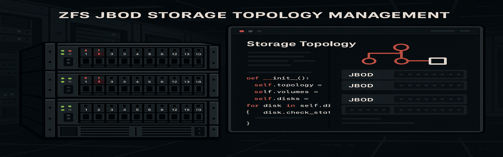
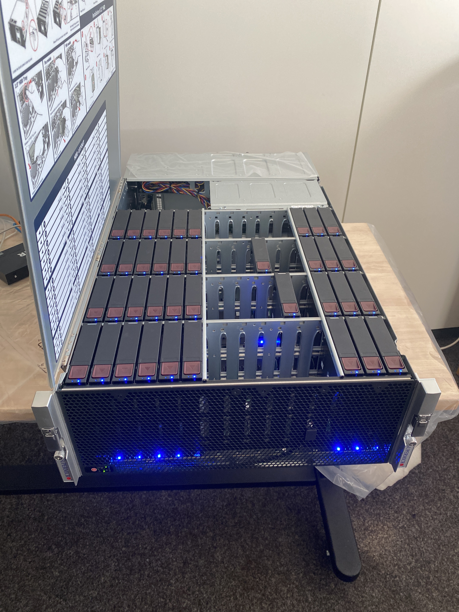
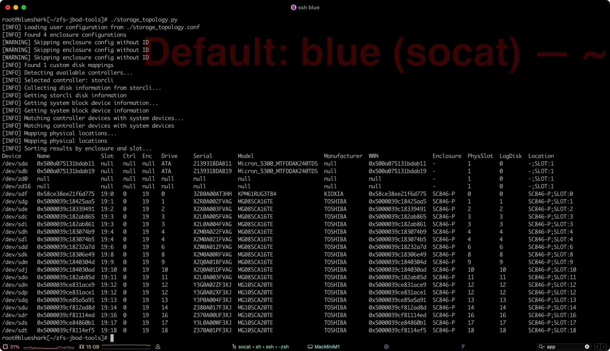
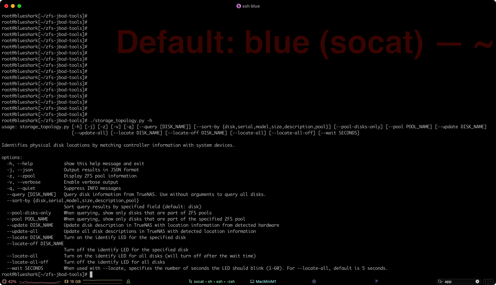
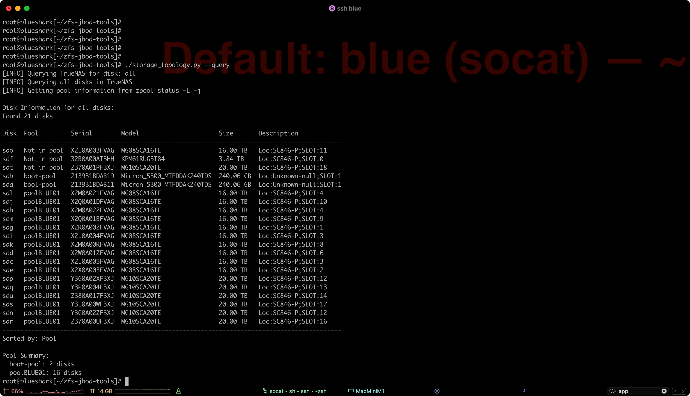
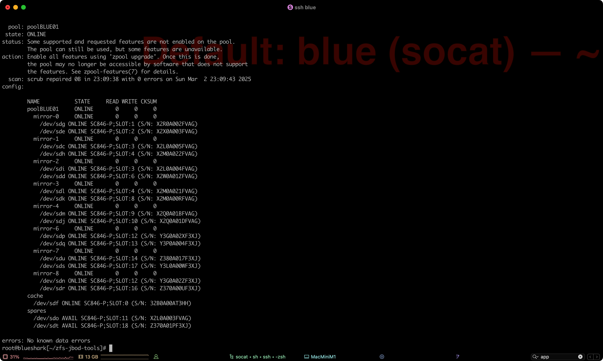

In modernen Rechenzentrumsumgebungen mit hunderten von Festplatten in JBOD-Arrays (Just a Bunch of Disks) steht man vor einem alltäglichen Problem: Wie findet man schnell die physische Position einer defekten Festplatte, wenn ZFS nur logische Device-Namen wie `/dev/sdk` anzeigt?



*Ein typisches JBOD-Storage-System mit dutzenden von Festplatten - jede muss eindeutig identifizierbar sein.*

Diese Herausforderung hat zur Entwicklung der **ZFS JBOD Tools** geführt - einem Python-basierten Werkzeug, das die Brücke zwischen ZFS-Pool-Strukturen und physischen Festplattenpositionen schlägt.

## Das Problem: Von der Seriennummer zum physischen Slot

ZFS-Pools können Hunderte von Festplatten umfassen, die über mehrere Enclosures und Controller verteilt sind. Wenn eine Festplatte ausfällt, zeigt ZFS zwar die Seriennummer oder den Device-Namen an, aber die physische Lokalisierung erfordert normalerweise zeitaufwändige manuelle Recherche.

```bash
# ZFS zeigt uns das:
pool: poolBLUE01
 state: ONLINE
 scan: scrub repaired 0B in 23:09:38 with 0 errors

NAME                        STATE     READ WRITE CKSUM
poolBLUE01                  ONLINE       0     0     0
  mirror-0                  ONLINE       0     0     0
    /dev/sdg                ONLINE       0     0     0
    /dev/sde                ONLINE       0     0     0
```

Aber welche Festplatte ist `/dev/sdg`? In welchem Enclosure-Slot befindet sie sich?

## Die Lösung: Ein Python Script!

Das ZFS JBOD Tools Projekt löst dieses Problem durch automatische Erkennung und Zuordnung:

### Automatische Controller-Erkennung

Das Tool erkennt verfügbare Storage-Controller automatisch:
- **storcli** (LSI/Broadcom MegaRAID)
- **sas2ircu/sas3ircu** (LSI HBA-Controller)
- Weitere Controller-Typen erweiterbar



Die erste Ausgabe des Tools zeigt eine vollständige Übersicht aller erkannten Festplatten mit deren physischen Positionen.

### Vollständige Disk-Zuordnung

Für jede Festplatte werden umfassende Informationen gesammelt:
- **Device-Name**: `/dev/sdx`
- **Seriennummer**: Eindeutige Identifikation
- **WWN**: World Wide Name für Hardware-Level-Zuordnung
- **Modell und Hersteller**: Hardware-Details
- **Kapazität**: Storage-Größe
- **Physische Position**: Enclosure und Slot-Nummer
- **ZFS Pool-Zugehörigkeit**: Welchem Pool gehört die Festplatte

### Flexible Abfrage-Optionen

Das Tool bietet verschiedene Abfrage-Modi:



Die umfangreichen Kommandozeilen-Optionen ermöglichen präzise Abfragen und Automatisierung.

## LED-Lokalisierung: Von digital zu physisch

Eine der wertvollsten Funktionen ist die LED-Lokalisierung:

```bash
# Festplatte physisch identifizieren
./storage_topology.py --locate sdk --wait 30

# Alle Festplatten eines Pools lokalisieren
./storage_topology.py --locate-all --pool poolBLUE01
```

Die Enclosure-LEDs blinken für die angegebene Zeit, wodurch die physische Identifikation in großen Server-Racks zum Kinderspiel wird.

## Praktische Anwendung im Rechenzentrum

### Fehlerdiagnose und -behebung

Wenn ZFS einen Festplatten-Ausfall meldet:

1. **Identifikation**: `./storage_topology.py --query defekte_seriennummer`
2. **Lokalisierung**: `./storage_topology.py --locate sdk --wait 60`
3. **Wartung**: Physischer Festplatten-Austausch mit blinkender LED-Führung

### Pool-Management



Die `--query` Option zeigt alle Festplatten mit ihrer Pool-Zugehörigkeit an. Hier sehen wir boot-pool, poolBLUE01 und verfügbare Spare-Festplatten.

### Integration in Monitoring-Systeme

Die JSON-Ausgabe ermöglicht Integration in bestehende Monitoring-Lösungen:

```json
{
  "device": "/dev/sdk",
  "serial": "MG08SCA16TE",
  "model": "TOSHIBA MG08SCA16TE",
  "size": "16.00 TB",
  "pool": "poolBLUE01",
  "enclosure": "SC846-P",
  "slot": 8
}
```

## ZFS Pool Status Integration



Das Tool zeigt detaillierte ZFS Pool-Strukturen mit Mirror-VDEVs, Cache- und Spare-Festplatten. Jede Festplatte kann ihrer physischen Position zugeordnet werden.

## Technische Implementierung

### Python-basierte Architektur

Das Tool ist in Python entwickelt und nutzt:
- **Subprocess-Integration** für Controller-Tools
- **JSON-Parsing** für strukturierte Datenverarbeitung
- **YAML-Konfiguration** für Anpassungen
- **Multipath-Device-Handling** für Enterprise-Storage

### Konfigurierbare Erweiterung

```yaml
# storage_topology.conf
controllers:
  storcli:
    path: /opt/MegaRAID/storcli/storcli64
    enabled: true
  sas2ircu:
    path: /usr/local/bin/sas2ircu
    enabled: true
```

## Fazit: Storage-Management vereinfacht

Die ZFS JBOD Tools haben sich als unverzichtbares Werkzeug im täglichen Storage-Management erwiesen. Was früher Stunden der manuellen Zuordnung erforderte, ist jetzt ein einziger Befehl.

**Hauptvorteile:**
- **Zeitersparnis**: Sofortige physische Lokalisierung
- **Fehlerreduzierung**: Keine manuellen Zuordnungsfehler
- **Automatisierung**: JSON-API für Integration
- **Skalierbarkeit**: Funktioniert mit hunderten von Festplatten

Das Tool steht als Open-Source-Projekt zur Verfügung und wird aktiv weiterentwickelt, um den Anforderungen moderner Storage-Infrastrukturen gerecht zu werden.

**Related Project**: [zfs-jbod-tools](https://github.com/styliteag/zfs-jbod-tools) - Tool for identifying physical disk locations in storage systems

---

*Wim Bonis ist CTO bei Stylite AG und beschäftigt sich schwerpunktmäßig mit Storage-Lösungen und ZFS-Infrastrukturen.*
