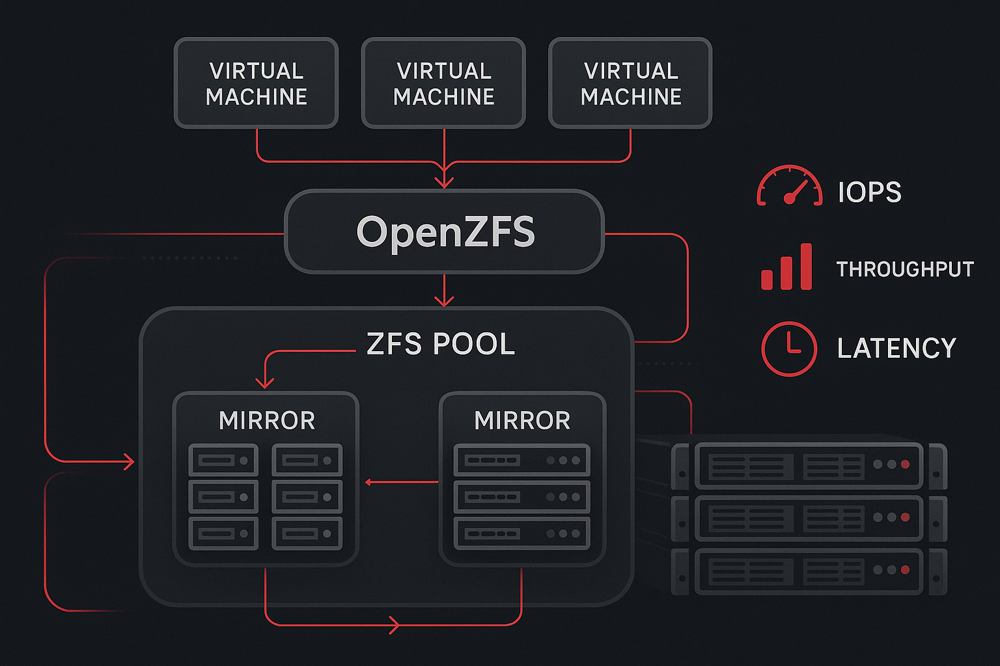

OpenZFS hat sich als universelles Dateisystem bereits bewährt – als Storage-Backend für virtuelle Maschinen entfaltet es jedoch seine wahren Stärken. Die charakteristischen Features wie Block-Level-Checksumming, Instant-Snapshots, asynchrone Replikation und granulares Performance-Tuning sind exakt das, was VM-Architekturen benötigen.

Während einfache VM-Deployments bereits mit Standard-Konfigurationen auf ungefeinten OpenZFS-Pools hervorragende Ergebnisse erzielen, profitieren produktive Umgebungen erheblich von zielgerichteter Optimierung. Diese Optimierungen lohnen sich auch für kleinere Umgebungen und Homelab-Setups.

## Hardware-Empfehlungen

Kleinere Infrastrukturen benötigen häufig keine Performance-Optimierung – die Standard-Konfiguration genügt für leichte bis mittlere Workloads. Für höhere Anforderungen bietet OpenZFS jedoch umfangreiche Tuning-Möglichkeiten, wobei drei Faktoren besonders relevant sind: Hardware, Pool-Topologie und Recordsize.

### SSD-Auswahl für VM-Storage

Für optimale VM-Performance sollten Speichermedien nicht nur schnell, sondern vor allem **vorhersagbar** schnell sein – auch bei dauerhaften, intensiven Workloads.

Consumer- und "Prosumer"-M.2-SSDs erweisen sich trotz beeindruckender Benchmark-Werte als problematisch für VM-Hosting. Diese Laufwerke zeigen bei kurzen, einfachen Tests (unter 30 Sekunden) hohe Performance, fallen jedoch bei anhaltenden Schreibvorgängen dramatisch ab, sobald der begrenzte SLC-Cache gefüllt ist. Zusätzlich droht thermisches Throttling bei unzureichender Kühlung.

**SATA-SSDs** zeigen ähnliche Cache-Limitierungen, jedoch ohne thermische Probleme. Hochwertige "Prosumer"-SATA-SSDs sind für Performance auch nach Cache-Erschöpfung optimiert – der Preisunterschied zwischen Samsung EVO und Pro reflektiert diese Designunterschiede.

### Enterprise-SSDs für kritische Workloads

**Enterprise-** oder **Datacenter-SSDs** stellen die optimale Wahl für Virtualisierungs-Storage dar. Diese Laufwerke bieten:

- **Hardware-QoS**: Minimiert Latenz-Spitzen für konsistente Performance
- **Power Loss Protection (PLP)**: Ermöglicht sichere Beschleunigung synchroner Schreibvorgänge
- **Höhere Schreibausdauer**: Doppelte bis vierfache Endurance-Ratings

Für anspruchsvolle Umgebungen sind **Hot-Swap U.3 NVMe-Laufwerke** erste Wahl, mit modernen Modellen, die sowohl extreme IOPS-Werte als auch HDD-vergleichbare Kapazitäten bieten.

### Schreibausdauer und Dimensionierung

Die Schreibausdauer wird in DWPD (Drive Writes Per Day) gemessen – ein 1TB-SSD bietet doppelte Endurance gegenüber dem 512GB-Modell derselben Serie.

**Faustregel für SSD-Dimensionierung:**
- Keine SSDs unter 1TB für VM-Storage
- Power Loss Protection und QoS nicht unterschätzen
- Schreibausdauer in Projektplanung einbeziehen

Eine 1TB-Consumer-SSD zeigt in Desktop-Umgebungen nach 3-5 Jahren Leistungsabfall. Eine 2TB-Consumer-SSD oder 1TB-Datacenter-SSD würde nach 6-10 Jahren noch vollwertige Performance liefern. Bei intensiveren Server-Workloads können selbst 4TB-Prosumer-SSDs innerhalb eines Jahres die Hälfte ihrer ursprünglichen Performance verlieren.

### Storage-Controller: SATA vs. SAS

Standard-Motherboard-SATA genügt für die meisten Systeme. Für extreme Performance sind jedoch diskrete SATA/SAS-Controller erforderlich.

SATA-Controller, ob onboard oder diskret, bieten typischerweise nur eine PCIe-Lane (≈2GB/s full-duplex, aufgeteilt in ≈1GB/s up/down). SAS-Controller nutzen hingegen PCIe x4 oder x8, wodurch der Durchsatz-Engpass entfällt.

Die theoretischen 6Gbps (≈750MiB/s) pro SATA-Port werden durch die PCIe-Bandbreite des Controllers limitiert – ein häufig missverstandener Bottleneck.

### RAM-Anforderungen

VM-Hosting ist RAM-intensiv und profitiert erheblich von hohen Storage-Cache-Hit-Raten. Die OpenZFS-Standardkonfiguration ("bis zu 50% des physischen RAMs für ARC") sollte beibehalten werden.

**Beispiel-Kalkulation für 32GB-System:**
- OpenZFS ARC: 12-16GB
- Host-OS: 2GB  
- Verfügbar für VMs: 14GB

Obwohl `zfs_arc_max` anpassbar ist, wird von Änderungen ohne fundierte Analyse abgeraten.

```bash
# ARC-Limit auf 8GB setzen (16GB RAM-System)
echo 8589934592 > /sys/module/zfs/parameters/zfs_arc_max

# Aktuelle ARC-Statistiken anzeigen
arcstat 1 5
```

### CPU-Anforderungen

OpenZFS ist nicht CPU-intensiv – selbst günstige AMD Kabini-Prozessoren (unter $50) bewältigen funktionale KVM-Hosts in Edge-Deployments.

Für viele VMs gilt jedoch: Ein physischer CPU-Core pro virtuellem Core minimiert Context-Switching und maximiert VM-Performance. Core-Oversubscription ist möglich, führt jedoch bei intensiver Nutzung zu Performance-Einbußen.

Für 10Gbps+-Netzwerke sind schnelle CPUs erforderlich, da Netzwerk-Transport oft auf einzelne CPU-Threads limitiert ist.

## Performance-Tuning

### Backend-Typ: ZVOL vs. Raw Files

Hypervisors unterstützen sowohl direkte Storage-Devices als auch dateibasierte Backends. OpenZFS ermöglicht native Raw-Storage-Devices (ZVOLs) – jedoch nicht immer mit optimaler Performance.

```bash
# ZVOL für VM erstellen (100GB)
zfs create -V 100G vmpool/vm-disk-01

# Raw-File für VM erstellen (sparse allocation)
truncate -s 100G /vmpool/vm-disk-02.raw

# .qcow2 Image erstellen mit voller Allokation
qemu-img create -f qcow2 -o preallocation=full /vmpool/vm-disk-03.qcow2 100G
```

Benchmark-Tests zeigen dramatische Performance-Unterschiede: Raw Files erreichen bei 4K-Random-I/O über 600% der ZVOL-Performance, bei 1MiB-Operationen immer noch 220%.

Raw Files übertreffen auch .qcow2-Files, wobei vollständig allokierte .qcow2-Files nahezu Raw-File-Performance erreichen.

### Pool-Topologie für maximale Performance

**Mirror-vdevs sind entscheidend** für VM-Performance. Breite RAIDz-Arrays performen trotz mehr Laufwerken oft schlechter als einzelne Drives.

Pool-Performance skaliert mit der **Anzahl der vdevs**, nicht der Laufwerke.

```bash
# Optimale Mirror-Pool Topologie (8 Drives)
zpool create vmpool mirror /dev/sda /dev/sdb mirror /dev/sdc /dev/sdd \
                    mirror /dev/sde /dev/sdf mirror /dev/sdg /dev/sdh

# RAIDz2 Topologie (weniger optimal für VMs)  
zpool create vmpool raidz2 /dev/sda /dev/sdb /dev/sdc /dev/sdd \
                    raidz2 /dev/sde /dev/sdf /dev/sdg /dev/sdh

# Pool-Status überprüfen
zpool status vmpool
zpool list -v
```

**8-Bay-System Performance-Ranking:**
1. Vier 2-wide Mirror vdevs (optimal)
2. Zwei 4-wide RAIDz2 vdevs 
3. Ein 6-wide RAIDz2 vdev (oft schlechter als Single-Drive)

### OpenZFS Recordsize-Optimierung

Recordsize kontrolliert die maximale Blockgröße und sollte den I/O-Patterns der VM-Workloads entsprechen.

```bash
# Dataset für Allzweck-VMs erstellen (64K recordsize)
zfs create -o recordsize=64K vmpool/general-vms

# Dataset für Datenbank-VMs (16K für MySQL)
zfs create -o recordsize=16K vmpool/mysql-vms

# Dataset für PostgreSQL (8K)
zfs create -o recordsize=8K vmpool/postgres-vms

# Dataset für File-Server/Media (1M)
zfs create -o recordsize=1M vmpool/fileserver

# Aktuellen Recordsize prüfen
zfs get recordsize vmpool/general-vms
```

**Empfohlene Recordsize-Werte:**
- **64K**: Allzweck-VMs (ext4/NTFS-optimiert)
- **16K**: MySQL-Datenbanken
- **8K**: PostgreSQL-Datenbanken  
- **1M**: File-Sharing/Medienserver

Bei .qcow2-Backends muss `cluster_size` (Standard: 64KiB) mit Recordsize abgestimmt werden:

```bash
# .qcow2 mit angepasster Cluster-Size erstellen
qemu-img create -f qcow2 -o cluster_size=16384,preallocation=metadata \
         /vmpool/mysql-vms/database-vm.qcow2 50G
```

Zu große Recordsize bei Small-Block-Workloads führt zu Read-Amplification – 128K-Recordsize bei PostgreSQL bedeutet 16 Datenbankseiten lesen für eine benötigte Seite.

## Fazit

OpenZFS bietet von Enterprise-Deployments bis zum Homelab unvergleichliche Zuverlässigkeit, Administrierbarkeit und Skalierbarkeit. Die richtige Hardware-Auswahl, durchdachte Pool-Topologie und angepasste Recordsize-Konfiguration erschließen das volle Performance-Potenzial für Virtualisierungs-Workloads.

Für produktive Umgebungen mit spezifischen Performance-Anforderungen empfiehlt sich eine detaillierte Analyse der konkreten Workload-Patterns und entsprechende Optimierung der OpenZFS-Parameter.

```bash
# VM-spezifische Tuning-Parameter
zfs set sync=disabled vmpool/general-vms     # Nur für Test-VMs!
zfs set primarycache=metadata vmpool/mysql-vms  # Bei RAM-Knappheit
```

---

*Wim Bonis ist CTO bei Stylite AG und beschäftigt sich schwerpunktmäßig mit Enterprise-Storage-Lösungen und Virtualisierungstechnologien.*
