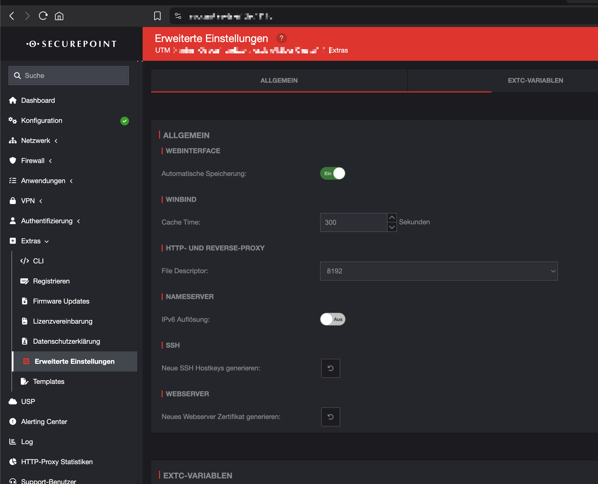
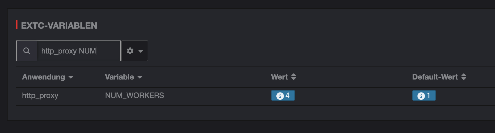
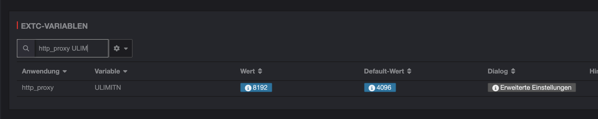

Nutzer melden häufig Probleme mit langsamen Internetverbindungen über den Proxy der Securepoint UTM. Webseiten laden nicht vollständig, Verbindungen brechen ab oder die Performance ist deutlich schlechter als erwartet. Die Ursache liegt oft in den standardmäßig konfigurierten Verbindungslimits der UTM.

## Das Problem: Begrenzte Proxy-Verbindungen

Die Securepoint UTM verwendet [Squid](https://github.com/squid-cache/squid) als HTTP-Proxy-Server. Moderne Webseiten laden Inhalte von zahlreichen verschiedenen Servern - CSS-Dateien, JavaScript-Bibliotheken, Bilder, APIs und weitere Ressourcen. Wenn die UTM nicht ausreichend parallele Verbindungen verarbeiten kann, entstehen Engpässe, die sich als langsame Ladezeiten oder Verbindungsabbrüche bemerkbar machen.

Die Standard-Konfiguration der Securepoint UTM verwendet folgende Limits:
- **NUM_WORKERS**: 1 Worker-Prozess  
- **ULIMITN**: 4096 maximale Verbindungen

Diese Werte reichen für kleinere Umgebungen aus, stoßen aber bei höherer Nutzeranzahl oder modernen Web-Anwendungen schnell an ihre Grenzen.

## Die Lösung: Erweiterte UTM-Konfiguration

Die Performance lässt sich durch Anpassung der Proxy-Parameter in den erweiterten Einstellungen deutlich verbessern.

### Schritt 1: Erweiterte Einstellungen aufrufen

Navigieren Sie in der UTM-Oberfläche zu **Extras → Erweiterte Einstellungen**. Hier finden Sie die Registerkarte **EXTC-VARIABLEN**, über die sich systemspezifische Parameter anpassen lassen.

### Schritt 2: NUM_WORKERS erhöhen

Die Variable **NUM_WORKERS** definiert die Anzahl der Worker-Prozesse für den HTTP-Proxy. Erhöhen Sie den Wert von **1** (Standard) auf **4**:

- **Variable**: `NUM_WORKERS`
- **Neuer Wert**: `4`
- **Standard-Wert**: `1`

### Schritt 3: ULIMITN anpassen

Die Variable **ULIMITN** legt das Maximum für gleichzeitige Dateideskriptoren fest. Erhöhen Sie den Wert von **4096** (Standard) auf **8192**:

- **Variable**: `ULIMITN`  
- **Neuer Wert**: `8192`
- **Standard-Wert**: `4096`

## Technischer Hintergrund

Die Anpassungen erhöhen die Verarbeitungskapazität des Squid-Proxy-Dienstes erheblich. Die Squid-Konfigurationsdateien sind auf der UTM unter `/etc/squid` einsehbar:

**Vorher**: 1 Worker × 4096 Verbindungen = **4.096 parallele Verbindungen**  
**Nachher**: 4 Worker × 8192 Verbindungen = **32.768 parallele Verbindungen**

Diese Konfiguration ermöglicht eine 8-fache Steigerung der theoretischen Kapazität und sorgt für:

- Schnellere Ladezeiten von Webseiten
- Weniger Verbindungsabbrüche
- Bessere Performance bei mehreren gleichzeitigen Nutzern
- Stabilere Verbindungen zu modernen Web-Anwendungen

## Systemvoraussetzungen

Die erhöhten Limits benötigen entsprechende Hardware-Ressourcen:

- **RAM**: Mindestens 4GB für die erweiterte Konfiguration
- **CPU**: Ausreichend Kerne für mehrere Worker-Prozesse
- **Netzwerk**: Entsprechende Bandbreite für erhöhten Durchsatz

## Nach der Anpassung

Nach dem Speichern der Konfiguration ist ein Neustart der UTM erforderlich, damit die Änderungen wirksam werden. Die Proxy-Performance sollte sich bei typischen Nutzungsszenarien deutlich verbessern.

Bei sehr großen Umgebungen oder speziellen Anforderungen können die Werte entsprechend der verfügbaren Hardware-Ressourcen weiter angepasst werden.

## Fazit

Die Optimierung der Proxy-Performance in Securepoint UTM-Umgebungen ist durch gezielte Anpassung der Worker- und Verbindungslimits effektiv lösbar. Die Erhöhung von NUM_WORKERS auf 4 und ULIMITN auf 8192 behebt die meisten Performance-Probleme bei der Internet-Nutzung über den UTM-Proxy.

---

*Wim Bonis ist CTO bei Stylite AG und beschäftigt sich schwerpunktmäßig mit Netzwerk-Security und UTM-Systemen.*
