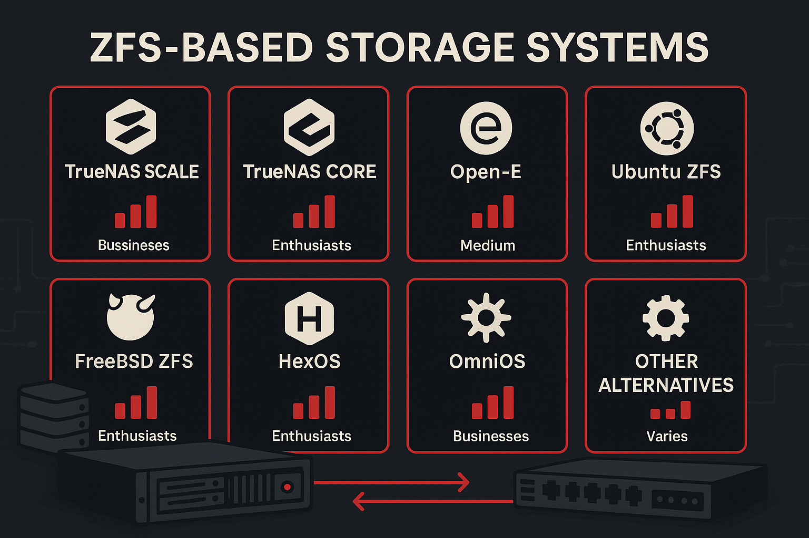

Die Wahl des richtigen [ZFS](https://en.wikipedia.org/wiki/ZFS)-basierten Storage-Systems ist eine der wichtigsten Entscheidungen für jeden, der sich mit professionellem Datenspeicher beschäftigt. Von einfachen DIY-Lösungen bis hin zu professionellen Enterprise-Systemen gibt es eine Vielzahl von Optionen, die alle auf dem robusten [ZFS-Dateisystem](https://openzfs.org/) basieren.

In diesem umfassenden Vergleich untersuchen wir **11 verschiedene ZFS-Systeme** und zeigen Ihnen, welche Lösung für Ihre spezifischen Anforderungen am besten geeignet ist. Jede Analyse enthält detaillierte Informationen zur [OpenZFS](https://openzfs.org/)-Version, dem Maintenance-Status, verfügbaren grafischen Benutzeroberflächen und der Zielgruppen-Eignung (Enterprise [NAS](https://en.wikipedia.org/wiki/Network-attached_storage)/[SAN](https://en.wikipedia.org/wiki/Storage_area_network) vs. Heimanwender mit VMs/Docker).

**Hinweis zu TrueNAS:** Bei Interesse an TrueNAS-Systemen bietet die Stylite AG sowohl vorkonfigurierte Enterprise-Systeme direkt aus den USA als auch TrueNAS Scale Community Edition zusammen mit maßgeschneiderter Hardware an.

## Übersicht der verglichenen Systeme

| System | Basis | Lizenz | Komplexität | Enterprise-Features | Zielgruppe |
|--------|-------|--------|-------------|-------------------|------------|
| **[TrueNAS Scale](https://www.truenas.com/truenas-scale/)** | [Debian Linux](https://www.debian.org/) | **Open Source (CE kostenlos)** | Mittel | **HA Cluster** | 🏢 Enterprise + 🏠 Heimanwender |
| **[TrueNAS Core](https://www.truenas.com/truenas-core/)** | [FreeBSD](https://www.freebsd.org/) | **Open Source (CE kostenlos)** | Mittel | **HA Cluster** | 🏢 Enterprise |
| **[Open-E](https://www.open-e.com/)** | [CentOS Linux](https://www.centos.org/) | Proprietär | Niedrig | **HA + Metro Cluster** | 🏢 Enterprise |
| **[Ubuntu Server + ZFS](https://ubuntu.com/tutorials/setup-zfs-storage-pool)** | [Ubuntu Linux](https://ubuntu.com/) | Open Source | Hoch | Grundlegend | 🏠 Heimanwender (DIY) |
| **[FreeBSD + ZFS](https://docs.freebsd.org/en/books/handbook/zfs/)** | [FreeBSD](https://www.freebsd.org/) | Open Source | Sehr Hoch | Grundlegend | 🏠 Heimanwender (Experten) |
| **[HexOS](https://hexos.com/)** | Debian Linux / TrueNAS Scale | Proprietär | Niedrig | Grundlegend | 🏠 Heimanwender |
| **[Nexenta](https://nexenta.com/)** | [illumos](https://illumos.org/) | Proprietär | Mittel | Umfangreich | 🏢 Enterprise |
| **[NAS4Free/XigmaNAS](https://www.xigmanas.com/)** | [FreeBSD](https://www.freebsd.org/) | Open Source | Mittel | Grundlegend | 🏠 Heimanwender |
| **[OmniOS](https://omnios.org/)** | [illumos](https://illumos.org/) | Open Source | Hoch | Umfangreich | 🏢 Enterprise |
| **[Napp-IT](https://napp-it.org/)** | [illumos](https://illumos.org/) | Open Source | Mittel | Umfangreich | 🏢 Enterprise |

## Schnellübersicht: Systemvergleich

| System | Preis | Komplexität | HA-Cluster | Metro-Cluster | Container | VMs | Community |
|--------|-------|-------------|------------|---------------|-----------|-----|-----------|
| **TrueNAS Scale** | CE kostenlos | Mittel | ✅ (Enterprise) | ❌ | ✅ Docker/LXC/App-Store | ✅ | ⭐⭐⭐⭐⭐ |
| **TrueNAS Core** | CE kostenlos | Mittel | ✅ (Enterprise) | ❌ | ❌ (Jails) | ✅ | ⭐⭐⭐⭐ |
| **Open-E** | Ab 500€ | Niedrig | ✅ | ✅ | ❌ | ❌ | ⭐⭐ |
| **Ubuntu + ZFS** | Kostenlos | Hoch | ❌ | ❌ | ✅ Docker/KVM/++ | ✅ | ⭐⭐⭐⭐⭐ |
| **FreeBSD + ZFS** | Kostenlos | Sehr Hoch | ❌ | ❌ | ❌ (Jails) | ✅ | ⭐⭐⭐⭐⭐ |
| **HexOS** | Kostenlos | Niedrig | ❌ | ❌ | ✅ Docker | ✅ | ⭐⭐⭐ |
| **Nexenta** | Ab 1000€ | Mittel | ❌ | ❌ | ❌ | ❌ | ⭐⭐ |
| **NAS4Free** | Kostenlos | Mittel | ❌ | ❌ | ❌ | ❌ | ⭐⭐⭐ |
| **OmniOS** | Kostenlos | Hoch | ❌ | ❌ | ❌ | ❌ | ⭐⭐⭐ |
| **Napp-IT** | Kostenlos | Mittel | ❌ | ❌ | ❌ | ❌ | ⭐⭐⭐ |

*Community-Bewertung basierend auf Aktivität, Dokumentation und Support (⭐ = schwach, ⭐⭐⭐⭐⭐ = exzellent)*

## Detaillierte Systemanalysen

### 1. TrueNAS Scale: Der Linux-Allrounder



- **Basis:** Debian Linux mit systemd und modernen [Container-Technologien](https://www.docker.com/)
- **OpenZFS-Version:** 2.3.x (neueste verfügbare)
- **Maintenance-Status:** ✅ Aktiv maintained (wöchentliche Updates)
- **GUI:** ✅ Vollständige Web-GUI mit 100+ Apps
- **Editionen:** Community Edition (CE) kostenlos mit vollem Quellcode, Enterprise Edition mit HA Cluster
- **Zielgruppen-Eignung:** 🏢 **Enterprise + 🏠 Heimanwender**


*Abbildung 1: TrueNAS Scale Web-Interface - Modernes Dashboard mit Storage-Pool-Übersicht, System-Performance-Metriken und intuitiver Navigation für Administratoren*

**Als Enterprise NAS/SAN:** Hervorragend geeignet für Unternehmen, die Storage für [VMware](https://www.vmware.com/), oder [Hyper-V](https://learn.microsoft.com/en-us/windows-server/virtualization/hyper-v/hyper-v-overview) benötigen. Die Enterprise Edition bietet einen hochverfügbaren HA Cluster bestehend aus zwei Nodes in einem gemeinsamen Gehäuse für maximale Ausfallsicherheit. Bietet native [iSCSI](https://en.wikipedia.org/wiki/ISCSI)/[NFS](https://en.wikipedia.org/wiki/Network_File_System) Integration mit Enterprise-Features wie Active Directory, Multi-Protocol-Support und professionellem Support.

**Als VM/Docker-Host:** Ausgezeichnet für Heimanwender, die selbst VMs und Container betreiben möchten. Native [Docker](https://www.docker.com/) und [Incus](https://linuxcontainers.org/incus/)-Unterstützung mit 100+ vorinstallierten Apps macht es ideal für Home-Labs und kleine Infrastrukturen. Vollständige Docker Compose-Unterstützung für komplexe Multi-Container-Anwendungen sowie LXD/LXC in der neuesten Version für leichte System-Container. Die Community Edition bietet alle diese Features kostenlos mit vollem Quellcode-Zugang.

**Stärken:**
- **Community Edition kostenlos:** Voller Quellcode-Zugang und alle Features ohne Kosten
- **Moderne Container-Unterstützung:** Native [Docker](https://www.docker.com/)
- **Docker Compose Unterstützung:** Vollständige Unterstützung für Multi-Container-Anwendungen
- **LXD/LXC Integration:** Neueste Version von LXD/LXC für System-Container
- **Umfangreiche App-Store:** Über 100 installierebare Anwendungen in einem App-Store
- **[Active Directory](https://learn.microsoft.com/en-us/windows-server/identity/ad-ds/get-started/virtual-dc/active-directory-domain-services-overview) Integration:** Nahtlose Windows-Umgebung-Integration
- **Performance-Optimierungen:** Optimierte ZFS-Performance unter Linux
- **[Samba 4.x](https://www.samba.org/):** Moderne SMB-Implementierung mit Multi-Channel-Support

**Idealer Einsatzbereich:** Storage für Hypervisor-Umgebungen, Moderne Infrastrukturen mit Container-Anwendungen, gemischte Umgebungen mit Windows-Clients


*Abbildung 2: TrueNAS Scale erweiterte Management-Features - Detaillierte Ansicht der Storage-Konfiguration, Dataset-Management und Netzwerk-Einstellungen*

**Beratung und Implementierung:** Bei Interesse an TrueNAS Scale berät Sie die Stylite AG gerne bei der Auswahl der optimalen Hardware und Konfiguration. Wir bieten sowohl TrueNAS Scale Community Edition zusammen mit maßgeschneiderter Hardware als auch die Möglichkeit, vorab aus den USA gelieferte TrueNAS Enterprise-Systeme zu konfigurieren und zu implementieren. [Kontaktieren Sie uns für eine individuelle Beratung ›](https://www.stylite.de/kontakt/)

### 2. TrueNAS Core: Der BSD-Traditionalist




*Abbildung 3: TrueNAS Core Dashboard - Traditionelle FreeBSD-basierte Storage-Verwaltung mit klassischer Weboberfläche und erweiterten ZFS-Konfigurationsoptionen*

- **Basis:** [FreeBSD](https://www.freebsd.org/) mit bewährter ZFS-Implementierung
- **OpenZFS-Version:** 2.2.x (aktuelle stabile Version)
- **Maintenance-Status:** ✅ Aktiv maintained (Sicherheitsupdates, Bugfixes)
- **GUI:** ✅ Vollständige Web-GUI (TrueNAS Web-Interface)
- **Editionen:** Community Edition (CE) kostenlos mit vollem Quellcode, Enterprise Edition mit HA Cluster
- **Zielgruppen-Eignung:** 🏢 **Enterprise (NAS/SAN)**

**Als Enterprise NAS/SAN:** Hervorragend für Unternehmen, die reine Storage-Lösungen benötigen. Die Enterprise Edition bietet einen hochverfügbaren HA Cluster bestehend aus zwei Nodes in einem gemeinsamen Gehäuse für maximale Ausfallsicherheit. Maximale ZFS-Performance und Stabilität machen es ideal für [VMware](https://www.vmware.com/), [XenServer](https://xenserver.org/) oder andere Hypervisor-Umgebungen, wo Storage die höchste Priorität hat.

**Als VM/Docker-Host:** Weniger geeignet für Heimanwender, die selbst VMs/Container betreiben möchten. [BSD-Jails](https://docs.freebsd.org/en/books/handbook/jails/) sind eine Alternative zu [Docker](https://www.docker.com/), aber weniger verbreitet und benutzerfreundlich. Die Community Edition bietet jedoch alle grundlegenden Storage-Features kostenlos mit vollem Quellcode-Zugang.

**Stärken:**
- **Community Edition kostenlos:** Voller Quellcode-Zugang und alle grundlegenden Features ohne Kosten
- **Ausgereifteste ZFS-Implementierung:** Längste Historie und umfangreichste Feature-Set
- **Geringerer Ressourcenverbrauch:** Effizientere Ressourcennutzung
- **[Jails-System](https://docs.freebsd.org/en/books/handbook/jails/):** BSD-spezifische Container-Alternative zu [Docker](https://www.docker.com/)
- **Robuste Netzwerk-Stack:** Optimierte Netzwerk-Performance
- **Umfangreiche Hardware-Kompatibilität:** Breite Unterstützung für Storage-Hardware

**Schwächen:**
- Weniger moderne Container-Unterstützung
- Ältere Samba-Version (4.10 in aktueller Version)
- Begrenzte Linux-Anwendungskompatibilität

**Idealer Einsatzbereich:** Reine Storage-Umgebungen, maximale Datenintegrität und Performance

**Beratung und Implementierung:** Bei Interesse an TrueNAS Core unterstützt Sie die Stylite AG bei der Auswahl und Implementierung von vorkonfigurierten Enterprise-Systemen aus den USA oder der Zusammenstellung maßgeschneiderter Hardware-Lösungen. [Kontaktieren Sie uns für eine professionelle Beratung ›](https://www.stylite.de/kontakt/)

### 3. Open-E: Der Enterprise-Spezialist



- **Basis:** Eigenes gehärtetes Linux mit kommerziellem Support
- **OpenZFS-Version:** 2.2.x (optimiert für Open-E Enterprise)
- **Maintenance-Status:** ✅ Aktiv maintained (Enterprise-Support)
- **GUI:** ✅ Vollständige Web-GUI (Open-E JovianDSS)
- **Zielgruppen-Eignung:** 🏢 **Enterprise (NAS/SAN)**


*Abbildung 4: Open-E JovianDSS Web-Interface - Professionelle Storage-Management-Oberfläche mit Metro Cluster-Unterstützung und Enterprise-Storage-Features*

**Als Enterprise NAS/SAN:** Perfekt für große Unternehmen und Rechenzentren. Die Enterprise Edition bietet sowohl einen hochverfügbaren HA Cluster bestehend aus zwei Nodes in einem gemeinsamen Gehäuse als auch die einzigartige Metro Cluster-Funktionalität für geografische Hochverfügbarkeit. Synchrone Datenreplikation über kurze Distanzen (bis zu 100km) mit automatischen Failover-Funktionen für maximale Hochverfügbarkeit. Professioneller Support und Enterprise-Features machen es ideal für kritische Infrastrukturen mit [VMware](https://www.vmware.com/), [Hyper-V](https://learn.microsoft.com/en-us/windows-server/virtualization/hyper-v/hyper-v-overview) oder anderen Hypervisor-Umgebungen.

**Als VM/Docker-Host:** Nicht primär dafür ausgelegt. Fokussiert sich auf reine Storage-Funktionen, nicht auf das Hosten von VMs oder Containern.

**Stärken:**
- **Metro Cluster:** Einzigartige optionale Metro Cluster-Lösung für geografische Hochverfügbarkeit mit synchroner Replikation über kurze Distanzen (bis zu 100km) und automatischem Failover
- **HA Cluster:** Hochverfügbarer Cluster mit zwei Nodes in einem gemeinsamen Gehäuse für lokale Ausfallsicherheit
- **Professioneller Support:** 24/7 Enterprise-Support verfügbar
- **Umfangreiche Management-Tools:** Grafische Tools für komplexe Konfigurationen
- **[Multi-Protocol-Support](https://en.wikipedia.org/wiki/Network_File_System):** Breite Unterstützung verschiedener Protokolle ([SMB](https://en.wikipedia.org/wiki/Server_Message_Block), [NFS](https://en.wikipedia.org/wiki/Network_File_System), [iSCSI](https://en.wikipedia.org/wiki/ISCSI))
- **[Hardware-RAID](https://en.wikipedia.org/wiki/RAID)-Unterstützung:** Integration mit Hardware-RAID-Controllern
- **Backup-Lösungen:** Integrierte Backup- und Replikations-Tools

**Schwächen:**
- Kostenpflichtig ab der Basic-Version
- Weniger Community-Support
- Proprietäre Erweiterungen

**Idealer Einsatzbereich:** Unternehmensumgebungen mit Budget für Support und professionelle Features

**Beratung und Implementierung:** Bei Interesse an Open-E JovianDSS unterstützt Sie die Stylite AG bei der Planung, Implementierung und Wartung Ihrer Storage-Infrastruktur. Open-E ist eine reine Software-Lösung, die Ihnen die freie Wahl der Hardware ermöglicht - von Standard-Servern bis zu hochperformanten Storage-Arrays. Gerne stellen wir Ihnen eine Trial-Version zur Verfügung, damit Sie die Software vorab testen können. [Kontaktieren Sie uns für eine professionelle Beratung oder Trial-Anforderung ›](https://www.stylite.de/kontakt/)

### 4. Selbstgebaut mit Ubuntu: Die DIY-Lösung



- **Basis:** [Ubuntu Server](https://ubuntu.com/server) mit nativer ZFS-Unterstützung
- **OpenZFS-Version:** 2.1.x/2.2.x (Ubuntu ZFS Pakete)
- **Maintenance-Status:** ✅ Aktiv maintained ([Ubuntu LTS Support](https://ubuntu.com/about/release-cycle))
- **GUI:** ❌ Keine native GUI ([Cockpit](https://cockpit-project.org/) optional)
- **Zielgruppen-Eignung:** 🏠 **Heimanwender (DIY)**

**Als Enterprise NAS/SAN:** Weniger geeignet für Unternehmen, da es keine integrierte Web-GUI und professionellen Support bietet. Kann aber als kostengünstige Alternative für kleine Unternehmen dienen.

**Als VM/Docker-Host:** Hervorragend für Heimanwender und kleine Teams, die selbst VMs und Container betreiben möchten. Ubuntu bietet native Unterstützung für [LXD](https://ubuntu.com/server/docs/containers-lxd) (Linux Containers), [Docker](https://www.docker.com/) und [KVM](https://www.linux-kvm.org/)-Virtualisierung.

**Stärken:**
- **Maximale Flexibilität:** Vollständige Kontrolle über die Konfiguration
- **[Ubuntu-Ökosystem](https://ubuntu.com/desktop/developers):** Zugang zu Millionen von Paketen
- **Kostenlos und Open Source:** Keine Lizenzkosten
- **Regelmäßige Updates:** Sicherheitsupdates durch [Canonical](https://canonical.com/)
- **[Community-Support](https://ubuntu.com/community):** Umfangreiche Ubuntu-Community

**Schwächen:**
- Hoher Konfigurationsaufwand
- Fehlende grafische Management-Oberfläche
- Hohe Einarbeitungszeit erforderlich
- Weniger integrierte Storage-Features

**Idealer Einsatzbereich:** Technisch versierte Anwender, die maximale Kontrolle wünschen

### 5. FreeBSD + ZFS: Der Purist



- **Basis:** Reines [FreeBSD](https://www.freebsd.org/)-System mit manueller ZFS-Konfiguration
- **OpenZFS-Version:** 2.1.x/2.2.x (FreeBSD ZFS Port)
- **Maintenance-Status:** ✅ Aktiv maintained ([FreeBSD Foundation](https://www.freebsdfoundation.org/))
- **GUI:** ❌ Keine native GUI ([bsdconfig](https://docs.freebsd.org/en/books/handbook/bsdinstall/) minimal)
- **Zielgruppen-Eignung:** 🏠 **Heimanwender (Experten)**

**Als Enterprise NAS/SAN:** Nur für sehr erfahrene Administratoren in Unternehmen geeignet. Maximale Performance, aber sehr hoher Konfigurationsaufwand ohne GUI-Unterstützung.

**Als VM/Jails Host:** Für erfahrene Heimanwender und Enthusiasten, die maximale Kontrolle wünschen. Bietet [bhyve](https://docs.freebsd.org/en/books/handbook/virtualization/) (FreeBSD-Hypervisor) für VMs und [jails](https://docs.freebsd.org/en/books/handbook/jails/) für Container, aber erfordert tiefes technisches Verständnis.

**Stärken:**
- **Maximale Performance:** Optimierte ZFS-Implementierung
- **Minimale Ressourcen:** Sehr effizienter Ressourcenverbrauch
- **[BSD-Ökosystem](https://www.freebsd.org/):** Zugang zu BSD-spezifischen Tools
- **Kernel-Integration:** Tiefste Integration von ZFS
- **Stabilität:** Bewährte Plattform für kritische Anwendungen

**Schwächen:**
- Sehr hoher Einarbeitungsaufwand
- Keine grafische Oberfläche standardmäßig
- Begrenzte Hardware-Unterstützung
- Weniger Benutzerfreundlichkeit

**Idealer Einsatzbereich:** Performance-kritische Umgebungen mit erfahrenen Administratoren

### 6. HexOS: Der TrueNAS Scale-Simplifier



**Basis:** [TrueNAS Scale](https://www.truenas.com/truenas-scale/) mit optimierter Benutzeroberfläche
**OpenZFS-Version:** 2.1.x (TrueNAS Scale ZFS)
**Maintenance-Status:** ✅ Aktiv maintained ([iXsystems](https://www.ixsystems.com/))
**GUI:** ✅ Web-GUI mit vereinfachter Benutzeroberfläche (basierend auf TrueNAS Scale)
**Zielgruppen-Eignung:** 🏠 **Heimanwender**

**Als Enterprise NAS/SAN:** Nicht empfehlenswert für Unternehmen. Zu minimalistisch und ohne professionelle Unterstützung. HexOS basiert auf TrueNAS Scale und soll die Installation eines NAS für Heimanwender vereinfachen, indem es die komplexen Setup-Schritte von TrueNAS Scale reduziert.

**Als VM/Docker-Host:** Gut für ressourcenbeschränkte Heimanwender-Umgebungen. Der geringe Ressourcenverbrauch macht es ideal für ältere Hardware, die VMs oder Container hosten soll. Die TrueNAS Scale Basis erleichtert die Einrichtung von Storage-Pools und Shares mit integrierter Container-Unterstützung.

**Stärken:**
- **Vereinfachte NAS-Installation:** Reduziert die Komplexität von TrueNAS Scale für Heimanwender
- **TrueNAS Scale Basis:** Zuverlässige und bewährte Storage-Plattform
- **Geringer Ressourcenverbrauch:** Optimiert für ressourcenschwache Systeme
- **Container-Unterstützung:** Docker LXD/LXC/App-Store Integration
- **ZFS-Speicher:** Vollständige OpenZFS-Funktionalität
- **Benutzerfreundliche Einrichtung:** Vereinfachte Setup-Schritte

**Schwächen:**
- Begrenzte Hardware-Unterstützung im Vergleich zu TrueNAS Scale
- Weniger Enterprise-Features als die Original-TrueNAS Scale
- Abhängigkeit von iXsystems-Entwicklung

**Idealer Einsatzbereich:** Heimanwender, die eine vereinfachte TrueNAS Scale-Installation suchen

## Zusätzliche Alternativen im Detail

### 7. OmniOS: Der illumos-Nachfolger



- **Basis:** [illumos](https://illumos.org/) ([OpenSolaris](https://en.wikipedia.org/wiki/OpenSolaris)-Nachfolger)
- **OpenZFS-Version:** 2.1.x/2.2.x (illumos native)
- **Maintenance-Status:** ✅ Aktiv maintained (OmniOS Community)
- **GUI:** ❌ Keine native GUI (nur CLI)
- **Zielgruppen-Eignung:** 🏢 **Enterprise**

**Als Enterprise NAS/SAN:** Für Unternehmen, die traditionelle illumos/Solaris-Umgebungen benötigen. Engste Verbindung zu ZFS und bewährte Enterprise-Features machen es ideal für kritische Infrastrukturen.

**Als VM/Docker-Host:** Begrenzt geeignet. Fokussiert sich primär auf Storage, bietet aber grundlegende Virtualisierungsmöglichkeiten für erfahrene Administratoren.

**Stärken:**
- **Ursprüngliche ZFS-Heimat:** Engste Verbindung zu [ZFS](https://openzfs.org/)
- **Enterprise-Features:** Umfangreiche Storage-Funktionen
- **Stabilität:** Bewährte Plattform für kritische Systeme
- **[Open-Source](https://opensource.org/):** Vollständig quelloffen

**Schwächen:**
- Komplexe Administration
- Begrenzte Hardware-Unterstützung
- Weniger moderne Features

### 8. NAS4Free/XigmaNAS

- **Basis:** [FreeBSD](https://www.freebsd.org/) mit Web-Interface
- **OpenZFS-Version:** 2.0.x (ältere Version)
- **Maintenance-Status:** ⚠️ Eingeschränkt maintained ([XigmaNAS](https://www.xigmanas.com/) aktiv)
- **GUI:** ✅ Vollständige Web-GUI
- **Zielgruppen-Eignung:** 🏠 **Heimanwender**

**Als Enterprise NAS/SAN:** Nicht empfehlenswert für Unternehmen aufgrund der eingeschränkten Maintenance und älteren ZFS-Version.

**Als VM/Docker-Host:** Gut für Heimanwender, die eine benutzerfreundliche FreeBSD-basierte Lösung mit Web-GUI suchen. Einfache Installation und Verwaltung machen es zugänglich für technisch interessierte Privatnutzer.

**Stärken:**
- **FreeBSD-Basis:** Robuste ZFS-Implementierung
- **[Web-GUI](https://en.wikipedia.org/wiki/Web_user_interface):** Benutzerfreundliche Verwaltung
- **Kostenlos:** Vollständig Open Source
- **Vielseitigkeit:** Breite [Protokoll-Unterstützung](https://en.wikipedia.org/wiki/List_of_network_protocols)

**Schwächen:**
- Entwicklung eingestellt (NAS4Free)
- Weniger aktiv als andere Projekte

### 9. Nexenta: Der Enterprise-Pionier



- **Basis:** [illumos](https://illumos.org/)/Solaris mit proprietärer Storage-Software
- **OpenZFS-Version:** 2.1.x/2.2.x (illumos native, ältere Version)
- **Maintenance-Status:** ⚠️ **Begrenzt maintained** (Nexenta Support, aber eher Nischenprodukt)
- **GUI:** ✅ Vollständige Web-GUI (Nexenta Management Console)
- **Zielgruppen-Eignung:** 🏢 **Enterprise**

**Als Enterprise NAS/SAN:** War vor TrueNAS Core eine der führenden illumos-basierten Storage-Lösungen. Heute eher ein Nischenprodukt für spezifische Enterprise-Umgebungen, die Solaris/illumos-Tradition bevorzugen. Nexenta bietet Software-Defined Storage mit Multi-Protocol-Support und Integration in bestehende Infrastrukturen.

**Stärken:**
- **Software-Defined Storage:** Flexibel und skalierbar
- **Multi-Protocol-Support:** NFS, SMB/CIFS, iSCSI
- **Enterprise-Grade:** Professioneller Support und SLAs
- **All-Flash- und Hybrid-Storage:** Optimierte Performance für verschiedene Workloads
- **Integration:** VMware

**Schwächen:**
- Eher alt und weniger aktiv maintained als moderne Alternativen
- Nischenprodukt mit begrenzter Community-Unterstützung
- Höhere Komplexität durch illumos/Solaris-Basis
- Kostenpflichtig und proprietäre Erweiterungen

**Idealer Einsatzbereich:** Spezifische Enterprise-Umgebungen, die illumos/Solaris-Tradition und bewährte Software-Defined Storage benötigen

### 10. Napp-IT: Die Web-GUI für illumos



**Basis:** [illumos](https://illumos.org/) (OmniOS/Solaris) mit Web-GUI
**OpenZFS-Version:** 2.1.x/2.2.x (illumos native)
**Maintenance-Status:** ✅ Aktiv maintained (Community)
**GUI:** ✅ Vollständige Web-GUI (napp-it SE/CS)
**Zielgruppen-Eignung:** 🏠 **Heimanwender (fortgeschritten)**

**Als Enterprise NAS/SAN:** Hervorragend für fortgeschrittene Heimanwender und kleine Unternehmen. Napp-IT bietet eine der umfangreichsten Web-GUIs für ZFS-Systeme mit professionellen Features wie Clustering, Replikation und erweitertem Monitoring. Bietet sowohl kostenlose Community-Edition als auch kommerzielle Support-Optionen.

**Stärken:**
- **Umfassende Web-GUI:** Eine der besten Web-Oberflächen für ZFS
- **Multi-Server-Management:** Remote-Verwaltung mehrerer Server
- **Clustering-Support:** HA-Cluster für Hochverfügbarkeit
- **Flexible Deployment-Optionen:** Bare-Metal oder virtualisiert
- **Kostenlos verfügbar:** Community-Edition ohne Einschränkungen
- **Professionelle Erweiterungen:** Kommerzielle Add-ons verfügbar

**Schwächen:**
- Steile Lernkurve für Anfänger
- Fokussiert auf illumos-Ökosystem
- Weniger Plug-and-Play als andere Lösungen

**Idealer Einsatzbereich:** Fortgeschrittene Heimanwender und IT-Professionals, die eine kleine Web-GUI für ZFS-Systeme benötigen

## Empfehlungen nach Anwendungsfall

### Für Einsteiger und kleine Büros
**Empfehlung:** TrueNAS Scale
- Benutzerfreundliche Oberfläche
- Moderne Features
- Gute Community-Unterstützung
- Kostenlos

### Für Performance und Stabilität
**Empfehlung:** TrueNAS Core oder FreeBSD ZFS
- Optimierte ZFS-Performance
- Bewährte Stabilität
- Geringer Ressourcenverbrauch

### Für Unternehmen mit Budget
**Empfehlung:** Open-E oder TrueNAS Enterprise
- Professioneller Support
- Enterprise-Features
- Garantierte Verfügbarkeit

### Für maximale Flexibilität
**Empfehlung:** Ubuntu Server + ZFS
- Vollständige Kontrolle
- Ubuntu-Ökosystem
- Kostenlos

## Fazit: Die richtige Wahl treffen

Die Wahl des optimalen ZFS-Systems hängt von Ihren spezifischen Anforderungen ab:

- **Für Einsteiger:** TrueNAS Scale bietet die beste Balance aus Benutzerfreundlichkeit und Funktionalität
- **Für Profis:** TrueNAS Core oder selbstgebautes FreeBSD-System maximieren die Performance
- **Für Unternehmen:** Open-E oder TrueNAS Enterprise bieten professionellen Support
- **Für Minimalisten:** HexOS oder ressourcenoptimierte TrueNAS Scale-Derivate schonen die Ressourcen

Jedes dieser Systeme basiert auf dem robusten [ZFS-Dateisystem](https://openzfs.org/) und bietet erstklassige Datenintegrität. Die Entscheidung sollte auf Ihren technischen Kenntnissen, Budget, Hardware und spezifischen Anforderungen basieren.

## Häufige Fragen (FAQ)

### ❓ Welches System für Einsteiger?
**Antwort:** TrueNAS Scale ist ideal für Einsteiger - benutzerfreundliche GUI, moderne Container-Unterstützung und aktive Community. Die Community Edition ist komplett kostenlos mit vollem Funktionsumfang.

### ❓ Brauche ich Enterprise für mein kleines Unternehmen?
**Antwort:** Abhängig von Ihren Anforderungen. TrueNAS Scale CE bietet bereits viele Enterprise-Features kostenlos. Enterprise-Versionen sind sinnvoll bei HA-Cluster-Anforderungen oder 24/7-Support-Bedarf.

### ❓ Wie migriere ich von altem Storage?
**Antwort:** ZFS ermöglicht einfache Migration durch Pool-Import. Bei TrueNAS-Systemen können Sie bestehende ZFS-Pools direkt importieren. Wir beraten Sie gerne bei der Planung Ihrer Migration.

### ❓ Was ist der Unterschied zwischen TrueNAS Scale und Core?
**Antwort:** TrueNAS Scale basiert auf Debian Linux mit moderner Container-Unterstützung (Docker/LXC/App-Store). TrueNAS Core basiert auf FreeBSD mit traditionellem Fokus auf maximale Storage-Performance und Stabilität.

### ❓ Welches System für maximale Performance?
**Antwort:** TrueNAS Core oder FreeBSD ZFS bieten die beste reine Storage-Performance. Bei gleichzeitiger Container-Unterstützung ist TrueNAS Scale die beste Wahl.

### ❓ Unterstützt Open-E Metro Cluster?
**Antwort:** Ja! Open-E ist das einzige System in diesem Vergleich, das sowohl HA-Cluster als auch Metro Cluster unterstützt. Metro Cluster ermöglicht synchrone Replikation über kurze Distanzen (bis 100km).

### ❓ Sind Community-Editionen wirklich vollständig kostenlos?
**Antwort:** Ja! TrueNAS Scale CE und TrueNAS Core CE bieten den vollen Funktionsumfang ohne zeitliche oder feature-basierte Einschränkungen. Lediglich kommerzieller Support ist kostenpflichtig.

### ❓ Welches System für Container/Docker?
**Antwort:** TrueNAS Scale bietet die beste Container-Unterstützung mit Docker, Docker Compose, LXD/LXC und App-Store.. Ubuntu ZFS ist eine gute kostenlose Alternative für selbstgebaute Systeme.

### ❓ Wie viel RAM braucht ein ZFS-System?
**Antwort:** Mindestens 16GB für kleine Systeme, 32-64GB für mittlere Setups, 128GB+ für Enterprise-Umgebungen. ZFS verwendet RAM für ARC (Adaptive Replacement Cache) zur Performance-Optimierung.

### ❓ Kann ich ZFS-Systeme virtualisiert betreiben?
**Antwort:** Ja, aber mit Einschränkungen. ZFS benötigt direkten Hardware-Zugriff für optimale Performance. In VMs läuft es, aber mit Performance-Einbußen. Besser: Bare-Metal oder dedizierte Storage-VMs.

## 🚀 Bereit für Ihre ZFS-Implementierung?

**Entscheiden Sie sich noch heute für die optimale Storage-Lösung!**

Als erfahrener Partner für ZFS-basierte Storage-Systeme unterstützt Sie die Stylite AG bei:

- **Professioneller Beratung** zur Auswahl des passenden Systems
- **Individuelle Hardware-Zusammenstellung** für Ihre Anforderungen
- **Komplette Implementierung** inklusive Konfiguration und Schulung
- **Langfristiger Support** und Wartung Ihrer Storage-Infrastruktur

### Warum Stylite AG?

✅ **Über 15 Jahre Erfahrung** mit ZFS und Enterprise Storage  
✅ **Zertifizierte Expertise** als TrueNAS und Open-E Partner  
✅ **Individuelle Lösungen** für kleine Unternehmen bis Enterprise 

**Kontaktieren Sie uns jetzt für eine unverbindliche Beratung!**
- *[Stylite.de](https://www.stylite.de/kontakt/)*

---

*Wim Bonis ist CTO bei Stylite AG und beschäftigt sich seit über 15 Jahren mit Storage-Technologien und ZFS-basierten Lösungen. Als autorisierter Reseller für TrueNAS und Open-E berät Stylite AG Unternehmen bei der Auswahl und Implementierung der optimalen Storage-Lösung für ihre individuellen Anforderungen.*