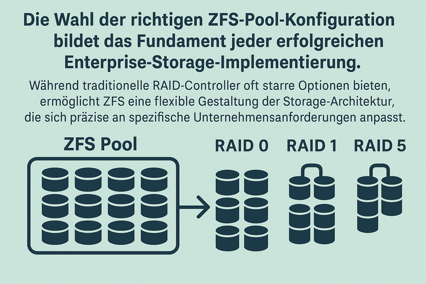

Die Wahl der richtigen ZFS Pool-Konfiguration bildet das Fundament jeder erfolgreichen Enterprise-Storage-Implementierung. Während traditionelle RAID-Controller oft starre Optionen bieten, ermöglicht ZFS eine flexible Gestaltung der Storage-Architektur, die sich präzise an spezifische Unternehmensanforderungen anpasst.

In Enterprise-Umgebungen bestimmt die Pool-Layout-Entscheidung maßgeblich die Performance, Verfügbarkeit und Skalierbarkeit des gesamten Storage-Systems. Falsche Entscheidungen in dieser frühen Phase lassen sich später nur mit erheblichem Aufwand korrigieren und können zu kostspieligen Performance-Engpässen oder unzureichender Datensicherheit führen.

Die verschiedenen ZFS Pool-Layouts - von Mirror-Konfigurationen über RAID-Z-Varianten - bieten jeweils spezifische Vor- und Nachteile. Die optimale Wahl hängt von Faktoren wie Workload-Charakteristika, Verfügbarkeitsanforderungen, Budget-Constraints und geplanter Skalierung ab.

### Die vdev-Hierarchie verstehen

Ein **vdev** (virtual device) ist die grundlegende Baueinheit eines ZFS-Pools. Es handelt sich um ein virtuelles Gerät, das aus einem oder mehreren physischen Speichergeräten besteht und als eine logische Einheit behandelt wird. ZFS organisiert Storage in einer hierarchischen Struktur, die maximale Flexibilität bei der Pool-Gestaltung ermöglicht:

Jeder vdev innerhalb eines Pools kann unterschiedliche RAID-ähnliche Konfigurationen haben (Mirror, RAID-Z usw.), wodurch verschiedene vdev-Typen innerhalb desselben Pools kombiniert werden können. Virtuelle Geräte können nicht verschachtelt werden - ein Mirror- oder RAID-Z-vdev kann nur physische Geräte oder Dateien enthalten.

Dieser Leitfaden analysiert die verfügbaren ZFS Pool-Layout-Optionen aus Enterprise-Perspektive und bietet praxiserprobte Entscheidungshilfen für Storage-Administratoren und IT-Entscheider.

## Mirror-Konfigurationen: Maximale Performance bei höchstem Platzbedarf

Mirror-Konfigurationen in ZFS entsprechen dem klassischen RAID-1-Konzept, bieten jedoch deutlich erweiterte Funktionalitäten und Flexibilität. Jeder vdev (virtual device) besteht aus zwei oder mehr Laufwerken, die identische Daten speichern und somit vollständige Redundanz gewährleisten.

### Performance-Eigenschaften

Mirror-Konfigurationen liefern die beste IOPS-Performance aller ZFS-Layouts. Read-Operationen werden intelligent auf alle verfügbaren Mirror-Member verteilt, wodurch sich die Leseleistung nahezu linear mit der Anzahl der Laufwerke skalieren lässt. Write-Operationen müssen auf alle Mirror-Member geschrieben werden, profitieren jedoch von der parallelen Ausführung.

Die Performance-Skalierung erfolgt über die Anzahl der Mirror-vdevs im Pool. Vier Mirror-vdevs mit jeweils zwei Laufwerken können theoretisch die vierfache Read-Performance eines einzelnen Laufwerks erreichen, während die Write-Performance von der langsamsten Operation der parallelen Writes begrenzt wird.

### Anwendungsfälle und Empfehlungen

Mirror-Konfigurationen eignen sich optimal für:

- **High-IOPS Workloads**: Datenbanken, virtualisierte Umgebungen, und transaktionsintensive Anwendungen profitieren von der niedrigen Latenz und hohen IOPS-Kapazität
- **Performance-kritische Anwendungen**: Wo Storage-Performance der limitierende Faktor ist und Storage-Kosten eine untergeordnete Rolle spielen
- **Kleinere Deployments**: Bei begrenzter Laufwerksanzahl bieten Mirrors die einfachste Redundanz-Implementierung

Die flexible Erweiterung stellt einen wesentlichen Vorteil dar: Mirror-vdevs können dem Pool jederzeit hinzugefügt werden, ohne bestehende Daten zu beeinträchtigen. Dies ermöglicht eine schrittweise Kapazitätserweiterung entsprechend dem tatsächlichen Bedarf.

### Wirtschaftliche Überlegungen

Der Hauptnachteil von Mirror-Konfigurationen liegt in der 50%-igen Kapazitätsausnutzung. In Enterprise-Umgebungen mit Premium-Storage-Hardware können sich die Kosten pro nutzbarem Terabyte erheblich aufsummieren. Jedoch amortisiert sich diese Investition oft durch die reduzierte Anzahl benötigter Laufwerke für gegebene Performance-Ziele.

## RAID-Z Varianten: Optimierte Balance zwischen Kapazität und Schutz

RAID-Z stellt [ZFS's](https://openzfs.org/) Antwort auf traditionelle RAID-5/6-Implementierungen dar und eliminiert dabei das berüchtigte "Write Hole"-Problem durch Copy-on-Write-Semantik. Die drei Varianten RAID-Z1, RAID-Z2 und RAID-Z3 bieten unterschiedliche Schutzlevel bei variierenden Kapazitäts- und Performance-Charakteristika.

### RAID-Z1: Grundlegende Redundanz

RAID-Z1 entspricht konzeptionell RAID-5 mit einer Paritätsinformation. Bei einem vdev mit N Laufwerken können N-1 Laufwerke für Nutzdaten verwendet werden. Die minimale Konfiguration umfasst drei Laufwerke, wobei die optimale Gruppengröße zwischen 4-6 Laufwerken liegt.

**Kapazitätseffizienz**: Bei 5 Laufwerken ergeben sich 80% nutzbare Kapazität, was RAID-Z1 deutlich attraktiver als Mirror-Konfigurationen für kapazitätsorientierte Deployments macht.

**Risikoprofil**: Der Ausfall eines Laufwerks wird toleriert. Während der Resilvering-Phase steigt jedoch das Risiko eines zweiten Ausfalls, der zu Datenverlust führen würde. Diese Schwachstelle wird bei größeren Laufwerken und längeren Resilvering-Zeiten kritischer.

### RAID-Z2: Enterprise-Standard für kritische Daten

RAID-Z2 implementiert doppelte Parität und toleriert den simultanen Ausfall von zwei Laufwerken. Dies macht es zur bevorzugten Wahl für geschäftskritische Daten in Enterprise-Umgebungen.

**Optimale Konfiguration**: 6-8 Laufwerke pro vdev liefern das beste Verhältnis aus Kapazitätsausnutzung (67-75%) und Resilienz. Bei 6 Laufwerken ergeben sich 4 Nutzdatenplatten, was 67% Kapazitätseffizienz bedeutet.

**Performance-Charakteristika**: Write-Performance liegt unter Mirror-Niveau, da Paritätsinformationen berechnet und geschrieben werden müssen. Read-Performance profitiert jedoch von der Parallelisierung über alle vdev-Member.

**Enterprise-Vorteile**: Die doppelte Parität bietet ausreichende Sicherheit für die meisten geschäftskritischen Workloads, während die Kapazitätsausnutzung deutlich besser als bei Mirror-Konfigurationen ausfällt.

### RAID-Z3: Maximaler Schutz für höchste Verfügbarkeitsanforderungen

RAID-Z3 mit dreifacher Parität toleriert den Ausfall von drei Laufwerken simultant. Diese Konfiguration richtet sich an Umgebungen mit extrem hohen Verfügbarkeitsanforderungen oder sehr großen Laufwerken.

**Anwendungsszenarien**:
- Archive Storage mit großen Laufwerken (>8TB)
- Compliance-kritische Umgebungen
- Remote-Standorte mit eingeschränkten Wartungsmöglichkeiten

**Wirtschaftliche Überlegungen**: Die dreifache Parität reduziert die Kapazitätsausnutzung erheblich. Bei 9 Laufwerken ergeben sich 67% nutzbare Kapazität, jedoch mit deutlich höherem Schutzlevel als RAID-Z2.

### Größenwahl und Performance-Optimierung

Die vdev-Größe beeinflusst maßgeblich Performance und Effizienz. Zu kleine vdevs (3-4 Laufwerke) begrenzen die Performance unnötig, während zu große vdevs (>12 Laufwerke) das Risikoprofil verschlechtern und Resilvering-Zeiten verlängern.

**Best Practices für vdev-Sizing**:
- RAID-Z1: 4-6 Laufwerke (nicht empfohlen für Produktion)
- RAID-Z2: 6-8 Laufwerke (optimal: 6-8)
- RAID-Z3: 8-11 Laufwerke (optimal: 8-10)

**Warum diese Größen optimal sind**:
- **Rebuild-Performance**: Kleinere vdevs = schnellere Resilvering-Zeiten
- **Parallele Performance**: Mehrere kleinere vdevs > ein großer vdev
- **Erweiterbarkeit**: Kleine vdevs erleichtern das Erweitern mit der gleichen Anzahl Laufwerke, wohingegen große vdevs nur mit der selben Anzahl Laufwerke sinnvoll erweitert werden können.

### Record-Size-Optimierung

Die Record-Größe sollte auf den Workload abgestimmt werden:

```bash
# Für Datenbanken
zfs set recordsize=8K poolname/database

# Für VM-Images
zfs set recordsize=64K poolname/vms

# Für Backup-Daten
zfs set recordsize=1M poolname/backups
```

**Alignment und Sektorgrößen**:

```bash
# Moderne Festplatten mit 4K-Sektoren
zpool create -o ashift=12 mypool raidz2 /dev/sd[a-f]

# Für 512e Festplatten
zpool create -o ashift=9 mypool raidz2 /dev/sd[a-f]
```

## Distributed RAID (dRAID): Fortgeschrittene Konzepte

Für detaillierte Informationen zu Distributed RAID (dRAID) und seiner Anwendung in modernen Storage-Arrays verweisen wir auf unseren kommenden Beitrag über fortgeschrittene ZFS-Konzepte. dRAID bietet innovative Ansätze für große Storage-Arrays, ist jedoch für typische Enterprise-Deployments noch nicht der Standard.

## Performance-Analyse: IOPS vs. Durchsatz in der Praxis

Die Auswahl des optimalen ZFS Pool-Layouts erfordert eine differenzierte Betrachtung der Performance-Anforderungen. Während Marketing-Materialien oft mit theoretischen Maximalwerten werben, entscheiden in Enterprise-Umgebungen die praktischen Performance-Charakteristika über Erfolg oder Scheitern der Storage-Implementierung.

Für detaillierte Performance-Messungen empfehlen wir [FIO-basierte Benchmarks](../2025-07-17-fio-analyzer/), um realistische Workload-Charakteristika zu ermitteln.

### IOPS-Performance im Vergleich

Random-I/O-Performance variiert drastisch zwischen den verschiedenen Pool-Layouts. Mirror-Konfigurationen dominieren bei Random-Read-Workloads, da Reads intelligent auf alle verfügbaren Laufwerke verteilt werden können. Ein Pool mit vier 2-Way-Mirrors kann theoretisch die vierfache Random-Read-IOPS eines einzelnen Laufwerks erreichen.

RAID-Z-Konfigurationen zeigen bei Random-Writes deutliche Schwächen aufgrund der Read-Modify-Write-Zyklen für Paritätsberechnung. Besonders problematisch werden kleine Random-Writes (<8KB), die nicht mit der natürlichen Stripe-Größe aligniert sind. Diese sogenannte "Small Write Penalty" kann die Write-IOPS auf 10-20% der theoretischen Laufwerksleistung reduzieren.

### Praktische IOPS-Richtwerte

**Beispiel-Benchmarks** (vereinfacht, abhängig von Hardware und Workload):

```bash
# Basis: 7200 RPM Laufwerk (~200 IOPS)
Mirror (2-Way):     ~20.000 IOPS (Read-optimiert)
RAID-Z1 (4 Disks):  ~8.000 IOPS
RAID-Z2 (6 Disks):  ~12.000 IOPS
```

**Detaillierte Performance-Matrix**:
- Mirror (Read): 800-1600 IOPS (4x2-Way Mirrors)
- Mirror (Write): 400-600 IOPS (parallel über vdevs)
- RAID-Z2 (Read): 600-800 IOPS (6-Laufwerk vdev)
- RAID-Z2 (Write): 100-200 IOPS (kleine Random-Writes)

Die tatsächlichen Werte hängen stark von der Hardware, Workload-Charakteristika und ZFS-Konfiguration ab.

### Durchsatz-Charakteristika

Sequentielle Performance zeigt ein ausgeglicheneres Bild zwischen den Layout-Optionen. Große sequentielle Writes können die verfügbare Bandbreite aller Laufwerke effizient nutzen, unabhängig vom gewählten Layout.

RAID-Z-Konfigurationen erreichen bei sequentiellen Workloads nahezu die theoretische Maximalleistung aller Datenlaufwerke. Ein 6-Laufwerk RAID-Z2 kann bei optimalen Bedingungen 4x die Einzellaufwerk-Bandbreite erreichen (4 Datenlaufwerke + Parallelisierung).

Bei entsprechend großen Arrays können optimierte RAID-Z-Konfigurationen ähnliche Durchsatzraten erreichen.

### Workload-spezifische Optimierung

**Datenbank-Workloads** erfordern konsistente Random-I/O-Performance. Mirror-Konfigurationen bieten hier die beste Vorhersagbarkeit, während RAID-Z-Layouts zu unerwarteten Performance-Einbrüchen bei Write-intensiven Operationen führen können.

**Media und Content Delivery** profitieren von der hohen sequentiellen Bandbreite der RAID-Z-Varianten. Die geringeren Random-I/O-Anforderungen machen die RAID-Z-spezifischen Schwächen weniger relevant.

**Virtualisierung** stellt besondere Anforderungen durch gemischte Workload-Pattern. Hier bieten Hybrid-Ansätze mit separaten Pools für verschiedene VM-Typen die beste Performance-Optimierung. Weitere Details zur [ZFS-Virtualisierung finden sich hier](../2025-07-23-openzfs-virtualisierung-storage/).

### Latenz-Betrachtungen

Die I/O-Latenz wird maßgeblich durch das schwächste Glied der Storage-Kette bestimmt. Mirror-Konfigurationen bieten die konsistentesten Latenz-Charakteristika, da Read-Operationen vom schnellsten verfügbaren Laufwerk bedient werden können.

RAID-Z-Implementierungen zeigen höhere und variablere Latenzen, besonders bei Write-Operationen. Die Paritätsberechnung fügt CPU-Overhead hinzu, während Read-Modify-Write-Zyklen die durchschnittliche Write-Latenz verdoppeln oder verdreifachen können.

**Latenz-Optimierung**:
- Bevorzugung von SSD-Cache (L2ARC/SLOG)
- Optimierung der Recordsize für den Workload
- Ausreichende RAM-Ausstattung für ARC-Cache
- Vermeidung von Mixed-Media-Konfigurationen ohne Tiering

## Best Practices für Enterprise-Deployments

Die erfolgreiche Implementierung einer ZFS Storage-Lösung erfordert mehr als die reine Auswahl des Pool-Layouts. Bewährte Praktiken aus realen Enterprise-Deployments zeigen wiederkehrende Erfolgsmuster und häufige Fallstricke.

### Kapazitätsplanung und Sizing

**80%-Regel einhalten**: ZFS Performance degradiert signifikant bei Pool-Füllständen über 80%. Enterprise-Deployments sollten diese Grenze als hartes Limit betrachten und rechtzeitige Kapazitätserweiterungen einplanen. Dies ist vor allem bei Festplatten und nicht bei SSDs der Fall, da SSDs über die gesamte Kapazität hinweg eine konstante Performance bieten.

**vdev-Balance sicherstellen**: Alle vdevs eines Pools sollten identische Größe und Performance-Charakteristika aufweisen. **⚠️ Wichtig:**  Ungleiche vdevs führen zu suboptimaler Performance, da ZFS Daten proportional zur verfügbaren Kapazität verteilt.

**Batch-Erweiterung bevorzugen**: Einzelne vdev-Hinzufügungen fragmentieren die Datenverteilung. Mehrere vdevs simultan hinzuzufügen optimiert die Load-Balancing-Algorithmen.

### Hardware-Auswahl und Konfiguration

**ECC-RAM als Minimum**: Non-ECC-RAM in ZFS-Systemen stellt ein inakzeptables Risiko dar. Speicher-Bit-Flips können zu stillen Datenkorruptionen führen, die erst bei Pool-Importen oder Scrubs entdeckt werden. ZFS ist besonders empfindlich gegenüber Speicherfehlern, da es umfangreiche Datenstrukturen im RAM vorhält.

**Controller-Kompatibilität**: RAID-Controller im JBOD-Modus (Just a Bunch of Disks) oder dedizierte HBA-Controller (Host Bus Adapter) bieten die beste ZFS-Kompatibilität. **⚠️ Wichtig:** Firmware-RAID-Features sollten deaktiviert werden, um Konflikte mit ZFS's eigenen Algorithmen zu vermeiden.

### Monitoring und Wartung

### Praktische Kommandos für Pool-Management

**Pool-Erstellung Beispiele**:

```bash
# Mirror-Pool erstellen
zpool create mypool mirror /dev/sda /dev/sdb mirror /dev/sdc /dev/sdd

# Mirror-vdev zum bestehenden Pool hinzufügen
zpool add mypool mirror /dev/sde /dev/sdf

# RAID-Z2 Pool erstellen (mindestens 4 Festplatten)
zpool create mypool raidz2 /dev/sda /dev/sdb /dev/sdc /dev/sdd /dev/sde

```

**Mirror-Flexibilität nutzen**:

```bash
# Zusätzliche Festplatte zu Mirror hinzufügen (3-Way Mirror)
zpool attach testpool da1 da4

# Mirror-vdev aus Pool entfernen (wenn redundant)
zpool remove testpool mirror-1
```

**Pool-Status überwachen**:

```bash
# Detaillierter Pool-Status
zpool status -v

# Performance-Statistiken
zpool iostat -v 1

# Scrub-Status prüfen
zpool scrub mypool
zpool status mypool
```

**Proaktives Scrubbing**: Monatliche Scrub-Zyklen identifizieren latente Datenkorruptionen vor kritischen Ausfällen. Scrub-Zeitpläne sollten außerhalb der Hauptgeschäftszeiten liegen, jedoch regelmäßig erfolgen. Ein Scrub stellt sicher das alle benutzten Blöcke auf den Laufwerken lesbar sind und redundant vorhanden sind. Hersteller wie TrueNAS oder OpenE bieten Scrub-Zyklen direkt in der Oberfläche an.

```bash
# Scrub einrichten (crontab)
0 2 1 * * /sbin/zpool scrub mypool
```

**SMART-Monitoring implementieren**: Predictive Failure Analysis über SMART-Daten ermöglicht präventive Laufwerkswechsel. Integration in bestehende Monitoring-Systeme automatisiert die Fehlerfrüherkennung. Hersteller wie TrueNAS oder OpenE bieten SMART-Monitoring direkt in der Oberfläche an.

```bash
# SMART-Status aller Pool-Festplatten
for disk in $(zpool status mypool | grep -E '^\s+sd' | awk '{print $1}'); do
    smartctl -a /dev/$disk
done
```

**Snapshot-Strategien**: Automatisierte, zeitbasierte Snapshots bieten Schutz vor logischen Fehlern und [Ransomware](../2025-01-16-ransomware-geschichte-schutzmassnahmen-zfs/). Retention-Policies sollten Compliance-Anforderungen und Recovery-Zeit-Ziele berücksichtigen.

### Performance-Optimierung

**Compression aktivieren**:

LZ4 ist der Standard-Kompressionsalgorithmus in modernen ZFS-Implementierungen und bietet ein optimales Gleichgewicht zwischen Kompressionsrate und Performance.

```bash
# Aktuelle Kompressionseinstellung überprüfen
zfs get compression poolname/dataset

# LZ4 Compression explizit aktivieren (Standard seit ZFS 0.8.0)
zfs set compression=lz4 poolname/dataset

# Compression für alle neuen Datasets aktivieren
zfs set compression=lz4 poolname
```

LZ4-Kompression kann die effektive Speicherkapazität um 20-50% erhöhen, abhängig vom Datentyp, mit minimalem Performance-Impact.

**ARC-Sizing**: 50-75% des verfügbaren RAMs für ARC-Cache maximiert Read-Performance. Bei Mixed-Workloads kann ein L2ARC auf SSDs die Cache-Effizienz weiter steigern.

**SLOG-Integration**: Synchrone Writes profitieren erheblich von dedizierten SLOG-Devices auf NVMe-SSDs. Besonders virtualisierte Umgebungen und Datenbanken zeigen messbare Latenz-Verbesserungen.

**Netzwerk-Optimierung**: 10GbE oder höher eliminiert Netzwerk-Bottlenecks bei modernen SSD-basierten Pools. Jumbo Frames (9000 MTU) reduzieren CPU-Overhead bei großen sequentiellen Transfers.

**Wichtige Performance-Regeln**:

- **Niemals verschiedene Festplattentypen in einem vdev mischen**
- **80-85%** maximale Pool-Auslastung für optimale Performance
- **Spare-Disks** bei kritischen Systemen vorhalten
- **Hot Spares** für automatisches Resilvering konfigurieren

### Disaster Recovery und Backup

**Offsite-Replikation**: ZFS Send/Receive ermöglicht effiziente, inkrementelle Replikation zu Remote-Standorten. Diese sollte als primäre DR-Strategie implementiert werden.

**Heterogene Backup-Strategien**: Zusätzlich zur ZFS-nativen Replikation sollten traditionelle Backup-Lösungen implementiert werden. Dies bietet Schutz vor logischen Pool-Korruptionen und admin-Fehlern.

**Recovery-Testing**: Regelmäßige DR-Tests validieren die Wiederherstellbarkeit und identifizieren potenzielle Probleme vor echten Notfällen. Dokumentierte Recovery-Procedures reduzieren MTTR erheblich.

## Hardware-Dimensionierung und Kostenoptimierung

### Empfohlene Hardware-Konfigurationen

**Server-Sizing für verschiedene Pool-Layouts**:

**Mirror-Konfigurationen (High-IOPS)**:
- CPU: Minimum 8 Cores, 3.0+ GHz (ZFS profitiert von Single-Core-Performance)
- RAM: 1GB per TB Raw Storage + 8GB Base (minimum 32GB für Enterprise)
- Netzwerk: 25GbE+ für moderne SSD-Arrays
- Laufwerke: Enterprise SSDs ([Samsung PM1733](https://semiconductor.samsung.com/ssd/datacenter-ssd/pm1733/), [Intel D7-P5510](https://www.intel.com/content/www/us/en/products/memory-storage/solid-state-drives/data-center-ssds/d7-series/d7-p5510-series.html)) für maximale IOPS

**RAID-Z2 Standard-Konfiguration**:
- CPU: 12-16 Cores für Paritätsberechnung
- RAM: 2GB per TB bei komprimierten Workloads
- Laufwerke: Mix aus Enterprise HDDs ([WD Ultrastar](https://www.westerndigital.com/products/internal-drives/data-center-drives/ultrastar-dc-hc500-series-hdd), [Seagate Exos](https://www.seagate.com/products/enterprise-drives/exos-x-series/)) mit SSD-Cache
- HBA: [LSI 9400-16i](https://www.broadcom.com/products/storage/host-bus-adapters/sas-9400-16i) oder ähnlich im IT-Mode


## Compliance und Enterprise-Integration

### Monitoring und Observability

**Enterprise-Monitoring-Stack**:

**Primäre Metriken**:
- Pool Capacity: `zpool list -H -o capacity`
- I/O Latenz: `zpool iostat -l 1` für kontinuierliches Monitoring
- Scrub Status: `zpool status` automation für proaktive Alerts
- ARC Hit Ratio: `arcstat` für Cache-Effizienz

**Integration in Enterprise-Tools**:

**Prometheus + Grafana**:
```bash
# ZFS Exporter für umfassende Metriken
zfs_exporter --zpool.enable --zfs.enable
# Dashboard Templates für ZFS-spezifische Visualisierung
```

Empfohlene Monitoring-Lösungen:
- [ZFS Exporter](https://github.com/pdf/zfs_exporter) für Prometheus-Integration
- [Grafana ZFS Dashboard](https://grafana.com/grafana/dashboards/11337) für Visualisierung

**Checkmk-Integration**:
- Checkmk Extension für ZFS-Metriken
- Custom Checks für Pool-Health und Performance
- Integration in bestehende DCIM-Systeme (Data Center Infrastructure Management)
- Snapshot überwachung und Alerting mit extra plugins: https://github.com/styliteag/checkmk-plugin-zfs-snapshot-age


**SNMP-Integration**:
- NET-SNMP Erweiterung für ZFS-Metriken
- Custom OIDs für Pool-Health und Performance
- Integration in bestehende DCIM-Systeme (Data Center Infrastructure Management)

**Automated Alerting**:
- Predictive Failure Detection via SMART + Machine Learning
- Capacity Planning Alerts bei projektierten Füllständen
- Performance Degradation Detection über Baseline-Vergleiche

### Troubleshooting-Leitfaden

**Häufige Enterprise-Probleme und Lösungen**:

**Performance-Degradation**:
```bash
# Diagnose: I/O Bottlenecks identifizieren
zpool iostat -v 1
# aktuellen ARC-Cache-Status überprüfen
arc_summary
```

**Capacity Issues**:
```bash
# Diagnose: Snapshot-Overhead analysieren
zfs list -t snapshot -o space
# Solution: Automated Snapshot Cleanup implementieren
```

**Network-Performance**:
```bash
# Diagnose: NFS/iSCSI Throughput testen
iperf3 -c storage-server -P 8
# Solution: Jumbo Frames und TCP Window Scaling
```

### Empfehlungen nach Anwendungsfall

**Für hohe Performance (Datenbank, VMs)**:

```bash
# Beispiel für High-Performance Setup
zpool create db-pool \
  mirror /dev/nvme0n1 /dev/nvme1n1 \
  mirror /dev/nvme2n1 /dev/nvme3n1 \
  mirror /dev/nvme4n1 /dev/nvme5n1
```

**Begründung**:
- Maximale Lese- und Schreib-Performance
- Niedrigste Latenz
- Einfache Erweiterung

**Für große Datenmengen (Archive, Backup)**:

```bash
# Beispiel für Storage-effizientes Setup
zpool create archive-pool \
  raidz2 /dev/sd[a-h] \
  raidz2 /dev/sd[i-p]
```

**Begründung**:
- Gute Speichereffizienz (75% bei 8 Festplatten)
- Schutz vor zwei Festplattenausfällen (pro vdev)
- Angemessene Performance für sequenzielle Workloads
- Einfache Erweiterung, durch 8 Laufwerke im einen neuenvdev kann die Kapazität erhöht werden.

**Für kritische Anwendungen**:

```bash
# Option 1: RAID-Z3
zpool create critical-pool raidz3 /dev/sd[a-j]

# Option 2: 3-Way Mirror
zpool create critical-pool mirror /dev/sda /dev/sdb /dev/sdc
```

**Begründung**:
- Maximale Redundanz
- Schutz vor mehreren gleichzeitigen Ausfällen
- Für Daten, die nicht verloren gehen dürfen

## Entscheidungsframework und Fazit

Die Auswahl der optimalen ZFS Pool-Konfiguration erfordert eine systematische Bewertung der spezifischen Unternehmensanforderungen. Kein Layout eignet sich universal für alle Anwendungsfälle - erfolgreiche Implementierungen basieren auf der präzisen Analyse von Performance-Anforderungen, Verfügbarkeitszielen und wirtschaftlichen Rahmenbedingungen.

**Für Performance-kritische Anwendungen**: Mirror-basierte Layouts bieten die beste Performance bei höheren Hardware-Kosten.

**Für Storage-effiziente Lösungen**: RAID-Z2 mit 6-8 Festplatten pro vdev bietet die beste Balance zwischen Speichereffizienz, Performance und Redundanz.

**Für maximale Sicherheit**: RAID-Z3 oder 3-Way Mirrors für kritische Daten.


Die richtige Planung des ZFS Pool Layouts ist entscheidend für die langfristige Performance und Zuverlässigkeit des Storage-Systems. Eine nachträgliche Änderung der vdev-Struktur ist nicht möglich, daher sollte die Entscheidung sorgfältig durchdacht werden.

Die erfolgreiche ZFS-Implementierung erstreckt sich jedoch weit über die reine Layout-Auswahl hinaus. Hardware-Kompatibilität, Monitoring-Integration, Backup-Strategien und operative Procedures entscheiden maßgeblich über den langfristigen Erfolg der Storage-Infrastruktur.

Für einen umfassenden Vergleich verschiedener ZFS-Systeme empfehlen wir unseren [detaillierten ZFS-Systemvergleich](../2025-09-09-zfs-systeme-im-vergleich/).

---

**Storage-Expertise für Ihr Unternehmen**

Als spezialisierter Partner für Enterprise-Storage-Lösungen unterstützt Stylite AG Unternehmen bei der Planung, Implementierung und Optimierung ihrer ZFS-basierten Storage-Infrastrukturen. Von der initialen Sizing-Analyse über die Hardware-Auswahl bis hin zur operativen Betreuung - maßgeschneiderte Lösungen für kritische Unternehmensanforderungen.

Für eine individuelle Beratung zu ZFS Pool-Layouts und Enterprise-Storage-Strategien stehen die Storage-Experten von Stylite AG zur Verfügung.

---

*Wim Bonis ist CTO bei Stylite AG und beschäftigt sich schwerpunktmäßig mit Enterprise Storage-Lösungen, ZFS-Implementierungen und Storage-Performance-Optimierung.*
