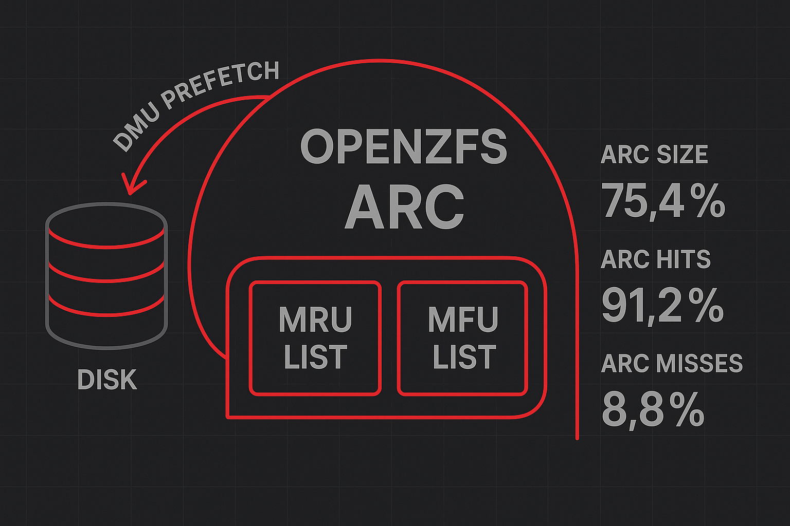

In Enterprise-Umgebungen, sei es TrueNAS SCALE, OpenZFS auf Linux oder FreeBSD-basierte Systeme, wird Performance-Tuning oft als erster Reflex betrachtet. Die Verlockung ist verständlich: Hunderte Parameter warten darauf, optimiert zu werden. Doch die jahrelange Praxis zeigt: **Blindes Tuning führt häufiger zu Degradation als zu Verbesserung.**

Der OpenZFS-Stack hat sich über Jahre hinweg entwickelt und die Defaults reflektieren kollektive Erfahrung aus Millionen Deployments. Während spezifische Workloads durchaus von gezielten Anpassungen profitieren können, ist das Verständnis der zugrundeliegenden Mechanismen entscheidend. Dieser Artikel beleuchtet den **Adaptive Replacement Cache (ARC)** mit Prefetch.

## Der Adaptive Replacement Cache (ARC)

Der ARC unterscheidet sich fundamental von klassischen LRU-Caches. Statt nur die zeitliche Nähe von Zugriffen zu betrachten, balanciert der ARC **Recency** (Aktualität) und **Frequency** (Häufigkeit) dynamisch aus. Die Implementierung nutzt vier separate Listen:

- **MRU (Most Recently Used)**: Blöcke mit einem oder wenigen Zugriffen
- **MFU (Most Frequently Used)**: Blöcke mit häufigen, wiederholten Zugriffen
- **Ghost MRU**: Metadaten eviktierter MRU-Einträge (ohne Daten)
- **Ghost MFU**: Metadaten eviktierter MFU-Einträge (ohne Daten)

Die Ghost-Listen sind der Schlüssel zur Adaptivität: Sie benötigen nur wenige Bytes pro Eintrag, liefern aber kritisches Feedback. Wird ein eviktierter Block erneut angefordert, adjustiert der ARC die Balance zwischen MRU und MFU.

### ARC Memory Management in TrueNAS

Auf TrueNAS SCALE (Linux-basiert) verhält sich der ARC anders als auf TrueNAS CORE (FreeBSD). Beide Systeme zeigen das RAM als "genutzt" an, obwohl der ARC bei Bedarf sofort Speicher freigibt.

Der ARC cached Data **und** Metadata. Auf Systemen mit Millionen kleiner Dateien kann Metadata 30-50% des ARC belegen - ein häufig übersehener Faktor bei Dimensionierung.

### Monitoring: arcstat in der Praxis

Das `arcstat`-Tool bietet Echtzeit-Einblick in ARC-Operationen. Auf TrueNAS SCALE:

```bash
arcstat 1
arcstat -f time,read,pread,ph%,size,c,avail,hit%,l2hit% 1
```

```bash
# Output alle 1 Sekunden:
    time  read  pread  ph%  size     c  avail  hit%  l2hit%
18:40:42  8.7K      0    0  314G  316G    13G   100       0
18:40:43  225K     16   62  314G  316G    13G    99      60
```

**Spalten-Erklärung:**
- `pread`: **Prefetch Reads** – DMU spekulatives Read-Ahead
- `ph%`: **Prefetch Hit-Ratio** – wie viele Prefetches im Cache lagen
- `hit%`: **Gesamt-Hit-Ratio** – alle Reads (Demand + Prefetch)

### DMU Prefetch verstehen

```
User liest Block 1, 2, 3, 4 → DMU prefetcht Block 5, 6, 7, 8
→ Bei weiterem Sequential Read: instant Cache-Hit statt Disk-Wait
```

**Prefetch-Hit-Ratio (ph%) Bewertung:**
- `ph%` 60-100%: Excellent – Prefetch trifft Pattern perfekt
- `ph%` 20-60%: OK – Teilweise richtig geraten
- `ph%` 0-20%: Ineffektiv – Random I/O, kein Sequential Pattern

**Wichtig:** Niedriger `ph%` ist **kein Problem**! Prefetch kostet wenig, falsches Prefetch wird verworfen. Kritisch ist die **Gesamt-Hit-Ratio**.

### ARC Tuning: Wann und wie

**Scenario 1: Datenbank-Server (PostgreSQL/MySQL)** – Datenbanken haben eigene Buffer-Caches und konkurrieren mit dem ARC:
```bash
echo 17179869184 > /sys/module/zfs/parameters/zfs_arc_max  # 16GB

# Persistent via /etc/modprobe.d/zfs.conf:
options zfs zfs_arc_max=17179869184
```

**Scenario 2: Virtualization Host** – VMs profitieren von großem ARC:
```bash
echo 21474836480 > /sys/module/zfs/parameters/zfs_arc_min  # 20GB Minimum
```

**Aber:** Die Defaults funktionieren in 90%+ aller Deployments optimal.

### arc_summary: Schneller Überblick
```bash
# ARC Status
arc_summary -s arc
```
Beispielauszug:
```bash
ARC status:                                                      HEALTHY
        Memory throttle count:                                         0

ARC size (current):                                    80.7 %  284.5 GiB
        Target size (adaptive):                        81.1 %  286.0 GiB
        Min size (hard limit):                          3.4 %   12.0 GiB
        Max size (high water):                           29:1  352.7 GiB
        Most Frequently Used (MFU) cache size:         82.1 %  223.8 GiB
        Most Recently Used (MRU) cache size:           17.9 %   48.8 GiB
        Metadata cache size (hard limit):              75.0 %  264.5 GiB
        Metadata cache size (current):                  9.3 %   24.6 GiB
        Dnode cache size (hard limit):                 10.0 %   26.5 GiB
        Dnode cache size (current):                    18.2 %    4.8 GiB

ARC hash breakdown:
        Elements max:                                              26.7M
        Elements current:                              69.8 %      18.6M
        Collisions:                                                 6.4G
        Chain max:                                                     8
        Chains:                                                     2.2M

ARC misc:
        Deleted:                                                    2.9G
        Mutex misses:                                               9.5M
        Eviction skips:                                             1.6G
        Eviction skips due to L2 writes:                            7.3k
        L2 cached evictions:                                   156.1 TiB
        L2 eligible evictions:                                 166.1 TiB
        L2 eligible MFU evictions:                     72.5 %  120.4 TiB
        L2 eligible MRU evictions:                     27.5 %   45.8 TiB
        L2 ineligible evictions:                                 3.5 TiB
```

```bash
# ARC Hits
arc_summary -s archits
```
Beispielauszug:
```bash
ARC total accesses (hits + misses):                                 1.2T
        Cache hit ratio:                               99.8 %       1.2T
        Cache miss ratio:                               0.2 %       2.1G
        Actual hit ratio (MFU + MRU hits):             99.8 %       1.2T
        Data demand efficiency:                        97.2 %      43.7G
        Data prefetch efficiency:                       6.5 %     578.7M

Cache hits by cache type:
        Most frequently used (MFU):                    98.0 %       1.2T
        Most recently used (MRU):                       2.0 %      24.6G
        Most frequently used (MFU) ghost:             < 0.1 %     200.7M
        Most recently used (MRU) ghost:               < 0.1 %     169.9M

Cache hits by data type:
        Demand data:                                    3.5 %      42.4G
        Prefetch data:                                < 0.1 %      37.8M
        Demand metadata:                               96.5 %       1.2T
        Prefetch metadata:                            < 0.1 %     450.6M

Cache misses by data type:
        Demand data:                                   57.5 %       1.2G
        Prefetch data:                                 25.5 %     540.9M
        Demand metadata:                                7.3 %     155.2M
        Prefetch metadata:                              9.7 %     205.0M
```

### Schlüsse (praxisnah)
- **hit% ≥ 95%**: Optimal, kein Tuning nötig; 85–95%: gut; <85%: Workload/Größe prüfen.
- **MFU ≫ MRU**: Working Set wiederholend (guter Cache-Fit). **MRU ≫ MFU**: eher sequentiell/wechselnd.
- **Metadata‑Anteil hoch**: Viele kleine Dateien – RAM‑Planung entsprechend erhöhen.
- Erst messen (arcstat/arc_summary), dann minimal anpassen; Defaults sind meist richtig.


---

### Weiterlesen
- **Übersicht**: [Serie](/blog/zfs-arc-l2arc-slog/)
- **Nächster Teil**: [L2ARC](/blog/zfs-l2arc/)
