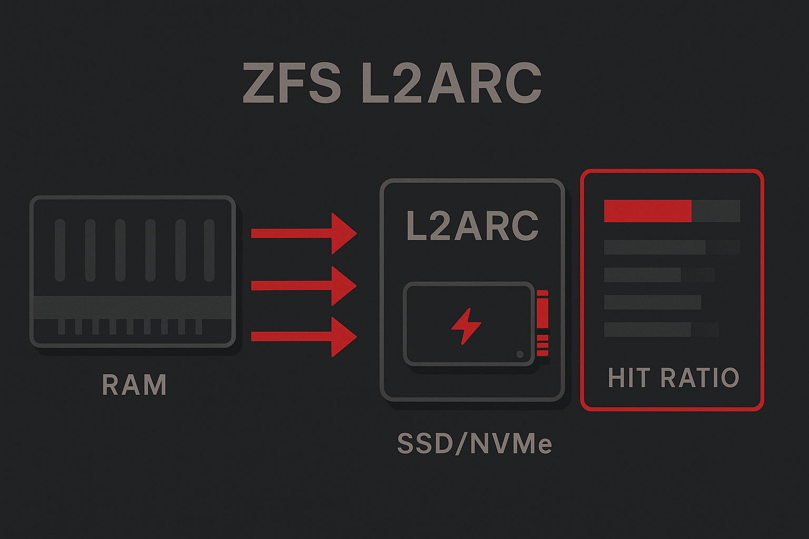

## L2ARC: Cache-Extension mit Tücken

Der L2ARC erweitert den RAM-basierten ARC auf Flash-Storage (NVMe/SSD). **Kritisch:** L2ARC ist ein **Read-Only-Cache** für eviktierte ARC-Blöcke. Neue Writes landen nie direkt im L2ARC – nur Daten, die aus dem ARC verdrängt wurden und noch im Dataset existieren.

### Die 80-Byte-Regel: RAM-Overhead

Jeder Block im L2ARC benötigt einen **Header im ARC-RAM**. Bei ZFS-Blocksize 128K:

```
1 TB L2ARC = 8.388.608 Blöcke (128K)
8.388.608 * 80 Bytes = 671 MB RAM-Overhead
```

**Praxis-Beispiel TrueNAS:**
- System: 64 GB RAM, 50 GB für ARC verfügbar
- L2ARC: 2x 1TB NVMe (2 TB total)
- RAM-Overhead: ~1.3 GB
- **Effektiver ARC: 48.7 GB** (nicht 50 GB!)

Bei komprimiertem Dataset (compression=lz4, ratio 2:1) speichert L2ARC compressed Data → doppelter RAM-Overhead.

```bash
# L2ARC Header Status prüfen
cat /proc/spl/kstat/zfs/arcstats | grep l2_hdr_size
```

### L2ARC Tuning: Write-Rate kontrollieren

**Problem:** Aggressive L2ARC-Feeds können SSDs vorzeitig verschleißen!

### Wann L2ARC Sinn macht

**✅ Ideal:**
- Working Set 1.5–3x größer als RAM
- Read-Heavy Workloads (>80% Reads)
- VM-Storage mit häufig genutzten VMDKs
- Media-Server (Plex, Jellyfin)

**❌ Problematisch:**
- Working Set > 10x RAM (zu viele Misses)
- Write-Heavy Loads (L2ARC hilft nur Reads)
- Limitiertes RAM (< 32 GB)
- Sequential Streaming (kein Re-Read)

### L2ARC Hit-Ratio: Realistische Erwartungen

Anders als beim ARC sind beim L2ARC **niedrigere Hit-Ratios normal und trotzdem wertvoll**.

**Bewertung:**
- `l2hit%` > 25%: Excellent – 25%+ weniger Disk-Reads
- `l2hit%` 10–25%: Gut – spürbar weniger Disk-I/O
- `l2hit%` < 10%: Fragwürdig – Working Set zu groß/Write-Heavy

```bash
arcstat -f time,read,hit%,l2hit%,l2size 1
```

Schon 20–30% L2ARC-Hit-Ratio rechtfertigt das Device – L2ARC ist ein **Disk-I/O Reducer**, kein Hit-Booster.


### arc_summary (L2ARC-Breakdown)
```bash
arc_summary -s l2arc
```
Beispielauszug:
```bash
L2ARC size (adaptive):                                  1015.0 GiB
        Compressed:                                    58.3 %  591.9 GiB
        Header size:                                    0.1 %  792.0 MiB
        MFU allocated size:                            82.8 %  490.2 GiB
        MRU allocated size:                            16.8 %   99.2 GiB
        Prefetch allocated size:                        0.5 %    2.7 GiB
        Data (buffer content) allocated size:          99.1 %  586.8 GiB
        Metadata (buffer content) allocated size:       0.9 %    5.3 GiB
```

### Schlüsse (praxisnah)
- **Header size** ≈ RAM‑Overhead – bei großem L2ARC im RAM mitplanen.
- **MFU dominiert**: Wiederholte Hot‑Data profitieren; **MRU hoch**: wechselnde Daten → geringerer Nutzen.
- **l2hit% 20–30%** ist realistisch und oft wirtschaftlich; <10% → Nutzen hinterfragen.


---

### Weiterlesen
- **Übersicht**: [Serie](/blog/zfs-arc-l2arc-slog/)
- **Vorheriger Teil**: [ARC](/blog/zfs-arc/)
- **Nächster Teil**: [ZIL/SLOG](/blog/zfs-zil-slog/)
