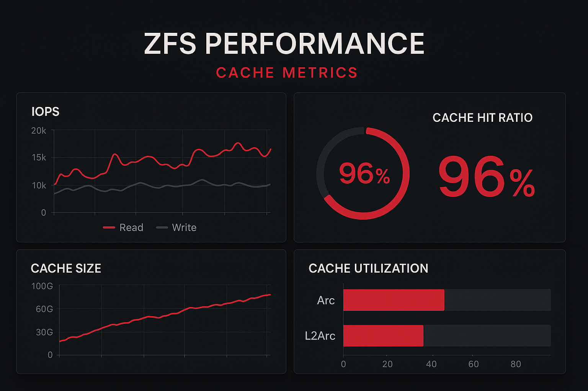

Die Inhalte dieses Artikels wurden in vier fokussierte Beiträge aufgeteilt. Nutzen Sie diese Übersicht, um gezielt ins gewünschte Thema einzusteigen:

### Teil 1 – ARC mit Prefetch
- Grundlagen des Adaptive Replacement Cache (ARC)
- Prefetch (DMU), `arcstat`/`arc_summary`, Hit‑Ratios und Monitoring
- Wann und wie ARC‑Tuning überhaupt sinnvoll ist

[Weiterlesen: ARC mit Prefetch](/blog/zfs-arc/)

### Teil 2 – L2ARC
- Nutzen und Grenzen des L2ARC, realistische Hit‑Ratios
- RAM‑Overhead (Header), Feeds, Bewertung in der Praxis

[Weiterlesen: L2ARC](/blog/zfs-l2arc/)

### Teil 3 – ZIL/SLOG (Architektur)
- ZIL‑/SLOG‑Mechanik, TXG‑Zyklus, Latenz statt Durchsatz
- Ausfallverhalten, Import mit `-m`, Mirroring

[Weiterlesen: ZIL/SLOG](/blog/zfs-zil-slog/)

### Teil 4 – Best Practices mit ZIL/SLOG
- Entscheidungsmatrix nach Pool‑Typ/Workload
- Sizing‑Faustregeln, Betrieb, Alternativen (z. B. `sync=disabled`)

[Weiterlesen: Best Practices](/blog/zfs-slog-best-practices/)

---

Hinweis: Die Serie richtet sich an Praktiker. Starten Sie mit dem für Ihren Anwendungsfall relevantesten Teil und verweisen Sie intern gern auf die übrigen Kapitel.
