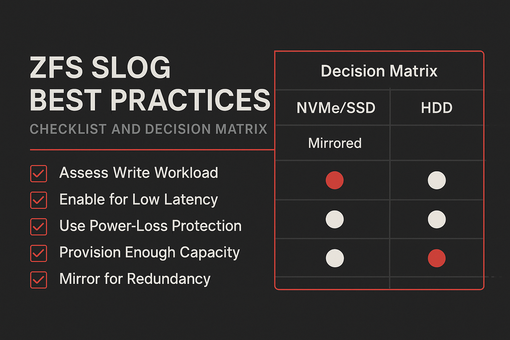

## Entscheidungsmatrix nach Szenario

**NVMe-Pool, Production:** Default-ZIL auf Pool – SLOG meist unnötig.

**SSD-Pool, High-Load:** Optional SLOG bei >10K Sync-IOPS, ideal gespiegelt.

**HDD-Pool:** Gespiegeltes SLOG dringend empfohlen (großer Latenzgewinn).

**Single-Node, Non-Critical:** `sync=disabled` pragmatisch – Performance > Durability.

## Sizing und Auslegung

**SLOG-Größe (Daumenregel):**

```
SLOG = (Max Sync-Write-Rate × 10s) × 2
```

Typisch reichen 16–32 GB pro SLOG-Device (gespiegelt).

**Latenz vor Durchsatz:** Entscheidend ist Write-Latenz (μs), nicht MB/s.

## Operativer Betrieb

**Monitoring:**
```bash
zpool iostat -v tank 1
```

**Import bei fehlendem SLOG:**
```bash
zpool import -m tank
```

## Risiken realistisch bewerten

- Single SLOG: Risiko eines 0–5s-Datenverlusts bei unmittelbar folgendem Crash.
- Mirrored SLOG: Minimiert Risiko, erhöht Kosten und Komplexität.
- Kein SLOG: Sicher, aber höhere Sync-Latenzen.

## Die radikale Alternative: sync=disabled

**Das ultimative Performance-Tuning** für synchrone Writes ist kein SLOG, sondern ein Datastore oder Pool mit **`sync=disabled`**:

```bash
# Synchrone Writes komplett deaktivieren
zfs set sync=disabled tank/vmstore

# Verifikation:
zfs get sync tank/vmstore
# NAME           PROPERTY  VALUE     SOURCE
# tank/vmstore   sync      disabled  local
```

**Was passiert:**
- Alle Writes werden als **asynchron** behandelt
- Kein ZIL/SLOG-Overhead
- ACK **sofort** nach RAM-Buffer
- Daten werden erst bei TXG-Commit (5s) vom RAM auf den Pool persistiert

**Performance-Impact:**
```
Mit SLOG (NVMe):     ~0.1ms write ACK-Latency
Mit sync=disabled:   ~0.01ms write ACK-Latency (10x schneller!)
```

### Single-Node-Systeme: Pragmatischer Ansatz

**Kontroverse Meinung:** Bei Single-Node-Systemen ist `sync=disabled` oft **unproblematisch**:

**Begründung:**
1. **Single Point of Failure existiert bereits:**
   - Host stirbt → Alle VMs/Services tot
   - SLOG-Redundanz schützt nicht vor Host-Ausfall
   - Kein Failover zu anderen Nodes

2. **Datenverlust-Fenster identisch:**
   ```
   mit sync=disabled:       Host-Crash → 0-5s Async-Writes verloren. Clients müssen sehr wahrscheinlich neu gestartet werden (reboot).
   Mit SLOG:                Host-Crash → 0-5s Sync-Writes verloren. Auch hier wird das ZFS System nicht schnell genug wiederkommen, damit
                            dir Clients den reboot(oder shutdown) überleben können. Deswegen steht hier auch ein Restart der Clients an.
   → Praktisch gleicher Impact!
   ```

3. **Workload-Realität:**
   - VMs/Datenbanken haben eigene Journale/Logs
   - Filesystem-Inkonsistenz = VM-Reboot nötig
   - **Host-Ausfall erzwingt VM-Reboot sowieso**

**Praxis-Beispiel - VM-Host mit TrueNAS:**
```bash
# Szenario: 10 VMs auf Single TrueNAS-Host
zfs set sync=disabled tank/vms # pro Dataset möglich
# oder pro Pool
zfs set sync=disabled tank

# Host-Crash:
# 1. Alle VMs terminieren ungraceful (Power-Loss)
# 2. ZFS: Letzte 0-5s Writes möglicherweise verloren
# 3. VM-Start: Filesystem-Check (fsck/NTFS-Replay)
# 4. Applikationen: Recovery über eigene Logs

# → Outcome identisch zu: "Host mit SLOG gestorben"
```

**Wann sync=disabled NICHT nutzen:**
- **Multi-Node HA-Cluster:** Failover erwartet konsistente Daten
- **Shared Storage (NFS/iSCSI):** Clients erwarten Sync-Garantien
- **Compliance-Anforderungen:** ACID-Garantien vorgeschrieben
- **Paranoia-Level > 9000:** Lieber 10x langsamer als 5s Datenverlust

**Wann sync=disabled OK ist:**
- **Single-Node Virtualization:** Host-Tod = VM-Reboot sowieso
- **Development/Testing:** Performance > Durability
- **Workloads mit Application-Level-Journaling:** PostgreSQL/MySQL machen eigenes fsync()
- **Backup-Targets:** Daten existieren woanders

## Alternativen und Tuning

- ARC/L2ARC korrekt dimensionieren, bevor SLOG-Hardware beschafft wird.

## Sichere Tuning-Szenarien

**Scenario 1: Virtualization Host (Proxmox/TrueNAS)**

```bash
# /etc/modprobe.d/zfs.conf
options zfs zfs_arc_min=17179869184          # 16GB Minimum
options zfs zfs_arc_max=107374182400         # 100GB Maximum (bei 256GB RAM)
options zfs zfs_txg_timeout=10               # TXG auf 10s (weniger fragmentation)
```

**Scenario 2: Backup-Target (Write-Heavy)**

```bash
# Compression bevorzugen (CPU meist idle)
zfs set compression=zstd-3 tank/backup       # Bessere Ratio als lz4
zfs set recordsize=1M tank/backup            # Large-Block für Streams
zfs set sync=disabled tank/backup            # Siehe Sync=disabled Vergleich
```

**Scenario 3: Database mit eigenem Cache (PostgreSQL) oder MySQL mit ZFS als File-System**

```bash
# ARC stark limitieren
options zfs zfs_arc_max=8589934592           # 8GB max (bei 64GB RAM)
options zfs l2arc_noprefetch=1               # Prefetch-Pollution verhindern
```

## OpenZFS on TrueNAS: Platform-spezifische Hinweise

**TrueNAS SCALE (Linux):**
- Tunables via WebUI: System → Advanced → Sysctl
- Kernel-Module: `/sys/module/zfs/parameters/`
- ZFS-Properties: `zfs get all tank` (über 100 Properties!)

**TrueNAS CORE (FreeBSD):**
- Tunables via Shell: `sysctl vfs.zfs.arc_max=34359738368`
- Persistent: `/boot/loader.conf`
- ZIL-Commits: `sysctl vfs.zfs.zil_replay_disable=0` (nie auf 1!)

**TrueNAS-Warnung:** TrueNAS WebUI überschreibt manche Tunables beim Update. **Custom-Tuning immer dokumentieren!**

## Checkliste vor dem Kauf

- Workload-Analyse: Anteil Sync-Writes, IOPS, Latenzanforderungen
- Pool-Medien: NVMe/SSD/HDD – Grundlatenz beachten
- Redundanz: Single vs. mirrored SLOG
- Recovery-Plan: Import mit `-m`, Monitoring, Alerting

---

### Weiterlesen
- **Übersicht**: [Serie](/blog/zfs-arc-l2arc-slog/)
- **Vorheriger Teil**: [ZIL/SLOG](/blog/zfs-zil-slog/)
