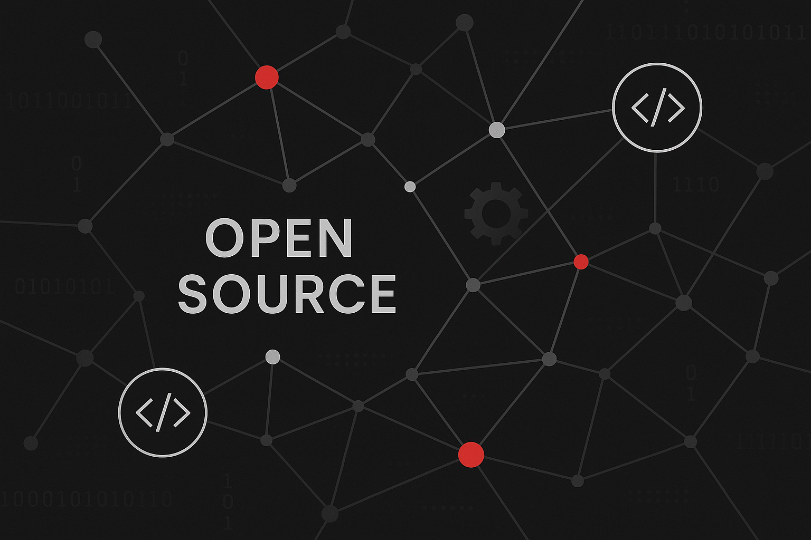

Open Source ist längst kein Nischenthema mehr. Unternehmen jeder Größe setzen heute auf offene Softwarelösungen – sei es für Serverinfrastrukturen, Datenbanken, Collaboration-Tools oder spezielle Fachanwendungen. Der Vorteil liegt auf der Hand: Unabhängigkeit von einzelnen Herstellern, transparente Codebasis und die Möglichkeit, Technologien an die eigenen Bedürfnisse anzupassen.

Doch wie wirkt sich Open Source im Unternehmenskontext wirklich aus? Der Blick aus drei Rollen – Anwender, Anbieter und Maintainer – zeigt, dass neben Freiheit und Innovationskraft auch neue Verantwortlichkeiten entstehen.

## Praxis bei Stylite: Open Source seit über 20 Jahren

Aus Sicht von Stylite ist dieses Thema seit über 20 Jahren gelebte Praxis. Wir arbeiten technologieoffen und suchen stets nach neuen, leistungsfähigen Lösungen jenseits der großen Hyperscaler.

Im täglichen Einsatz setzen wir auf bewährte Open-Source-Tools:

- **Nextcloud** für sicheres Filesharing
- **BigBlueButton** für Videokonferenzen
- **Mattermost** als leistungsfähige Chatplattform
- **OpenProject** für professionelles Projektmanagement

Diese Lösungen ermöglichen es uns und unseren Kunden, flexibel, unabhängig und datenschutzkonform zu arbeiten – ohne dabei auf Komfort und Benutzerfreundlichkeit zu verzichten.

## Open Source im Gesundheitswesen: Ein Praxisbeispiel

Ein eindrucksvolles Beispiel für die Bedeutung von Open Source findet sich im Gesundheitswesen: Viele Kliniken und Forschungseinrichtungen weltweit nutzen die Open-Source-Plattform **OpenMRS** (Open Medical Record System), um Patientendaten sicher und effizient zu verwalten.

Das System ermöglicht eine digitale Dokumentation medizinischer Abläufe – von der Diagnose bis zur Medikation – und wird vor allem in Entwicklungsländern eingesetzt, wo proprietäre Software oft zu teuer oder zu unflexibel wäre. Durch die offene Architektur kann jede Einrichtung Anpassungen für lokale Anforderungen, Datenschutzrichtlinien oder Sprachen vornehmen.

So zeigt sich: **Open Source ist häufig die Basis für kritische Infrastrukturen**, auch wenn Nutzer es nicht auf den ersten Blick erkennen.

## Perspektive 1: Der Unternehmensanwender

### ✅ Vorteile

- **Digitale Souveränität**: Keine Bindung an proprietäre Anbieter, volle Kontrolle über Daten und Systeme.
- **Kostenflexibilität**: Wegfall hoher Lizenzgebühren, Investitionen fließen in Support und Know-how.
- **Anpassbarkeit**: Möglichkeit, Software individuell zu erweitern oder zu modifizieren.
- **Transparenz und Sicherheit**: Einsehbarer Quellcode ermöglicht unabhängige Sicherheitsprüfungen.

### ⚠️ Herausforderungen

- **Technisches Know-how erforderlich**: Eigenes Fachwissen oder externe Experten sind nötig, um Open-Source-Systeme dauerhaft zu betreiben.
- **Support-Fragen**: Community-Support ist wertvoll, aber nicht immer mit garantierten SLA-Zeiten verbunden.
- **Integrationsaufwand**: Anpassungen und Schnittstellen zu bestehenden Systemen können mehr Projektzeit erfordern.
- **Verantwortung für Betrieb**: Fehlerbehebung und Updates liegen oft in Eigenregie.

## Perspektive 2: Der Open-Source-Anbieter

### ✅ Vorteile

- **Marktzugang ohne Lizenzbarriere**: Niedrige Einstiegshürden für Kunden.
- **Innovation durch Community**: Feedback und Verbesserungsvorschläge aus einer breiten Nutzerbasis.
- **Langlebigkeit durch offenen Code**: Software kann über den Anbieter hinaus weiterentwickelt werden.

### ⚠️ Herausforderungen

- **Konkurrenz durch Forks**: Abgespaltene Projekte können Marktanteile entziehen.
- **Geringere unmittelbare Einnahmen**: Monetarisierung oft nur über Service, Support und Zusatzfunktionen möglich.
- **Hohe Transparenzpflicht**: Sicherheitslücken oder Fehler sind in offenen Repositories für jedermann sichtbar.

## Perspektive 3: Der Maintainer

### ✅ Vorteile

- **Einfluss auf Projektentwicklung**: Direkte Steuerung über Funktionen, Architektur und Roadmap.
- **Starke Vernetzung**: Zusammenarbeit mit Entwicklern weltweit, Zugang zu vielfältigen Expertisen.
- **Langfristige Wissensbildung**: Internes Know-how wächst und stärkt die eigene Technologiebasis.

### ⚠️ Herausforderungen

- **Kontinuierliche Pflege nötig**: Updates, Sicherheitspatches und neue Features benötigen fortlaufende Ressourcen.
- **Verantwortung für Qualität und Stabilität**: Fehler wirken sich unmittelbar auf Nutzer aus.
- **Abhängigkeit von Freiwilligen**: Fehlt die Community-Teilnahme, tragen Maintainer oft allein die Last.

## Fazit: Mit Freiheit kommt Verantwortung

Open Source im Unternehmen ist kein Selbstläufer. Die Vorteile – digitale Souveränität, Anpassbarkeit und Innovationskraft – sind starke Argumente, aber sie kommen mit Verantwortung.

Wer Open Source einsetzt, muss nicht nur die Technologie verstehen, sondern auch den Betrieb nachhaltig sichern:

- **Anwender** müssen Know-how aufbauen und Ressourcen einplanen
- **Anbieter** müssen klare Support-Modelle schaffen, um wettbewerbsfähig zu bleiben
- **Maintainer** tragen die technische und strukturelle Verantwortung, damit der offene Code nicht nur verfügbar, sondern auch verlässlich bleibt

Stylite zeigt seit Jahrzehnten, dass dieser Weg funktioniert – kompromisslos technologieoffen, praxisnah und immer im Dienst nachhaltiger, unabhängiger IT-Strategien.

---

*Matteo Keller ist bei Stylite AG im Marketing tätig und beschäftigt sich schwerpunktmäßig mit innovativen Open-Source-Lösungen für Unternehmen.*
