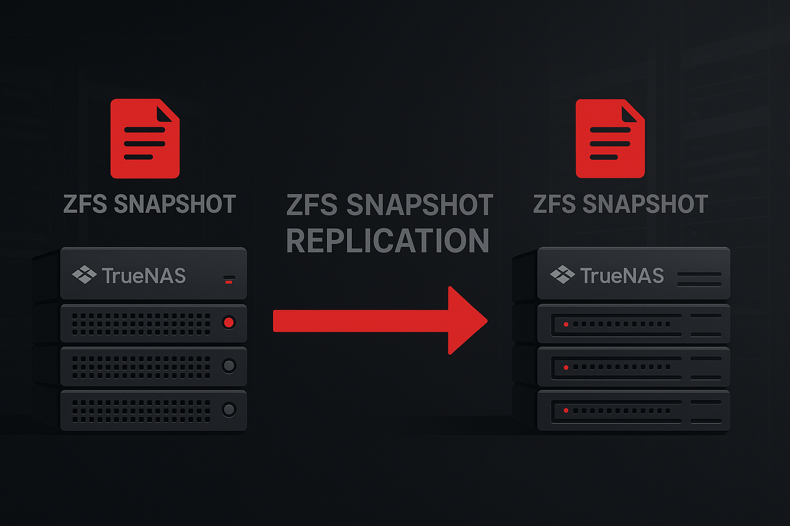

ZFS Snapshot-Replikation ist eine der mächtigsten Funktionen von TrueNAS für Disaster Recovery und Datensicherung. Im Gegensatz zu herkömmlichen Backup-Lösungen nutzt die Replikation die inhärenten Snapshots von ZFS, um effiziente, punkt-in-time-konsistente Kopien zwischen Systemen zu erstellen.

Dieser Artikel erklärt das Prinzip der Remote-Replikation in TrueNAS SCALE, zeigt den Unterschied zwischen Push- und Pull-Replikation und führt durch die GUI-Konfiguration.

**Hinweis zu TrueNAS CORE:** Die GUI und Konfiguration in TrueNAS CORE (FreeBSD-basiert) ist sehr ähnlich. Replikation zwischen CORE und SCALE ist möglich – idealerweise von CORE zu SCALE, da SCALE die neuere ZFS-Version verwendet und ZFS abwärtskompatibel ist. Eine Replikation von SCALE zu CORE kann bei neueren ZFS-Features zu Kompatibilitätsproblemen führen.

## Was ist ZFS Snapshot-Replikation?

### Das Grundprinzip

ZFS Snapshots sind read-only Momentaufnahmen eines Datasets zu einem bestimmten Zeitpunkt. Die Replikation überträgt diese Snapshots zwischen verschiedenen TrueNAS-Systemen, wodurch eine exakte Kopie der Daten am Zielort entsteht.

TrueNAS verwendet intern **[zettarepl](https://github.com/truenas/zettarepl)**, ein Python-Framework für ZFS-Replikation, das die gesamte Snapshot-Verwaltung, SSH-Kommunikation und Scheduling übernimmt. Die GUI ist letztlich ein Frontend für dieses leistungsfähige Tool.

**Hinweis für Fortgeschrittene:** Zettarepl ist nicht zwingend erforderlich. Wer lieber direkte Kontrolle möchte, kann Replikation manuell mit `zfs send`/`zfs receive` und Cronjobs konfigurieren:

```bash
# Beispiel: Snapshot erstellen und via SSH replizieren
zfs snapshot tank/data@backup-$(date +%Y%m%d-%H%M%S)
zfs send -I tank/data@previous tank/data@latest | ssh backup-server "zfs receive backup/data"
```

Die GUI bietet jedoch deutlich mehr Komfort:
- **Automatisches Snapshot-Management**: Integration mit Periodic Snapshot Tasks
- **Snapshot-Filterung**: Auswahl über Naming Schema (`auto-%Y-%m-%d_%H-%M`) oder reguläre Ausdrücke
- **Fehlerbehandlung**: Automatische Wiederholungsversuche bei temporären Fehlern
- **Logging und Status-Überwachung**: Detaillierte Logs und Real-Time-Status in der GUI
- **Retention-Management**: Automatische Löschung alter Snapshots nach Zeitplan

**Wichtige Eigenschaften:**

- **Inkrementiell**: Nach dem initialen Transfer werden nur Änderungen (Deltas) übertragen
- **Konsistent**: Snapshots sind immer in einem konsistenten Zustand (atomare Operation)
- **Effizient**: ZFS sendet nur geänderte Blöcke, nicht ganze Dateien
- **Komprimiert**: Daten werden während der Übertragung komprimiert (wenn konfiguriert)

### Abgrenzung zu anderen Backup-Methoden

**Snapshot-Replikation vs. Rsync/File-Copy:**

- Replikation arbeitet auf ZFS-Block-Ebene, nicht auf Datei-Ebene
- Deutlich effizienter bei großen Datasets mit vielen kleinen Änderungen
- Behält ZFS-Eigenschaften (Compression, Deduplication, etc.)
- Kann verschlüsselte Datasets replizieren, ohne sie zu entschlüsseln

**Snapshot-Replikation vs. traditionelle Backups:**

- Block-Level-Transfer statt File-Level
- Replikation ist geografisch getrennt möglich
- Replikation behält Historie (mehrere Snapshots)

## Remote-Replikation: Push vs. Pull

TrueNAS SCALE unterstützt zwei Replikationsmodi, die unterschiedliche Anwendungsfälle abdecken: **Push** und **Pull**.

### Push-Replikation (Standard)

**Funktionsweise:**

Das **Quellsystem** initiiert die Verbindung zum Zielsystem und "schiebt" die Snapshots zum Remote-Server.

```
[Quell-TrueNAS] --SSH--> [Ziel-TrueNAS]
     (aktiv)              (passiv)
```

**Konfiguration:**

- Source Location: **On this System**
- Destination Location: **On a Different System**
- SSH-Verbindung vom Quellsystem zum Ziel konfigurieren

**Vorteile:**

- **Einfacheres Security-Modell**: Nur das Quellsystem benötigt Zugriff auf das Ziel
- **Zentrale Kontrolle**: Backup-Zeitplan wird auf dem Quellsystem verwaltet
- **Typischer Anwendungsfall**: Produktionssystem pusht zu Backup-System

**Sicherheitsrisiko bei Push-Replikation:**

Bei Push-Replikation hat das Quellsystem **Schreibzugriff** auf das Zielsystem. Ein Angreifer, der das Quellsystem kompromittiert, kann:

- **Snapshots am Ziel löschen** (inklusive älterer Backups)
- **Snapshots am Ziel manipulieren** (durch Löschen und Neusenden)
- **Ransomware-Szenarien**: Angreifer verschlüsselt Quelle UND löscht Backups am Ziel

Unter TrueNAS wird das erschwert, da das Zielsystem eine eigene SSH-Key benötigt, der ist aber nicht im Filesystem des Quellsystems gespeichert, sondern in der Config-Datenbank des Quellsystems. Aber ein Angriffeer könnte den Key aus der Config-Datenbank des Quellsystems extrahieren und verwenden.

### Pull-Replikation

**Funktionsweise:**

Das **Zielsystem** initiiert die Verbindung und "zieht" Snapshots vom Quellsystem.

```
[Quell-TrueNAS] <--SSH-- [Ziel-TrueNAS]
     (passiv)              (aktiv)
```

**Konfiguration:**

- Source Location: **On a Different System**
- Destination Location: **On this System**
- SSH-Verbindung vom Zielsystem zur Quelle konfigurieren

**Wichtig bei Pull-Replikation:**

Bei der Pull-Replikation müssen die Snapshots **auf dem Quellsystem** erstellt werden, nicht auf dem Ziel. Das bedeutet:

- Auf dem Quellsystem muss ein **Periodic Snapshot Task** konfiguriert sein
- Das Zielsystem repliziert nur bereits existierende Snapshots
- Der Replication-Task am Ziel kann keine Snapshots auf der Quelle erstellen

**Vorteile:**

- **Backup-System kontrolliert Zeitplan**: Unabhängig vom Quellsystem
- **Typischer Anwendungsfall**: Zentrale Backup-Appliance zieht von mehreren Quellen
- **Sicherheitsvorteil**: Quellsystem hat keinen Schreibzugriff auf Zielsystem, Ein Angreifer kann keine Snapshots am Ziel löschen.

**Herausforderungen:**

- Zielsystem benötigt SSH-Zugriff auf Quellsystem
- Snapshot-Erstellung muss separat auf Quelle konfiguriert werden

**Sicherheitsvorteil bei Pull-Replikation:**

Bei Pull-Replikation hat das Quellsystem **keinen Schreibzugriff** auf das Zielsystem. Ein Angreifer, der das Quellsystem kompromittiert:

- **Kann keine Snapshots am Ziel löschen** (nur lesender SSH-Zugriff)
- **Kann keine Backups manipulieren** (Ziel kontrolliert Empfang)
- **Ransomware-Schutz**: Selbst bei vollständiger Kompromittierung der Quelle bleiben Backups am Ziel intakt


**Best Practice für maximale Sicherheit:**
- **Pull-Replikation** von produktiven Systemen zu dedizierten Backup-Appliances
- **Read-only SSH-Keys** mit eingeschränkten Berechtigungen auf Quelle
- **Air-Gap-Strategie**: Zusätzlich offline Backups (z.B. Tape, ausgesteckte Festplatten)

## Sicherheit & Verschlüsselung

<details>
<summary>Verschlüsselung: Unterschiede bei Push und Pull – klicken für Details</summary>

### Verschlüsselung: Unterschiede bei Push und Pull

**Verschlüsselte Datasets replizieren:**

ZFS unterstützt das Replizieren verschlüsselter Datasets im "raw send" Modus, wobei die Daten verschlüsselt übertragen und empfangen werden.

**Unterschied: Encryption Key vs. Passphrase**

ZFS Dataset Encryption unterstützt zwei Authentifizierungsmethoden:

- **Encryption Key (Raw Key):**
  - Zufällig generierter 256-Bit Schlüssel (Hex-Format)
  - Automatisches Entsperren beim Boot (wenn Key in der TrueNAS-Datenbank gespeichert)
  - Ideal für automatisierte Systeme ohne manuelle Interaktion
  - **Bei Replikation**: Key bleibt auf Quelle, Ziel hat keinen Zugriff

- **Passphrase:**
  - Benutzer-definiertes Passwort (z.B. `MeinSicheresPasswort123!`)
  - Manuelle Eingabe beim Entsperren erforderlich (oder in Script gespeichert)
  - Ideal für höhere Sicherheitsanforderungen mit manueller Kontrolle
  - **Bei Replikation**: Passphrase bleibt auf Quelle, Ziel kennt sie nicht

**Bei Push-Replikation:**

- Quellsystem hat Zugriff auf Encryption-Key/Passphrase (ist ja Owner)
- Ziel erhält verschlüsselte Daten **ohne** Key/Passphrase
- **Am Ziel sind Daten verschlüsselt und nicht lesbar** (ohne Key-Import)
- Ideal für Offsite-Backups mit Zero-Knowledge-Prinzip

**Bei Pull-Replikation:**

- Quellsystem hat Encryption-Key/Passphrase
- Zielsystem kann verschlüsselt pullen (raw receive)
- **Auch hier: Ziel erhält verschlüsselte Daten ohne Key/Passphrase**
- Zusätzliche Sicherheit: Backup-System kann Daten nicht entschlüsseln

**Wichtig für Replikation:**

- Bei **raw send** (verschlüsselte Replikation) ist es egal, ob Quelle Key oder Passphrase nutzt
- Beide Methoden führen zum gleichen Ergebnis: Ziel hat verschlüsselte Blöcke ohne Entschlüsselungsmöglichkeit
- Der Unterschied wird erst bei Disaster Recovery relevant:
  - **Key**: Muss aus Backup importiert werden
  - **Passphrase**: Kann manuell eingegeben werden (wenn bekannt)

**Verschlüsselung erst am Ziel (Advanced):**

Es ist auch möglich, ein **unverschlüsseltes** Dataset von der Quelle zu replizieren und **am Ziel zu verschlüsseln**:

- **Quelle**: Dataset unverschlüsselt (z.B. für Performance oder Legacy-Gründe)
- **Ziel**: Dataset wird verschlüsselt empfangen
- **Konfiguration**: Ziel-Dataset mit Encryption erstellen, TrueNAS verschlüsselt beim `zfs receive`
- **Vorteil**: Quellsystem muss keine CPU-Last für Verschlüsselung tragen

**Disaster-Recovery-Szenario:**

Um am Zielort die Daten wiederherstellen zu können, muss der Encryption-Key separat gesichert werden:

- **Über die GUI**: 
- **Export Key** TODO Dataset-Details .. exportieren und sichern.


- **Best Practice**: Keys an mehreren sicheren Orten aufbewahren:
  - Key-Management-System (z.B. HashiCorp Vault, AWS KMS)
  - Verschlüsselter USB-Stick im Tresor
  - Passwort-Manager mit Team-Zugriff

</details>

<details>
<summary>Warum ist Failover schwierig? – klicken für Details</summary>

## Warum ist Failover schwierig?

Viele erwarten, dass man bei Ausfall des primären Systems einfach auf die Replikation umschalten kann. **Das ist komplexer als es klingt:**

### Technische Herausforderungen

**1. Read-Only Replicas:**

Replizierte Snapshots sind standardmäßig read-only am Zielort. Um das Ziel-Dataset beschreibbar zu machen, muss die Replikation gestoppt werden.

**2. Snapshot-Historie:**

Nach einem Failover zum Ziel-System entsteht eine neue Snapshot-Historie. Ein Failback zur ursprünglichen Quelle erfordert eine vollständige Resynchronisierung oder komplexe manuelle Snapshot-Verwaltung.

**3. IP-Adressen und Services:**

- Applikationen müssen auf neue IP-Adressen/Hostnamen umkonfiguriert werden
- Shares (SMB, NFS) zeigen auf altes System
- Keine automatische Service-Migration

**4. Bidirektionale Replikation:**

Für echtes Failover/Failback bräuchte man bidirektionale Replikation, was zusätzliche Komplexität bedeutet:

- Konfliktauflösung bei gleichzeitigen Änderungen
- Snapshot-Synchronisation in beide Richtungen
- Erhöhtes Risiko von Dateninkonsistenzen

### Was TrueNAS kann (und was nicht)

**TrueNAS Replikation ist optimiert für:**

- **Disaster Recovery** mit manueller Umschaltung
- **Langzeit-Archivierung** mit Snapshot-Retention
- **Offsite-Backups** mit getrennten Standorten

**TrueNAS Replikation ist NICHT:**

- Ein automatisches High-Availability (HA) System
- Ein Clustering-Lösung mit transparentem Failover
- Ein Ersatz für Application-Level-Redundanz

**Für echtes HA benötigt man:**

- TrueNAS Enterprise mit HA-Controller-Paar (shared storage)
- Oder: Application-Level-Clustering (z.B. Kubernetes mit persistenten Volumes)
- Oder: Block-Level-Replikation mit DRBD oder ähnlichen Technologien

</details>

## Advanced & Transport

### Transport-Methoden: SSH vs. Netcat

<details>
<summary>SSH vs. Netcat – wann was? (Ports, Active side, Hinweise)</summary>

- **SSH (Standard):** Verschlüsselt, einfach zu filtern; via Bandwidth‑Limit drosselbar
- **Netcat (LAN/isoliert):** Unverschlüsselt, extrem schnell; Active side + Port‑Range definieren; Firewall öffnen
- SSH bleibt Steuerkanal (Port 22); Netcat nutzt zusätzliche Datenports (Range)
- WAN: ZFS‑Stream‑Kompression bevorzugen; SSH‑Compression optional
- 10/25/40GbE: Netcat erwägen; nur in vertrauenswürdigen Netzen

</details>

Remote-Replikation unterstützt zwei Transport-Methoden für die Datenübertragung.

### SSH (Standard und empfohlen)

SSH ist die Standard-Transport-Methode für ZFS-Replikation:

**Vorteile:**
- **Verschlüsselt**: Alle Daten werden über SSH verschlüsselt
- **Authentifizierung**: Public-Key-basierte Authentifizierung
- **Firewall-freundlich**: Standard-Port 22, meist bereits offen
- **Bandbreiten-Kontrolle**: TrueNAS kann Bandwidth-Limits setzen
- **Kompression**: Optional: SSH-Kompression; zusätzlich zur ZFS-Stream-Kompression

**Nachteile:**
- **CPU-Overhead**: Verschlüsselung kostet Rechenleistung
- **Langsamerer Transfer**: Bei schnellen LANs (10GbE+) kann SSH zum Bottleneck werden

### Netcat (für schnelle, unverschlüsselte Transfers)

Netcat (`nc`) ermöglicht unverschlüsselte, direkte Socket-Verbindungen für **Bulk-Daten**:

**Wichtig zu verstehen:**

Auch bei Netcat-Replikation wird **SSH weiterhin benötigt**:

- **SSH-Verbindung**: Wird für Kontrolle, Authentifizierung und ZFS-Befehle verwendet
- **Netcat-Kanäle**: Separate TCP-Verbindungen nur für die eigentlichen ZFS-Stream-Daten
- **Ablauf**:
  1. TrueNAS stellt SSH-Verbindung her (Authentifizierung, Setup)
  2. Über SSH werden Netcat-Listener auf Quelle/Ziel gestartet
  3. ZFS-Snapshot-Daten fließen durch Netcat-Socket (unverschlüsselt, schnell)
  4. SSH bleibt für Koordination und Abschluss aktiv

**Vorteile:**
- **Höchstgeschwindigkeit**: Minimaler CPU-Overhead für Bulk-Daten, volle Link-Auslastung
- **Ideal für 10GbE/25GbE+**: Keine Verschlüsselungs-Bottlenecks für große Datenmengen
- **Einfaches Protokoll**: Direkter TCP-Stream ohne Overhead für Snapshot-Daten

**Nachteile:**
- **ZFS-Daten unverschlüsselt**: Snapshot-Stream wird im Klartext übertragen (SSH-Kontrolle bleibt verschlüsselt)
- **Zusätzliche Ports**: Netcat benötigt separate Ports (neben SSH Port 22)
- **Keine Bandbreiten-Kontrolle**: Volle Auslastung auf Netcat-Kanal, kann Netzwerk überlasten
- **Nur für vertrauenswürdige Netze**: Niemals über Internet oder unsichere LANs

**Wann Netcat verwenden?**

Netcat ist sinnvoll in folgenden Szenarien:
- **Dediziertes Backup-VLAN** ohne andere Dienste
- **Initiale Replikation** großer Datasets (mehrere TB) im LAN
- **10GbE+ Netzwerke** wo SSH-Verschlüsselung limitiert
- **Bereits verschlüsselte Datasets** (raw send) - doppelte Verschlüsselung unnötig

**Wichtig:** Für die meisten Produktivumgebungen ist SSH die bessere Wahl. Netcat nur in isolierten, vertrauenswürdigen Netzwerken verwenden.

**Active Side und Port-Range (Firewall):**
- In den Replikations‑Optionen die „Active side“ definieren (Quelle oder Ziel öffnet Verbindungen)
- Feste **Port‑Range** konfigurieren (z.B. 35000–35100) und in der Firewall freigeben
- SSH bleibt für Steuerung aktiv (Port 22); Netcat nutzt zusätzliche Datenports

## SSH-Verbindung konfigurieren

SSH ist die Standard-Transport-Methode und erfordert Zugriff zwischen den Systemen.

### Voraussetzungen

**Auf dem Zielsystem (bei Push) bzw. Quellsystem (bei Pull):**

1. **Admin-User mit Home-Directory:**
   - Benutzer muss ein Home-Directory haben (NICHT `/var/empty`)
   - Standardmäßig `/root` für root-user
   - Wird für SSH-Key-Storage benötigt
   - **Wichtig bei TrueNAS 13.0-U6.x (CORE)**: Remote-User ist immer `root`

2. **SSH-Service aktiviert:**
   - System → Services → SSH (auf "Running" setzen)
   - SSH-Service muss während der Task-Ausführung laufen (nicht nur beim Setup)
   - Password Authentication kann für das Setup kurzzeitig aktiviert werden
   - Nach dem Setup wieder deaktivieren und ausschließlich Key-Authentifizierung verwenden

3. **Sudo-Rechte für ZFS-Befehle:**
   - Admin-User benötigt passwordless `sudo` für `zfs`/`zpool` Befehle
   - In TrueNAS SCALE: Standard-Admin hat dies bereits
   - Alternative: "Use Sudo for ZFS Commands" in der GUI aktivieren (empfohlen)

### SSH-Connection in der GUI erstellen

TrueNAS bietet zwei Methoden zur SSH-Konfiguration:

**Option 1: Semi-automatic (empfohlen für TrueNAS-zu-TrueNAS):**

1. **Credentials → Backup Credentials → SSH Connections**
2. Klick auf **Add**
3. **Setup Method**: Semi-automatic (TrueNAS only)
4. **TrueNAS URL**: `https://remote-truenas.example.com` (oder IP)
5. **Admin Username/Password**: Root-User des Remote-Systems
6. **Name**: Beschreibender Name (z.B. "offsite-backup")

<!-- TODO: Screenshot einfügen: SSH Connection Setup - Semi-automatic -->
<!--  -->

Semi-automatic erstellt automatisch:
- SSH-Key-Pair auf dem lokalen System
- Installiert Public-Key auf Remote-System
- Testet die Verbindung

**Option 2: Manual (für Non-TrueNAS oder erweiterte Kontrolle):**

1. SSH-Key manuell generieren
2. Public-Key auf Remote-System in `~/.ssh/authorized_keys` eintragen
3. Private-Key in TrueNAS importieren

## GUI-Konfiguration: Schritt für Schritt

### Vorbereitung

**Vor dem Start:**

1. **Dataset am Zielort erstellen:**
   - Gehe zu **Datasets**
   - Erstelle ein neues Dataset für replizierte Daten (z.B. `backup/replicated`)
   - **Wichtig**: Der Wizard kann fehlende Ziel-Unterdatasets am angegebenen Pfad anlegen (keine neuen Pools)

2. **Periodic Snapshot Task erstellen (Quelle):**
   - **Data Protection → Periodic Snapshot Tasks → Add**
   - **Dataset**: Quell-Dataset auswählen
   - **Snapshot Lifetime**: z.B. 7 Tage
   - **Schedule**: z.B. stündlich oder täglich

**Hinweis:** TrueNAS kann theoretisch automatisch einen Periodic Snapshot Task erstellen, wenn keiner existiert. In der Praxis ist es jedoch empfehlenswert, den Task manuell zu erstellen, um volle Kontrolle über Naming Schema und Retention zu haben.

### Push-Replikation konfigurieren

Szenario: Produktionssystem (lokal) soll zu Backup-System (remote) pushen.

#### 1. Replication Task Wizard öffnen

- **Data Protection → Replication Tasks**
- Klick auf **Add**

Der Wizard führt durch die Konfiguration.

<!-- TODO: Screenshot einfügen: Data Protection > Replication Tasks Liste -->
<!--  -->


#### 2. What and Where (Quelle und Ziel)

**Source Location**: `On this System`

- Klick auf **Folder-Icon** neben Source
- **Dataset auswählen** (z.B. `tank/production`)
- **Recursive**: Aktivieren, wenn Unterverzeichnisse inklusive sein sollen

**Destination Location**: `On a Different System`

- **SSH Connection**: Dropdown → **Generate New** oder bestehende auswählen
- Falls neu: Semi-automatic Wizard (siehe SSH-Abschnitt oben)
- **Destination Dataset**: Pfad auf Remote-System (z.B. `backup/replicated/production`)
  - Tipp: Neue Unterverzeichnisse können direkt angelegt werden durch Anhängen von `/neuer-ordner` am Pfad

**Replicate Custom Snapshots** (optional):

- Standard: Nur automatisch erstellte Snapshots (von Periodic Snapshot Tasks) werden repliziert
- Aktivieren: Um auch manuell erstellte Snapshots zu replizieren
- **Naming Schema**: Pattern mit strftime-Format (z.B. `manual-%Y-%m-%d`)
- **Regex Pattern**: Alternativ regulärer Ausdruck für komplexe Muster (Performance-Hinweis: Regex kann bei vielen Snapshots langsam sein)

<!-- TODO: Screenshot einfügen: Wizard "What and Where" mit Source/Destination -->
<!--  -->


#### 3. When (Zeitplan)

**Replication Schedule:**

- **Run On a Schedule**: Aktivieren für geplante Replikation
  - **Schedule**: Daily, Hourly, Weekly, Monthly oder Custom (Cron)
  - Beispiel: Täglich um 02:00 Uhr
- **Run Once**: Einmalige Ausführung direkt nach Erstellung

**Destination Snapshot Lifetime** (Retention am Ziel):

- **Same as Source**: Identische Aufbewahrungsdauer wie Quelle
- **Never Delete**: Snapshots werden nicht automatisch gelöscht (manuelles Cleanup erforderlich)
- **Custom**: Eigene Aufbewahrungsdauer (z.B. 30 Tage, wenn Quelle nur 7 Tage behält)

**Make Destination Dataset Read-only?**

- Aktivieren: Verhindert versehentliche Änderungen am Ziel-Dataset
- Empfohlen für dedizierte Backup-Systeme
- Deaktivieren: Wenn am Ziel aktiv gearbeitet werden soll (nicht empfohlen für Backups)

<!-- TODO: Screenshot einfügen: Wizard "When" - Scheduling Options -->
<!--  -->


#### 4. Security and Task Name

**Encryption** (Dataset-Verschlüsselung am Ziel):

Diese Einstellung erstellt ein **verschlüsseltes Dataset am Zielort**:

- **Unencrypted**: Ziel-Dataset wird unverschlüsselt erstellt (Standard)
- **Encrypted**: Ziel-Dataset wird mit Encryption erstellt
  - **Encryption Key Format**: Hex (Base 16) oder Passphrase (alphanumerisch)
  - **Generate Encryption Key**: Automatische Key-Generierung für Ziel-Dataset
  - **Store Encryption key in Sending TrueNAS database**:
    - **Aktiviert** (Standard): Quelle speichert den Ziel-Key (ermöglicht automatische Replikation)
    - **Deaktiviert**: Key wird NICHT auf Quelle gespeichert (höhere Sicherheit, Ziel muss manuell entsperrt werden)

**Wichtig zu verstehen:**

- Diese Option erstellt Verschlüsselung **am Ziel**, nicht während des Transports
- Wenn deaktiviert: **Ziel kennt eigenen Key nicht** (Zero-Knowledge), muss nach Replikation manuell mit Key entsperrt werden
- Ideal für Offsite-Backups: Quelle kann replizieren, aber Ziel-Daten bleiben ohne separaten Key-Import unlesbar
- **Unterschied zu "raw send"**: Raw send repliziert bereits verschlüsselte Datasets; diese Option verschlüsselt am Ziel neu

**Use Case:**
- Unverschlüsselte Quelle → verschlüsseltes Ziel (z.B. für Compliance am Backup-Standort)
- Key nicht auf Quelle speichern = maximale Sicherheit (selbst bei Kompromittierung der Quelle bleibt Ziel geschützt)

**Key Handling (Empfehlung):**
- Schlüssel nach Möglichkeit NICHT in der Sending‑TrueNAS‑Datenbank speichern
- Schlüssel separat sichern (siehe Abschnitt „Disaster‑Recovery‑Szenario“)
- Für Pull: Schlüssel nie auf der Quelle ablegen; Ziel verwahrt eigene Keys
- Für Push: Nur speichern, wenn automatisches Entsperren betrieblich zwingend ist

**Task Name**: Beschreibend benennen (z.B. `production-to-offsite`)
- Wird automatisch aus Quelle/Ziel generiert, kann aber überschrieben werden

**Advanced Options:**

<details>
<summary>Erweiterte Optionen (ZFS send, Holds, Properties) – klicken für Details</summary>

- **Use Sudo for ZFS Commands**: Bei Non-Root SSH-User aktivieren
- **Hold pending snapshots (Quelle)**: Sperrt Quell‑Snapshots bis zur erfolgreichen Replikation, verhindert vorzeitiges Löschen
- **Delete stale snapshots on destination**: Entfernt am Ziel Snapshots, die an der Quelle nicht mehr existieren (Drift vermeiden)
- **Include dataset properties (-p)**: Repliziert ZFS‑Eigenschaften (z.B. Compression, Quotas, Reservations)
- **Include dataset permissions (ACLs)**: Repliziert Berechtigungen/ACLs mit (je nach Version verfügbar)
- **ZFS send Flags**:
  - **Large blocks (-L)**: Schneller bei großen Recordsizes; Quell- und Ziel‑Unterstützung nötig
  - **Embedded data (-e)**: Effizienter für kleine/komprimierte Daten
  - **Compressed send (-c)**: Sendet bereits komprimierte Blöcke; meist schneller über WAN
  - **Dedup send (-D)**: Selten sinnvoll (RAM‑intensiv, oft langsamer) – in der Regel deaktiviert lassen
- **Bandwidth limit**: Drosselt Replikation (z.B. 100 MiB/s), um Produktionslast zu schonen
- **Stream Compression (ZFS)**: Aktivieren für langsame/limitierte Links
- **Resumable replication**: Abgebrochene Streams werden automatisch über Resume‑Token fortgesetzt (sichtbar in Logs)

</details>

<!-- TODO: Screenshot einfügen: Wizard "Security and Task Name" mit Encryption-Optionen -->
<!--  -->


#### 5. Save und Execute

- **Save**: Task wird erstellt
- **Status**: Erscheint als "Pending" in der Liste
- **Run Now**: Für initiale Replikation klicken

<!-- TODO: Screenshot einfügen: Replication Task in der Liste mit Status -->
<!--  -->




### Pull-Replikation konfigurieren

Szenario: Backup-System (lokal) zieht von Produktionssystem (remote).

#### Unterschiede zu Push

**Source Location**: `On a Different System`

- **SSH Connection**: Verbindung zum Remote-Quellsystem
- **Remote Dataset**: Pfad auf Remote-System

**Destination Location**: `On this System`

- **Local Dataset**: Lokales Ziel-Dataset

**Wichtig:** SSH-Connection muss vom Backup-System zum Produktionssystem zeigen.

Alle anderen Schritte sind identisch.

#### Hinweise speziell für Pull

- Snapshots werden auf der **Quelle** durch Periodic Snapshot Tasks erzeugt (Ziel kann keine erstellen)
- **Hold pending snapshots** auf der Quelle aktivieren, damit Snapshots nicht vor Replikation gelöscht werden
- Bei mehreren Quellsystemen hilfreicher Betriebsmodus: Zentrale Backup‑Appliance zieht parallel (Bandbreitenlimit pro Task setzen)







### Lokale Replikation (im selben System)

- **Source Location**: On this System → Dataset A
- **Destination Location**: On this System → Dataset B (anderer Pool oder anderes Dataset)
- Nützlich für Migrationen zwischen Pools oder schnelle „Kaltkopie“ im selben Host

## Betrieb & Troubleshooting

### Replikation Status prüfen

**Data Protection → Replication Tasks:**

- **State**: SUCCESS, PENDING, RUNNING, FAILED
- **Last Snapshot Sent**: Letzter replizierter Snapshot
- **Enabled**: Task ist aktiv

**Details anzeigen:**

- Klick auf Task → **Expand** Symbol
- Zeigt detaillierte Logs und Transfer-Statistiken

<details>
<summary>Häufige Probleme – klicken für Details</summary>

### Häufige Probleme

**1. "SSH Connection Failed"**

- SSH-Service auf Remote-System aktiv?
- Firewall blockiert Port 22?
- SSH-Key korrekt installiert?

**Lösung:** Test mit `ssh root@remote-system` vom TrueNAS-Shell

**2. "Permission Denied for ZFS Command"**

- Admin-User hat keine Sudo-Rechte für ZFS
- **Lösung:** "Use Sudo for ZFS Commands" aktivieren

**3. "No Common Snapshots Found"**

- Initiale Replikation nach Manual-Changes am Ziel
- **Lösung:** Gemeinsamen Startpunkt wählen ("Replicate from a specific snapshot") oder Ziel-Dataset löschen und neu replizieren

**4. "Destination Dataset Already Exists"**

- Ziel-Dataset existiert bereits mit anderen Daten
- **Lösung:** Anderes Ziel-Dataset wählen oder bestehendes löschen

</details>

<details>
<summary>Best Practices – klicken für Details</summary>

### Best Practices

**Performance:**

- **Stream Compression aktivieren** bei WAN-Links
- **Bandwidth Limit setzen** um produktive Systeme nicht zu beeinträchtigen
- **Schedule außerhalb Peak-Zeiten** (nachts/Wochenende)
- **Large blocks / Embedded / Compressed send** aktivieren (Dedup send i.d.R. aus)

**Sicherheit:**

- **Verschlüsselte Datasets** für Offsite-Backups
- **Encryption-Keys separat sichern** (nicht auf Backup-System!)
- **SSH-Keys mit Passphrase schützen** (optional)

**Retention:**

- **Snapshot Lifetime** am Zielort länger als an Quelle setzen
- Beispiel: Quelle 7 Tage, Ziel 30 Tage
- Ermöglicht längere Wiederherstellungspunkte
- Interne/Service‑Datasets (z.B. `.system`) ausschließen oder nicht rekursiv replizieren

**Erweiterte Retention-Strategie (für komplexe Anforderungen):**

Wenn am Zielort eine andere Retention-Policy gewünscht ist (z.B. Grandfather-Father-Son-Schema), sollte das Snapshot-Naming-Schema angepasst werden:

- **Quelle**: Naming Schema auf `auto-hourly-`, `auto-daily-`, `auto-weekly-` umstellen (statt `auto-%Y-%m-%d_%H-%M`)
- **Ziel**: In der Replication Task GUI die Retention auf "Do Not Delete" (nicht löschen) setzen
- **Ziel**: Snapshot-Cleanup per Cronjob mit eigener Logik durchführen

Beispiel Naming Schemas:
```
Stündlich:  auto-hourly-%Y-%m-%d_%H-%M   (behalten: 24 Stunden)
Täglich:    auto-daily-%Y-%m-%d         (behalten: 7 Tage)
Wöchentlich: auto-weekly-%Y-W%U         (behalten: 4 Wochen)
Monatlich:  auto-monthly-%Y-%m          (behalten: 12 Monate)
```

Dies ermöglicht präzise Kontrolle über Retention per Kategorie. In einem kommenden Artikel wird ein Cronjob-basiertes Cleanup-Tool vorgestellt, das bei Stylite für granulare Retention-Policies eingesetzt wird.

**Testing:**

- **Regelmäßig Test-Restores durchführen**
- Disaster-Recovery-Prozess dokumentieren
- Failover-Szenario proben

</details>

## Mini-Glossar

- **Raw send**: ZFS sendet verschlüsselte Blöcke unverändert; Ziel erhält Daten ohne Schlüssel
- **Hold**: Schutzmarkierung auf Snapshots gegen Löschen (bis Replikation/Manuell entfernt)
- **Stale Snapshots**: Ziel‑Snapshots, die an der Quelle nicht mehr existieren (Drift)
- **Resume‑Token**: Marker, mit dem abgebrochene Replikationen fortgesetzt werden
 - **Periodic Snapshot Task**: Zeitplan zur automatischen Snapshot‑Erstellung auf der Quelle
 - **Naming Schema**: Namensmuster für Snapshots; muss mit Replikations‑Filter übereinstimmen
 - **Replication Task**: Automatisierter `zfs send/receive`‑Job zwischen Quelle und Ziel
 - **Push/Pull**: Richtung der Initiierung (Quelle schiebt / Ziel zieht)
 - **Netcat**: Unverschlüsselter Datenpfad für den Stream; SSH bleibt Steuerkanal
 - **Stream‑Kompression**: Komprimiert den Sendestream; meist vorteilhaft über WAN
 - **Large blocks / Embedded / Compressed / Dedup**: ZFS‑Send‑Flags; Dedup selten sinnvoll
 - **Properties/ACLs**: Mitübernahme von ZFS‑Eigenschaften und Berechtigungen
 - **snapdir**: Steuert Sichtbarkeit des `.zfs`‑Verzeichnisses (Einzeldatei‑Restore)
 - **Clone/Rollback**: Schreibbarer Abzweig aus Snapshot / vollständiges Zurücksetzen des Datasets
 - **Active side / Port‑Range**: Seite, die Datenverbindungen öffnet / freizugebende Ports
 - **Seeding**: Erste Vollübertragung lokal; danach inkrementell über WAN
 - **Air‑Gap**: Zeitweise physisch/logisch getrennte Backups für Ransomware‑Schutz

<details>
<summary>Security Hardening (SSH) – klicken für Details</summary>

### Security Hardening (SSH)

- Für Pull: SSH‑Key auf Quelle mit `command="/usr/bin/sudo /usr/sbin/zfs ..."` einschränken
- Optionen setzen: `no-agent-forwarding,no-port-forwarding,no-pty,no-user-rc`
- Nur notwendige Sudo‑Befehle erlauben (ZFS/ZPOOL); Shell‑Zugriff vermeiden
- PasswordAuth deaktivieren, nur Key‑Auth verwenden; Keys mit passphrase sichern (wenn praktikabel)

</details>

## Weiterführende Links

- [TrueNAS SCALE Docs – Data Protection (Replikation, Snapshots, SSH)](https://www.truenas.com/docs/scale/)
- [Zettarepl (TrueNAS Replikations‑Engine)](https://github.com/truenas/zettarepl)
- [OpenZFS – Konzepte zu Snapshots/Clones/Send‑Receive](https://openzfs.github.io/openzfs-docs/)
- [Microsoft – Volume Shadow Copy (Vorgängerversionen)](https://learn.microsoft.com/windows-server/storage/file-server/volume-shadow-copy-service)

## Mini-Checkliste

- Periodic Snapshot Task mit eindeutigem Naming Schema
- Replication Task: Hold pending + (optional) Delete stale aktivieren
- Advanced: Large blocks + Embedded + Compressed send an; Dedup send aus
- Properties/ACLs bei Bedarf mitreplizieren
- Bandwidth limit/Parallelisierung passend setzen
- SSH nur mit Keys; PasswordAuth nach Setup aus
- Netcat nur im vertrauenswürdigen LAN; Active side + Ports freigeben

## Weiterführende Links

- [TrueNAS SCALE Docs – Data Protection (Replikation, Snapshots, SSH)](https://www.truenas.com/docs/scale/)
- [Zettarepl (TrueNAS Replikations‑Engine)](https://github.com/truenas/zettarepl)
- [OpenZFS – Konzepte zu Snapshots/Clones/Send‑Receive](https://openzfs.github.io/openzfs-docs/)
- [Microsoft – Volume Shadow Copy (Vorgängerversionen)](https://learn.microsoft.com/windows-server/storage/file-server/volume-shadow-copy-service)

## Fazit

<details>
<summary>Restore / DR (Wie zurückspielen?) – klicken für Details</summary>

## Restore / DR (Wie zurückspielen?)

1. Ziel‑Dataset entsperren (falls verschlüsselt) und für Restore klonen oder zurückrollen
   - `zfs clone pool/dataset@snapshot pool/restore` oder `zfs rollback pool/dataset@snapshot`
2. Shares/Exports am Ziel setzen (SMB/NFS/ISCSI) und Pfade anpassen
3. Anwendungen testen (Datenkonsistenz, Berechtigungen/ACLs, Performance)
4. Bei Failback: Neue Snapshot‑Linie beachten; zurück zur Quelle replizieren (ggf. Full Resync)
5. Dokumentation der Schritte pflegen; regelmäßige Restore‑Tests einplanen

### Einzeldatei‑Restore aus Snapshots

- Ein Rollback stellt immer das **gesamte Dataset** auf den Snapshot‑Zustand zurück (nicht einzelne Dateien)
- Für einzelne Dateien: Im Mountpoint das virtuelle Verzeichnis `.zfs/snapshot/<SNAP>/...` öffnen (read‑only) und benötigte Dateien herauskopieren
  - Falls `.zfs` nicht sichtbar ist: Dataset‑Property `snapdir=visible` setzen
- Über SMB/Windows: „Vorgängerversionen"/Schattenkopien im Explorer nutzen, um Dateien aus Snapshots zu öffnen/kopieren
- Für umfangreichere, selektive Restores: Snapshot klonen (`zfs clone`) und Daten aus dem Clone zielgerichtet zurückkopieren

</details>

<details>
<summary>Seeding der Erstübertragung (empfohlen) – klicken für Details</summary>

## Seeding der Erstübertragung (empfohlen)

- Große Anfangsreplikation lokal durchführen (z.B. portable Disk oder Netcat im LAN)
- Seed ans Ziel bringen, dort importieren/anhängen
- Danach über WAN inkrementell fortsetzen (Resume‑Token nutzt gemeinsame Basis)
- Vorteil: drastisch kürzere Erstlaufzeit, weniger Risiko von Abbrüchen

</details>

ZFS Snapshot-Replikation in TrueNAS SCALE ist ein mächtiges Werkzeug für Disaster Recovery und Datensicherung. Der Hauptvorteil liegt in der block-basierten, inkrementellen Übertragung von konsistenten Snapshots über SSH.

**Wichtige Erkenntnisse:**

- **Push vs. Pull**: Wahl abhängig von Netzwerk-Topologie und Security-Anforderungen
- **Verschlüsselung**: Möglich ohne Key-Offenlegung am Zielort
- **Kein automatisches Failover**: Replikation ist für DR, nicht für HA gedacht
- **SSH-Setup entscheidend**: Semi-automatic vereinfacht Konfiguration erheblich

**Für wen geeignet:**

- Kleine bis mittlere Unternehmen mit TrueNAS-Infrastruktur
- Offsite-Backup-Strategien
- Compliance-Anforderungen mit Langzeit-Archivierung

Die GUI macht die Konfiguration auch ohne tiefe ZFS-CLI-Kenntnisse zugänglich, während fortgeschrittene Nutzer über Custom-Scripts und `zfs send`/`receive` noch mehr Kontrolle haben.

**Ausblick:**

In einem kommenden Artikel wird das Setup ohne Root-User behandelt – inklusive der Konfiguration eines dedizierten Backup-Users mit eingeschränkten ZFS-Rechten und Sudo-Delegation. Dies ist besonders wichtig für produktive Umgebungen mit strengen Security-Anforderungen.

---

*Wim Bonis ist CTO bei Stylite AG und beschäftigt sich schwerpunktmäßig mit Storage-Lösungen und Rechenzentrumsinfrastruktur.*
