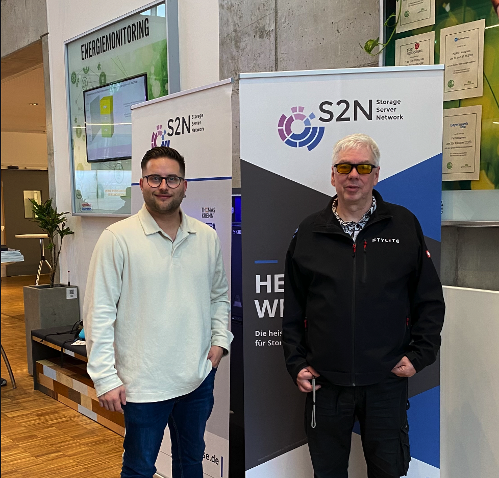

Die S2N-Konferenz (Storage, Server, Network) ist eine der wichtigen Fachkonferenzen für Rechenzentrumsinfrastruktur. Am 22. und 23. Oktober 2025 waren wir in Regensburg dabei.

## Aktuelle IT-Trends und RZ-Infrastruktur

Die diesjährige Konferenz hatte **Digitale Souveränität und Cyber-Resilienz** als Hauptthema. Die Keynote "Digitale Souveränität und Cyber-Resilienz: Europas strategische Handlungsfähigkeit" zeigte, wie europäische Unternehmen ihre Handlungsfähigkeit in vernetzten Umgebungen sicherstellen können.

Die Sessions zu Rechenzentrumsinfrastruktur für hochperformante Workloads waren interessant: von steigenden Leistungsdichten bis zu skalierbaren Storage-Lösungen – Themen, die bei Stylite AG täglich auf dem Tisch liegen.

## Workshops zu Virtualisierung und Storage

Am Vortag (21. Oktober) gab es Workshops mit technischen Details:

- **Proxmox VE**: Migration, Clustering und Log-Analyse
- **Ceph Orchestration**: Hands-on zur Verwaltung verteilter Storage-Plattformen und S3-Objekt-Storage
- **Netbox**: Infrastructure-Management-Tools

Die Session **Proxmox vs. OpenStack** zeigte unterschiedliche Virtualisierungsansätze – von KMU bis Enterprise.

## Fokus auf Resilienz, Sicherheit und KI

### Cyber-Resilienz und Immutable Backups

Mehrere Sessions behandelten **Cyber-Resilienz-Strategien** und unveränderliche Backup-Konzepte. **Immutable Backups** sind mittlerweile Pflicht, nicht optional.

### IT-OT-Integration und Kritische Infrastrukturen

Die Verschmelzung von IT- und OT-Systemen (Operational Technology) war ein weiteres Thema. Besonders bei kritischen Infrastrukturen ist **Vulnerability-Management** in heterogenen Umgebungen komplex.

### WLAN-Sicherheit und Netzwerk-Troubleshooting

Sessions zu **Wireshark-Netzwerkanalyse** und WLAN-Sicherheit zeigten Methoden für Network-Troubleshooting.

## Networking und Austausch

Die S2N ist auch eine gute Networking-Plattform. Der Austausch mit IT-Verantwortlichen, CTOs und CIOs aus verschiedenen Branchen brachte neue Perspektiven:

- Wie lösen andere Unternehmen ähnliche Probleme?
- Direkte Gespräche mit Herstellern von Storage-, Virtualisierungs- und Security-Lösungen
- Austausch mit der Proxmox-, Ceph- und Open-Source-Community

Die Abendveranstaltung mit Thementischen gab Gelegenheit, Diskussionen zu vertiefen.

## Ransomware-Notfall in der Praxis

Die **Ransomware-Incident-Response Case Studies** waren besonders interessant. Fallbeispiele zeigten:

- Wie Angriffe verhindert oder früh erkannt werden können
- Welche Schritte im Ernstfall zu ergreifen sind
- Wie die Wiederherstellung nach einem Angriff funktioniert
- Was aus echten Vorfällen gelernt wurde

Diese Einblicke zeigten: Auch die beste Prävention ersetzt keinen Notfallplan.

## Fazit

Die S2N 2025 war eine gute Mischung aus technischen Details und strategischen Themen. Die Kombination von Workshops, Case Studies und Diskussionen zur digitalen Souveränität war nützlich.

Für Stylite AG waren **Storage-Skalierung, Cyber-Resilienz und KI-Integration** besonders relevant. Die Einblicke in Proxmox- und Ceph-Umgebungen sowie Ransomware-Prävention lieferten Impulse für Kundenprojekte und interne Optimierungen.

Die Konferenz zeigte: **Open-Source-Lösungen** wie Proxmox und Ceph sind in Enterprise-Umgebungen angekommen und bieten solide Alternativen zu proprietären Systemen.

## Ausblick

In einem kommenden Beitrag werden ausgewählte Vorträge genauer beschrieben. Die Sessions zu **Ceph S3-Storage**, **Proxmox Clustering** und **Ransomware-Recovery-Strategien** bieten Material für technische Deep-Dives.

---

*Wim Bonis ist CTO bei Stylite AG und beschäftigt sich schwerpunktmäßig mit Storage-Lösungen, Cybersicherheit und Open-Source-Technologien. Matteo Keller ist für Marketing und Kommunikation bei Stylite AG verantwortlich.*
