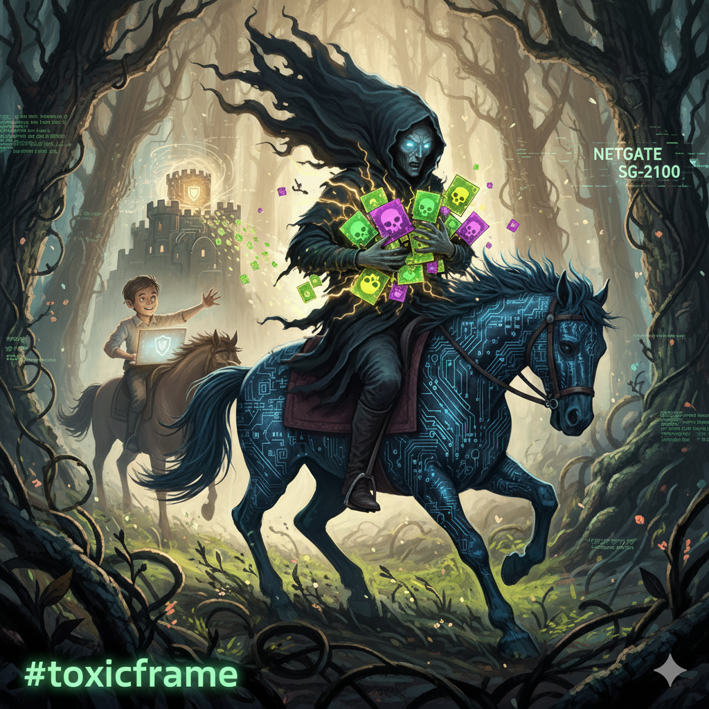

## TL;DR

A **Toxic Frame** on the Netgate SG-2100 stops file transfers over SMB/HTTP. The problem lies in the hardware of the integrated Marvell 6000 Switch and occurs when the LAN port of the SG-2100 is involved in the switch – independent of VLAN configuration, routing, or firewall rules. The specific data pattern from `toxic.bin` triggers the bug deterministically (e.g., with a certain file exactly at 49%). When exactly the bug is triggered and which other data patterns are also problematic is currently unclear. Reproducible with `toxic.bin`; `nontoxic.bin` transfers without problems. Problem known for at least four years, no solution found. **Workaround:** **none** available.

---

## 🌙 The Nocturnal Journey Begins

> "Who rides so late through night and wind?<br>
> It is the father with his child;<br>
> He holds the boy secure in his arm,<br>
> He grasps him safely, keeps him warm."

## The Symptom – Exactly 49%, Then Standstill

> "Who rides so late through net and port?<br>
> It is the admin with his support.<br>
> He holds the file secure in his arm,<br>
> At forty-nine percent it gets warm."

The file `stdww2.cab` (≈195 MB) breaks when transferring over SMB always at the same point: **exactly at 49%** (ca. 95 MB). Not random, not load-dependent – millimeter-precise. The behavior is equally reproducible over **HTTP** (easy test: download `toxic.bin` via HTTP). The finding: a so-called **Toxic Frame** – a specific data pattern that is not transported over the switch path logic on the Netgate **SG‑2100** (pfSense). When exactly the bug is triggered and which other data patterns are also problematic is currently unclear.

> "My father, my father, now he grabs me!<br>
> The Erlking has done me harm!"

## Framework Conditions and Exclusion List

- **Protocols**: SMB, HTTP – same effect
- **Topologies**: IPsec tunnel and locally via VLAN-to-VLAN on the internal switch – same effect
- **VLAN Configuration**: **The problem also occurs without VLAN** – VLAN setup is not the cause
- **Hardware Requirement**: The problem occurs when the **LAN port of the Netgate SG-2100 is involved in the integrated Marvell 6000 Switch** – independent of VLAN configuration, routing, or firewall rules
- **Clients/Files**: other files of the same size or structure – unremarkable
- **Time/Load**: independent

The precision of the abort speaks against classic MTU/fragmentation or bandwidth issues. Logs remain silent. It doesn't seem like rate limiting or DPI blocking – rather like a deterministic drop on a specific bit sequence.

> "My customer, why do you hide your face so anxiously?<br>
> Don't you see, admin, the error?<br>
> The error frame with crown and tail?"<br>
> "My customer, it's a network veil."

## Reproduction and Artifacts

- **Binary Data**: `toxic.bin` vs. `nontoxic.bin`
  - `toxic.bin`: contains the specific toxic byte pattern (extracted from `stdww2.cab` at 49%) – triggers the bug deterministically
  - `nontoxic.bin`: contains random bytes without the problematic pattern – this file transfers without problems, as a comparison basis.
  
  **Test Files for Download** (HTTP links to trigger the bug):
  - [toxic.bin](http://toxicframe.stylite-live.net/toxic.bin)
  - [nontoxic.bin](http://toxicframe.stylite-live.net/nontoxic.bin)

- **Checksums** (for verifying the test files):

```txt
# sha256sum toxic.bin
c53442b8ebc2631d4326fb70cdcc62a5c452674ed306d31120235fc180cfd499  toxic.bin
# shasum toxic.bin
528a21bf89c2529122b8bcab429a983263aa5a62  toxic.bin
# md5sum toxic.bin
b5c1a508e7cd741b94d5645d81375fbc  toxic.bin
```

- **Videos**: Reproductions over SMB and HTTP (see Screenshots section)

## Technical Suspicion

The tests point to a drop in the **Switch/SoC path** of the SG‑2100 (Marvell platform). Independent of the protocol, the flow breaks as soon as the "toxic" sector/packet pattern arrives. PCAP files (`packetcapture-mvneta0.pcap`, `packetcapture-mvneta1.pcap`) support the thesis that a very specific frame is not passed through. The behavior reproduces VLAN-internally without IPsec – the IPsec chain is thus excluded as the cause.

**Important:** The problem also occurs **without VLAN configuration**. The critical factor is that the **LAN port of the Netgate SG-2100 is involved in the integrated Marvell 6000 Switch** – regardless of whether VLANs are configured or not. The VLAN setup is not the cause of the problem.

**Hardware Specifications:**
- **CPU**: Dual-core ARM Cortex-A53
- **NIC**: Marvell 88E6141 (mvneta driver)
- **Affected Interface**: mvneta1
- **pfSense Version**: 25.07.x
- **Switch**: Marvell 6000 Switch

The extraction of the toxic sector was done with:
```bash
dd if=stdww2.cab bs=1024 skip=99989 count=1 of=toxic.bin
```

PCAP analyses show: The transmission stops abruptly without FIN/RST, the last ACK packet is never answered, the frame contains the toxic byte pattern in the payload. The PCAP files (`packetcapture-mvneta0.pcap`, `packetcapture-mvneta1.pcap`) are linked in the Screenshots section.

> "The father shudders; he rides swiftly,<br>
> He holds in his arms the moaning child;"

## What Was Excluded?

- **VLAN Configuration**: The problem occurs with and without VLAN – VLAN setup is not the cause
- MTU/PMTUD problems: fragmentation-relevant tests without findings
- Timeout/Rate Limit/DPI: no corresponding log events
- File/Client specifics: only the "toxic" sequence triggers the effect
- Routing/Firewall Rules: independent of configuration

**Critical Insight:** The problem lies in the **hardware of the Marvell 6000 Switch**, specifically when the **LAN port of the Netgate SG-2100 is involved in the switch**. It is a hardware-related error at the switch level, not configuration-related.

## Systematic Debugging

> "I love you, your beautiful form entices me;<br>
> And if you're not willing, I'll use force."<br>
> "My admin, my admin, now he grabs me!<br>
> The Toxic Frame has done me harm!"

The identification of the problem required a systematic isolation of each variable. Over several days, tests were conducted:

- Different files of the same size → **No Problem**
- Other files of similar structure → **No Problem**
- Same file from different clients → **Problem always occurs**
- Transmission over other protocols (HTTP) → **Problem always occurs**
- Different times, different loads → **Problem remains constant**
- Other internet links → **Problem always occurs**
- Other firewall manufacturers → **No Problem**
- Other pfSense versions → **Problem always occurs**
- Firewall parameterization → **Problem always occurs**

The realization: It was not the protocol, not the network connection in the classical sense, but the specific byte pattern within the file. With binary dumps, the transmission was analyzed byte by byte – extremely time-consuming and requires deep understanding of network and filesystem protocols.

**A single sector was never transmitted.** Not delayed, not corrupted, but simply not transmitted. The connection broke exactly at this point, every time, without exception.

## Why Was This So Difficult to Find?

> "The admin shudders, he rides swiftly,<br>
> He holds in his arms the complaining child,<br>
> Reaches the datacenter with effort and trouble;<br>
> In his arms the packet was dead."


Debugging this problem was extremely difficult because:

1. **The symptoms were deceptive**: It initially looked like a typical network problem
2. **The precision was unusual**: That a problem always occurs at exactly the same byte position is extremely rare in network technology
3. **The isolation was complex**: Each variable had to be systematically isolated – protocol, route, time, load, file content
4. **The reproducibility was difficult**: Not every sector caused the problem, but only a very specific one
5. **The transparency was low**: Standard network tools don't show this detail level – binary dumps and sector-based analyses were required

## A Discouraging Discovery

While researching similar cases, we came across a [Reddit discussion in the r/PFSENSE subreddit](https://www.reddit.com/r/PFSENSE/comments/twswig/weirdest_issue_ever_experts_needed_smb_hangs_over/) from **four years ago**, in which someone had described exactly the same problem.

> "You fine packet, so well-shaped,<br>
> I love your pattern – so well-preserved;<br>
> And if you're not willing, so I'll use force."

The description was practically identical: SMB hangs over IPsec, a file that always breaks at the same point, tests over various protocols – everything matched our observations. **What was particularly alarming:** No solution was found at that time. The discussion ended without a conclusive answer, without a fix, without an explanation.

This means that this problem should have been known for at least **four years**, but apparently was never properly analyzed or fixed.

> "My father, my father, now he grabs me!<br>
> The Elf King – Toxic Frame – has done me harm!"

## The Challenge: Communication with Manufacturer/Reseller

How do you explain to a support team that normally deals with standard problems that a single, specific sector cannot be transmitted at the hardware level? Most support staff have never heard of a "Toxic Frame" and will initially think of configuration errors or user errors.

The documentation must therefore include: Binary dumps of the toxic sectors, test protocols over several days, screenshots, step-by-step analysis, PCAP files, and video evidence of the reproducible errors. The challenge lies not only in documenting the problem, but also in communicating the urgency and technical complexity in such a way that the manufacturer takes it seriously.

**For Manufacturer/Reseller:** A detailed bug report is available as [Bug Report](/blog/bugreport-toxicframe-netgate-sg-2100/) and can be forwarded directly to support.

## For Manufacturer/Reseller: Reproducible Template

- Test file: `stdww2.cab` (195 MB) – abort at 49% (example of the problem)
- Minimal example: `toxic.bin` (hash see above) triggers the drop deterministically; `nontoxic.bin` works perfectly
- Reproduction: **LAN port of Netgate SG-2100 involved in integrated Marvell 6000 Switch** – occurs with and without VLAN configuration, also over IPsec. Easy test: download `toxic.bin` via HTTP
- Expectation: Transmission without abort; Actual state: deterministic standstill
- **Uncertainties**: When exactly the bug is triggered and which other data patterns are also problematic is currently unclear

**Important:** The problem is **not VLAN-related**. It occurs as soon as the LAN port of the SG-2100 is involved in the integrated Marvell 6000 Switch – independent of VLAN configuration, routing, or firewall rules. The screenshots show VLAN configurations, but this only served to isolate the problem and is not the cause.

For narrowing down, it is recommended to check the packet path at the SoC level or in the driver handling of the **Marvell 6000 Switch interface** for this specific bit/frame signature.

> "In his arms the child was dead."<br>
> <br>
> The admin shudders, he rides swiftly,<br>
> Carries PCAPs and checksums against the wind.<br>
> Reaches the rack with toil and trouble;<br>
> At forty-nine the node freezes solid.

## Conclusion

A **Toxic Frame bug** is rare – here, however, clearly reproducible: **a specific data pattern** (as contained in `toxic.bin`) stops the transfer on the SG‑2100 deterministically (e.g., with the test file `stdww2.cab` exactly at 49%). The evidence (checksums, dumps, reproducible videos) is consistent. When exactly the bug is triggered and which other data patterns are also problematic is currently unclear. Until analysis by manufacturer/reseller, we recommend routing critical transfers over alternative paths/hardware.

To further spread awareness of this issue and reach affected users, we will use the hashtag **#toxicframe** for publishing and communicating about this hardware bug.

> "And if you're not willing, my packet alone,<br>
> Then change the hardware - then it will be fine again!"

## Screenshots and Further Resources

**Screenshots:**
- [screenshot_1174.png](screenshot_1174.png) – The test environment, a Netgate SG-2100 with pfSense 25.07.x
- [screenshot_1175.png](screenshot_1175.png) – The network interfaces and VLAN of the hardware
- [screenshot_1176.png](screenshot_1176.png) – The VLAN setup of the hardware
- [screenshot_1177.png](screenshot_1177.png) – The integrated switch of the hardware
- [screenshot_1178.png](screenshot_1178.png) – The ports of the integrated switch
- [screenshot_1179.png](screenshot_1179.png) – VLAN setup of the switch
- [screenshot_1180.png](screenshot_1180.png) – Error message after abort of SMB connection
- [screenshot_1181.png](screenshot_1181.png) – Error when transmitting the problematic sector via HTTP

**PCAP files:**
- [packetcapture-mvneta0.pcap](packetcapture-mvneta0.pcap) – Packet capture of mvneta0
- [packetcapture-mvneta1.pcap](packetcapture-mvneta1.pcap) – Packet capture of mvneta1

**Videos:**
- [SMB Reproduction](toxicframe_oversmb.mp4) – Video demonstration of the problem over SMB
- [HTTP Reproduction](toxicframe_overhttp.mp4) – Video demonstration of the problem over HTTP

## The Elf King, New Rendition

> Who rides so late through night and wind?<br>
> It is the father – admin – with child;<br>
> He holds the file secure in his arm,<br>
> At forty-nine it suddenly grows warm.<br>
> <br>
> "My father, my father, do you see the gleam?<br>
> The frame with crown in the byte array?"<br>
> "My son, my son, it is a misty streak;<br>
> A switch in the branches, only network sprite."<br>
> <br>
> "You fine packet, so well-shaped,<br>
> I love your pattern – so well-preserved;<br>
> And if you're not willing, so I'll use force."<br>
> <br>
> The TCP murmurs, the ACK stays out,<br>
> No FIN, no RST – only silent dread;<br>
> VLAN here, VLAN there – the LAN port stays thereby,<br>
> Marvell stays silent, mvneta gives you not free.<br>
> <br>
> "My father, my father, now he grabs me!<br>
> The Elf King – Toxic Frame – has done me harm!"<br>
> The father shudders, he rides swiftly,<br>
> Carries PCAPs and checksums against the wind.<br>
> <br>
> Reaches the rack with toil and trouble;<br>
> At forty-nine the node freezes solid.<br>
> He bends down, his breath catches:<br>
> In his arms the child was dead.<br>
> <br>
> The admin looks, the bug report comes,<br>
> The frame has won, the transfer has failed.<br>
> Four years already, no fix, no light –<br>
> The Toxic Frame rules the night.

---

*Wim Bonis is CTO of Stylite AG and focuses primarily on storage and network technology.*


