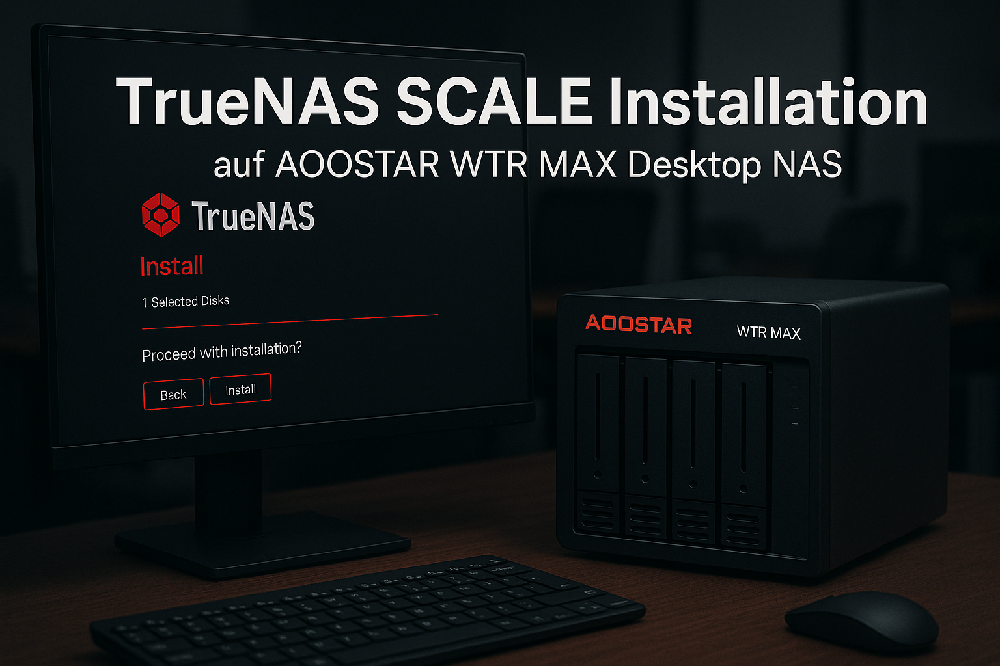
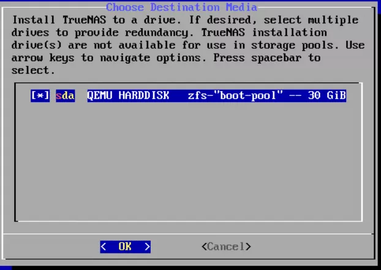
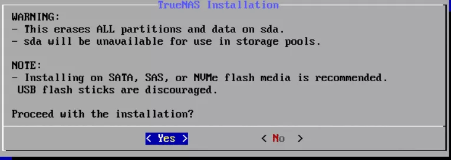
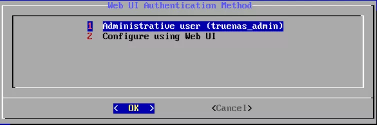
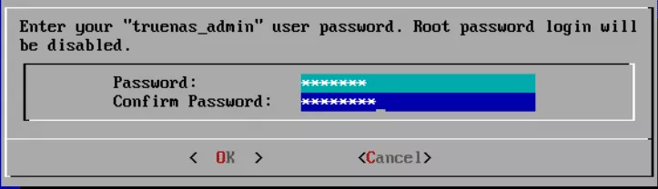
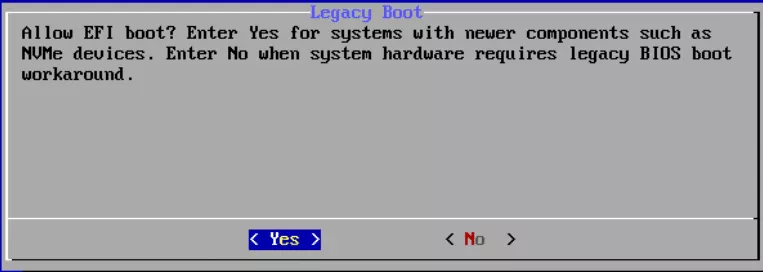
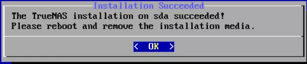
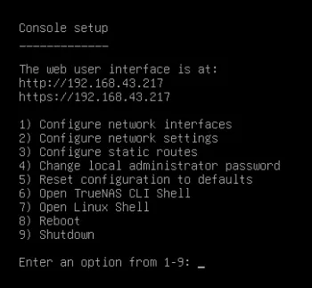
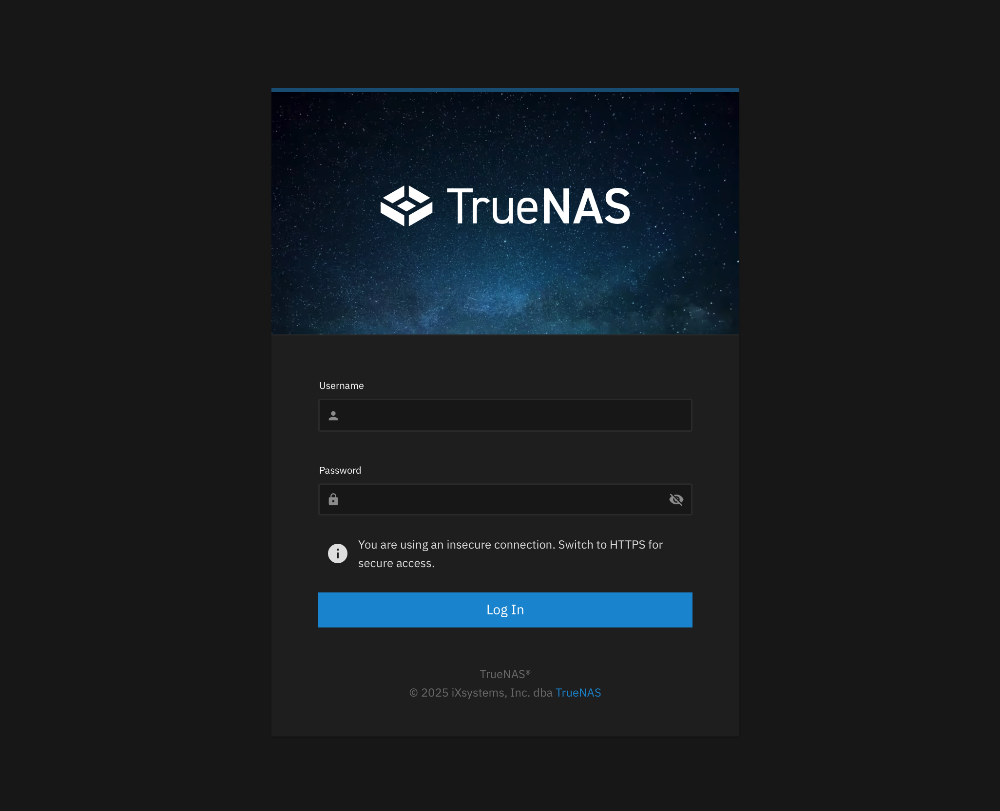
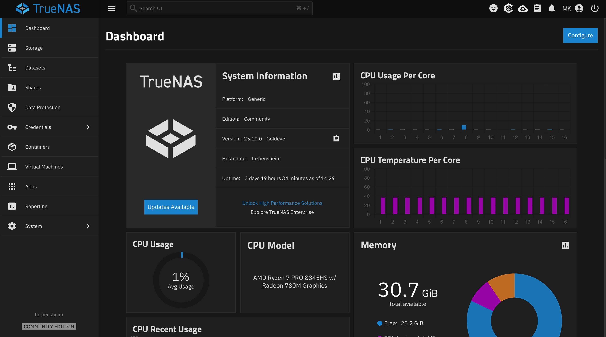

Auf der Suche nach einem kompakten lokalen Backup-System für das Büro sind wir auf das NAS-System **AOOSTAR WTR MAX 11 Bay** aufmerksam geworden. Eine Mischung aus Leistung, Robustheit und einem System, das im Arbeitsalltag akustisch nicht wahrnehmbar ist, war dabei ausschlaggebend.

Mit sechs großen Laufwerksschächten, schnellen Netzwerkschnittstellen (10 GbE SFP+ plus 2,5 GbE) und Anschlüssen für Monitor, Tastatur und Maus eignet sich dieses Gerät ideal für eine TrueNAS SCALE Installation, die lokal im Büro als sichere und flexible Datenplattform dienen soll.

## Warum AOOSTAR WTR MAX mit TrueNAS SCALE?

**TrueNAS SCALE** ist eine Open-Source-Plattform auf Linux-Basis, die das ZFS-Dateisystem mit seinen Vorteilen wie Snapshots, Replikationen und hoher Datenintegrität bietet. Zudem erlaubt die Plattform Virtualisierung und Containerisierung – ideal für moderne Büro-Workloads.

Die Hardware mit 6 SATA-Bays und 5 NVMe M.2 Slots schafft genug Spielraum für größere Setups und bietet mit RAIDZ2 rund **88 TB effektiven Speicher** in unserem Büro.

## Ziel und Rahmen

Dieser Leitfaden beschreibt die vollständige Installation von TrueNAS SCALE auf dem AOOSTAR WTR MAX 11 Bay Desktop NAS Mini PC, inklusive:

- **Vorbereitung** der Hardware
- **BIOS/UEFI-Einstellungen**
- **Installer-Schritte**
- **Erste Web-GUI-Konfiguration**

### Hardware-Voraussetzungen

- **Hardware:** AOOSTAR WTR MAX mit separater SSD/NVMe für das System und mehreren HDDs/SSDs für die Datenpools
- **Ziel:** Sauberes, reproduzierbares Setup für Büro- oder Laboreinsatz mit ZFS, Snapshots und Replikation

---

## Installation TrueNAS SCALE auf AOOSTAR WTR MAX

### Schritt 1: Vorbereitung

**Am AOOSTAR:**

- Monitor, Tastatur und Maus anschließen
- Alle benötigten Laufwerke einbauen
- Mindestens eine Netzwerkschnittstelle mit dem LAN verbinden
- Im UEFI/BIOS den Bootmodus auf **UEFI** stellen (Legacy/CSM deaktivieren)
- Optional: Boot-Reihenfolge so setzen, dass USB-Geräte temporär vor den internen Laufwerken gebootet werden

**Auf dem Admin-PC:**

1. Aktuelles TrueNAS SCALE ISO von der [offiziellen Download-Seite](https://www.truenas.com/download-truenas-scale/) laden
2. Bootfähigen USB-Stick (mind. 8 GB) mit [Rufus](https://rufus.ie/de/) oder [balenaEtcher](https://etcher.balena.io/) erstellen
3. Als Zielmodus **UEFI** wählen

---

### Schritt 2: TrueNAS SCALE vom USB-Stick starten

1. USB-Stick in den AOOSTAR stecken und Gerät einschalten
2. Per Boot-Menü-Taste (oft **F11** beim Mainboard, ggf. Handbuch prüfen) den USB-Stick als Bootmedium wählen
3. Im TrueNAS GRUB-Menü **„Start TrueNAS SCALE Installation"** auswählen

Danach erscheint die Konsolen-Setup-Oberfläche und der eigentliche Installer beginnt.

---

### Schritt 3: Installer – Bootlaufwerk auswählen und installieren

1. Im Konsolenmenü **„Install/Upgrade"** auswählen und mit Enter bestätigen

2. **Beim Auswahlbildschirm der Installationsziele:**
   - Nur die SSD/NVMe auswählen, auf der das System laufen soll (z.B. `nvme0n1`)
   - Optional: Zwei identische Laufwerke markieren, falls ein gespiegeltes Boot-Device gewünscht ist (Space-Taste zur Auswahl)

3. **Hinweisseiten bestätigen:** Der Installer weist darauf hin, dass alle Daten auf den gewählten Bootlaufwerken gelöscht werden – die Auswahl mit Enter bestätigen

4. **Swap-Konfiguration:** Je nach Empfehlung Swap anlegen oder bewusst deaktivieren; im Zweifel Standardvorschlag übernehmen

5. **Administrator-Benutzer:**
   - Web-UI-Admin auswählen (z.B. „Administrative user (admin/truenas_admin)" je nach Version)
   - Starkes Passwort setzen und zweimal bestätigen

6. **Bootmodus im Installer:**
   - **EFI-Boot** bestätigen (empfohlen für moderne Hardware wie AOOSTAR)
   - Nur bei spezieller Umgebung Legacy wählen

Danach beginnt die eigentliche Installation; die Dateien werden extrahiert und auf das Bootlaufwerk geschrieben.

---

### Schritt 4: Reboot und Zugriff auf die Weboberfläche

1. Nach Abschluss meldet der Installer, dass die Installation erfolgreich war und ein Neustart nötig ist
2. Im Menü **„Reboot"** wählen und den USB-Stick entfernen, damit von der SSD/NVMe gebootet wird

3. Beim ersten Boot zeigt die Konsole eine Übersicht mit der zugewiesenen IP-Adresse und dem Hinweis *„The Web User Interface is at …"*
4. Am Admin-Rechner einen Browser öffnen und die angezeigte IP aufrufen (z.B. `https://192.168.x.y`)
5. Mit dem zuvor gesetzten Admin-User und Passwort anmelden

**Geschafft!** Sie befinden sich jetzt im TrueNAS SCALE Dashboard.

---

### Schritt 5: Basis-Konfiguration in der Konsole (optional, aber sinnvoll)

Vor oder parallel zum ersten Web-Login können über das Konsolenmenü noch grundlegende Netzwerkeinstellungen gemacht werden:

1. Im Konsolenmenü Option **„Configure Network Interfaces"** wählen
2. Hauptinterface (z.B. `enp3s0`) auswählen
3. Feste IP, Gateway, DNS und optional Domain definieren, wenn kein DHCP genutzt wird

Das sorgt für stabile, vorhersehbare Erreichbarkeit im Büro-Netz.

---

### Schritt 6: Ersteinrichtung im WebGUI

Nach Anmeldung im WebGUI:

1. **Zeitzone und Sprache:** Unter *„System Settings → General → Localization"* Zeitzone, Sprache und Datum/Zeit prüfen und anpassen
2. **Updates:** Unter *„System Settings → Updates"* automatische Updates aktivieren und prüfen, ob ein aktueller Patch für die SCALE-Version verfügbar ist; falls ja, kontrolliert einspielen
3. **Hostname:** Konfigurieren (z.B. `truenas-aoostar-bensheim`) und, falls vorhanden, interne Domain eintragen

---

## Ausblick

> **Hinweis:** An dieser Stelle endet der heutige Teil der Anleitung. In der kommenden Woche geht es weiter mit der detaillierten Konfiguration im WebGUI – inklusive **Netzwerkeinstellungen**, **Freigaben** und **Nutzerverwaltung**.

Bleiben Sie dran, um den nächsten Schritt zur vollständigen Inbetriebnahme Ihres TrueNAS-Systems nicht zu verpassen!

---

*Matteo Keller ist im Marketing bei Stylite AG tätig und beschäftigt sich schwerpunktmäßig mit Enterprise-Storage-Lösungen und TrueNAS-Systemen.*

**Stylite AG** – Ihr TrueNAS Partner für professionelle Storage-Lösungen.
